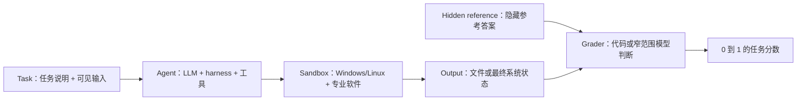

# Agents' Last Exam：零基础入门精读

研究日期：2026-08-05

## 先建立一个正确的整体印象

ALE 不是让一个裸 LLM 回答一套难题。它把一个完整 AI Agent 放进 Windows 或 Linux 电脑环境，给它任务说明、输入材料和专业软件，让它连续工作，最后根据它留下的文件或系统状态评分。

最接近的类比不是“学生参加笔试”，而是：

> 给一位远程员工一台预装软件的电脑、一份项目 brief 和原始资料；员工独立完成工作；验收方最后检查交付物。

这一点决定了后面的所有解释：ALE 分数属于“模型 + harness + 工具 + 环境 +预算”的整套配置，不属于裸模型一个组件。

## 四个链接分别是什么

| 链接 | 实际角色 | 适合回答什么 | 不能单独回答什么 |
|---|---|---|---|
| arXiv HTML | 完整论文正文与附录 | 为什么建 ALE、任务如何收集、怎么评分、实验结果和失败分析 | 当前动态数据集和实现是否已经变化 |
| arXiv abs v2 | 同一篇论文的摘要与版本记录 | 论文身份、v1/v2 日期、作者、摘要级主张 | 方法细节、表格口径、限制 |
| 官方 Docs | 评测框架的工程说明书 | 沙箱如何建立、输入/参考如何 staging、Agent 如何接入、日志如何保存 | 独立验证论文的科学结论 |
| Hugging Face dataset | 公开任务卡元数据目录 | 题目具体长什么样、需要哪些软件/输入、属于哪个领域和 split | 完整输入、隐藏参考、完整 grader、VM 镜像、论文实验结果 |

所以，前两个链接不是两篇论文；后两个也不是两项独立实验。它们是同一个 benchmark 的论文、工程框架和公开数据三个层面。

## 先学会九个核心词

### 1. LLM

负责生成推理和行动决策的基础模型。它只是 Agent 的一部分。

### 2. Agent

能够围绕任务循环观察、规划、调用工具、检查结果并继续行动的完整系统。

### 3. Harness

包在模型外面的控制软件，包括 system prompt、工具接口、行动循环、上下文压缩、重试、子 Agent 和日志。Codex、Claude Code、OpenClaw 等属于不同 harness。

### 4. Workflow

一个可复用的端到端专业流程，例如“根据年报建立一份完整财务工作簿”，而不是“点击一个按钮”。

### 5. Task instance / variant

同一 workflow 的一个具体输入案例。例如同一个财务抽取流程，可以换成不同公司或年份的数据。

### 6. Sandbox

Agent 实际控制的隔离电脑环境，包含操作系统、文件、终端、桌面和专业软件。

### 7. Artifact

Agent 最后交出的东西，可以是表格、报告、程序、3D 模型、图片、数据库状态或软件项目。

### 8. Hidden reference

隐藏的正确输出或专家参考材料。Agent 工作时看不到，结束后才提供给 grader。

### 9. Grader

将交付物转换为 `[0,1]` 分数的验收程序。可以检查字段、数值、几何、可执行行为和视觉效果。

## 第一份材料：完整论文究竟讲了什么

### 论文要解决的问题

作者认为，传统 benchmark 经常测模型会不会答知识题、写代码片段或完成短操作，却较少测量它能否持续完成真实、经济相关的专业工作。

这是论文的出发点，也是作者主张，不是论文已经证明的宏观经济因果关系。

### 什么任务可以进入 ALE

论文提出三个原则：

1. **Representativeness：**任务和软件要接近专业实践。
2. **Complexity：**必须是端到端 workflow，而不是几个点击。
3. **Verifiability：**必须留下可以自动检查的结果。

第三条非常重要，也带来选择偏差：难以数字化、难以自动验收、主要依靠人际沟通或线下行动的工作，不容易被 ALE 纳入。

### 任务从哪里来

论文报告完整语料库包含 960 个专家 workflow、1,490 个 task instances，覆盖 13 个领域集群和 55 个数字工作子领域。任务来自专家过去做过的项目，并经历专家招募、提交与编辑、初审、工程实现/试跑和最终专家 QC 五个阶段。

公共 release 只是完整语料库的一小部分；其他任务保留在私有池或仍待 QC，以便降低公开题目被训练、过拟合或定向优化的风险。

### 一次评测如何进行

论文将系统拆成三个可替换组件：

- Task specification：任务说明、输入、软件、隐藏参考和评分逻辑。
- Agent：foundation model 加 harness。
- Environment：Windows/Linux 远程 VM。

每个任务通过 `load()`、`start()`、`evaluate()` 三阶段建立、运行和评分。Agent 只能看到任务和输入；参考答案在运行结束后才进入评分环境。

### Agent 可以做什么

ALE 的目标对象叫 Generalist Computer-Use Agent。它需要联合使用：

- 截图和 GUI；
- 鼠标、键盘；
- 终端和代码；
- 文件系统；
- 网页或 API；
- 上下文管理和子 Agent。

但 ALE 通常看最后成果，而不是强制唯一操作路径。因此它不是纯 GUI benchmark：Agent 经常用脚本或 CLI 替代图形软件中的一部分操作。

### 如何验收不同类型的成果

论文列出多种 grader：

- 精确值或哈希；
- 表格和数值字段加容差；
- 3D 几何或点云距离；
- 最终软件/游戏状态；
- 程序在隐藏测试集上的执行结果；
- 图像、视频或报告的窄范围模型判断。

论文的静态分析显示，93.2% 的 workflow 使用代码型确定性 grader，6.8% 使用 LLM/VLM judge。模型 judge 被限制为针对具体证据的窄问题，而不是笼统地问“作品好不好”。

### Gate-and-score 为什么重要

很多任务先检查硬门槛：文件是否存在、格式是否可解析、是否发生碰撞、结构是否合规。门槛失败可能直接得到 0，即使其他部分做得还不错。

因此，零分不一定等于完全没有有用工作；它可能表示交付没有达到可以接受的最低完整性。

### 三个 tier 是什么

- Near-Term：67 个相对可推进的任务，用于短期迭代。
- Full-Spectrum：论文实验选择 55 个任务，覆盖全部 55 个子领域。
- Last-Exam：38 个最困难任务，用于保留长期 headroom。

三个 tier 不是互斥分区。`67 + 55 + 38 = 160`，而论文 Overall 按 152 个 distinct public tasks 计算，说明同一任务可以属于多个评测视图。

### 两个核心指标

**Mean Score** 是每个任务 `[0,1]` 部分分数的平均值。

**Full Pass Rate** 是得到完整 `1.0` 的任务比例。

假如一个系统在 10 个任务上都完成 80%，它的 Mean Score 可以很高，但 Full Pass Rate 仍可能是 0%。前者回答“做到了多少”，后者回答“能否独立完成到完全验收”。

### v2 论文结果怎么读

以 Last-Exam 38 题为例：

- Codex + GPT-5.5：0% full pass、11.2 mean score。
- ALE-Claw + GPT-5.5：2.6% full pass、12.8 mean score。

`2.6%` 实际上约等于通过 1/38；`0%` 是 0/38。v2 摘要的“平均低于 1%”指跨多种配置的平均 full-pass rate，大多数配置是 0/38。因此 `0%`、`2.6%` 和 `<1%` 可以同时成立。

### 论文认为 Agent 为什么失败

论文只对 Claude Code + Opus 4.7 的失败运行做了模型辅助分类：

- Approach 47%：策略错误 30%，未完成/放弃 17%。
- Understanding 31%：领域知识缺口 25%，幻觉/捏造 6%。
- Execution 22%：格式 10%，实现 bug 8%，GUI 失败 4%。

这提示瓶颈更像“选错方法、缺少专业知识、不能完整收尾”，而不只是不会点击 GUI。但这是一个配置、模型辅助标注的描述性分析，不能直接当成所有 Agent 的普遍因果比例。

## 第二份材料：arXiv v2 摘要页讲了什么

这个页面主要承担身份和版本功能：

- 论文编号：2606.05405。
- v1：2026-06-03。
- v2：2026-06-11。
- 论文类别、作者和项目/代码链接。
- v2 的三段摘要。

初学者应该先看它确定“作者在主张什么”，再进入 HTML 看“证据如何支持主张”。不要把摘要中的 `1K+ tasks`、`250+ experts` 当作最精细统计，也不要仅凭摘要判断 benchmark 的效度。

## 第三份材料：官方 Docs 讲了什么

Docs 不重复论文的科学论证，而是解释测量机器怎么工作。

一次运行有六个阶段：

1. 创建或连接 sandbox。
2. 将可见输入和软件状态放入环境。
3. 让 Agent 独立运行。
4. Agent 结束后放入隐藏 reference，并评分。
5. 保存统一 trajectory、事件日志和原始 artifacts。
6. 删除、停止、保留或断开 sandbox。

Docs 进一步说明：

- Windows/Linux、云 VM、Docker、QEMU 和 static machine 的差别；
- in-sandbox 与 out-of-sandbox Agent；
- CLI MCP 与 GUI MCP；
- deployer 和 executor；
- retry、timeout、cleanup、output collection；
- 每次运行保存哪些日志和截图；
- 如何添加新 Agent 或新任务。

一句话：论文定义和研究这把尺子；Docs 告诉你这把尺子如何制造和使用。

## 第四份材料：Hugging Face dataset 讲了什么

当前页面显示 v1.0、153 行。它是 metadata-only 的任务卡表格，每行有：

- task ID、标题和摘要；
- 完整 task prompt；
- Agent 必须完成的动作；
- 预期软件；
- 输入文件的名称/格式/路径描述；
- taxonomy 和 split；
- GitHub 源码路径。

它不包含实际输入内容、软件二进制、隐藏 reference、完整评分 fixture 或 VM 镜像。实际输入和参考分别在 companion repositories；reference 访问受控。

### 从真实题目感受 ALE

当前任务卡包括：

- 下载并解析 1,500 份年报，生成完整 Excel；
- 在 Odoo 中完成采购、制造、交付、发票、退货全流程；
- 审查四份中文并购监管文件并写英文一致性报告；
- 用 Rhino 根据建筑图纸构建 3D 模型；
- 分析企业 PCAP 并重建感染链；
- 从医学 CT 构建生存风险模型；
- 定位彝文手稿字形并写有出处的翻译报告；
- 在音乐软件中完成管弦乐转录并输出 PDF/MIDI。

这些题的共同点不是“都很难”，而是每题都有多个相互依赖步骤、真实输入、具体软件和严格交付格式。

## 为什么四个页面的数字有时对不上

这是 living benchmark 的典型现象：

- 论文语料库图和附录写约 150 个公开任务。
- v2 实验正文写 152 个 distinct public tasks。
- 当前 Hugging Face metadata release 有 153 行。
- 论文 Full-Spectrum 实验切片是 55 题；当前 metadata 单标签统计是 47 个 full-spectrum、67 个 near-term、38 个 last-exam，加一个空标签。
- 论文宣称 13 个职业领域集群；当前 repository `category` 字段出现 14 个值，其中包括 `other`，且它并不总等于 taxonomy domain。

正确做法不是选一个“永远正确”的数字，而是同时记录：来源、版本、日期、统计单位和评测 manifest。

## 事实、作者主张和审阅判断

### 论文直接支持的事实

- ALE 在沙箱中运行完整 Agent，并按最终 artifact/state 评分。
- 公开任务横跨多种数字专业流程。
- 分数受模型、harness、工具和环境共同影响。
- 当前系统经常取得部分分，但在最难任务上极少完整通过。

### 作者的解释或愿景

- 现实部署落后主要是评测问题。
- ALE 的任务具有经济代表性。
- ALE 饱和将意味着接近真实产业影响。

这些观点有设计和案例支持，但不是由 benchmark 分数自动证明的因果结论。

### 本次审阅判断

- ALE 最直接测的是“完整 Agent 在受控数字项目中的端到端交付可靠性”。
- 它要求规划、知识、工具和验证，但不能用一个总分将这些潜在能力逐项分离。
- Mean Score 与 Full Pass Rate 的差距直接说明：Agent 常能满足部分评分条件，却未完整满足 ALE rubric。结合轨迹与失败分析，这与端到端完整性交付问题一致；但这个差距本身不是对现实世界可靠性的校准估计。
- ALE 不能单独证明一个 Agent 已达到人类专业水平、可以替代一个岗位或会产生某种 GDP 影响。

## 最强的限制和反方意见

1. 论文没有匹配条件下的人类 baseline。专家过去花几天/几周做过类似项目，不等于人类在同一五小时沙箱中一定满分。
2. 任务必须数字化、可自动评分，因此不代表全部工作。
3. 评分偏最终成果，除非 grader 明确检查，否则可能看不到不安全、不可审计或非专业的过程。
4. 大多数配置没有多次独立重复，细小排名差距可能不稳定。
5. 公开任务、代码和 grader 会带来定向优化与污染风险；private rotation 只能缓解。
6. 严格 gate 有利于测可靠性，但可能压低对有价值部分进展的表达。
7. 四个指定页面都由同一 benchmark 生态发布，不构成独立 replication。

独立相邻研究 OSWorld 2.0、Remote Labor Index 和一般 agent-evaluation 方法研究同样强调长程可靠性、成本、holdout 与复现问题，但它们的任务和评分不同，不能用来复现 ALE 的具体百分比。

## 四个研究假设的结论

1. **四个链接不是四篇独立文章：确认。**它们是同一 benchmark 的论文、摘要页、工程文档和数据目录。
2. **ALE 测完整 Agent 系统而非裸 LLM：确认。**论文和 Docs 都明确将 harness、模型、工具和环境纳入运行。
3. **部分分与 full pass 的差距体现端到端可靠性问题：只部分支持，需要收窄。**它直接证明的是“满足部分评分条件，但没有完整满足 ALE rubric”；只有结合轨迹与失败分析，才能将其解释为端到端完整性交付问题，而且严格 gate 与 grader 设计也会影响差距大小。
4. **ALE 不能单独建立职业替代结论：确认其证据不足。**没有匹配人类 baseline，也不是劳动力市场概率样本。

## 零基础推荐阅读顺序

### 第一遍：只建立直觉，20 分钟

1. 看 arXiv v2 摘要。
2. 在 Hugging Face 随机读 5 个不同领域任务卡。
3. 记住 Agent、harness、sandbox、reference、grader 五个词。

### 第二遍：理解 benchmark，45–60 分钟

读论文：Introduction、2.1–2.3、3.1–3.3、4.1–4.2。

重点问题：任务从哪里来？Agent 看见什么？最后按什么评分？

### 第三遍：学会正确解读结果

读 Appendix C.3、D.2–D.5。

重点问题：gate 如何影响零分？失败标签怎么产生？模型与 harness 如何混在一个结果里？

### 第四遍：只有准备运行或开发时再读 Docs

先读 overview、tasks、agents、sandbox、trajectories，再进入配置和扩展页面。

## 最终一句话

ALE 不是在问“LLM 知道多少”，而是在问：

> 一套完整 AI Agent 能否在真实电脑环境中，把一项陌生专业数字工作从任务说明做到可严格验收的最终交付。

它目前最有解释力的结论是“Agent 已能完成不少评分项，但对完整 ALE rubric 的满足仍明显不足”；结合轨迹和失败分析，可以看到长程完整性交付问题。它不能单独证明“AI 已经能替代哪些职业”。
