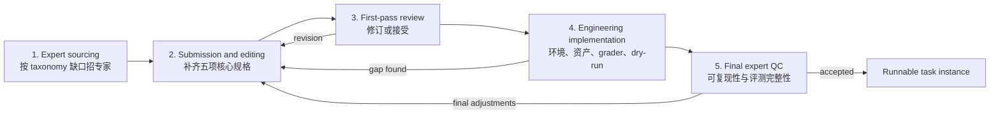
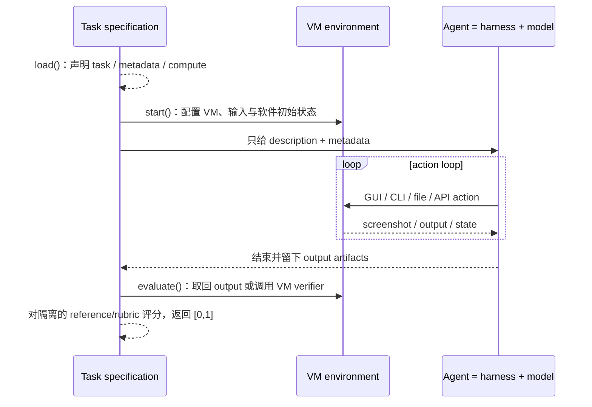

# *Agents’ Last Exam*（ALE）中英对照精读与六问解读

> 工作译名：**《智能体的终极考试》**  
> 论文：Yiyou Sun et al., arXiv:2606.05405v2, 2026-06-11  
> 主源：[arXiv HTML v2](https://arxiv.org/html/2606.05405v2) · [arXiv v2 版本页](https://arxiv.org/abs/2606.05405v2) · [Hugging Face Paper](https://huggingface.co/papers/2606.05405) · [官方 taxonomy](https://agents-last-exam.org/taxonomy)  
> 核对日期：2026-08-06

## 阅读说明

这不是对英文论文的逐字重印。下面的英文是按论文结构写成的 **faithful English paraphrase（忠实英文改写）**，中文与其逐节对应；正文、实验和附录的核心论点、流程、术语与数字均保留。作者/单位长名单和参考文献目录不重复翻译，原始引文关系请回到论文页面查看。

文中使用三种证据标签：

- **[事实]**：论文直接报告的设计、流程、数字或实验结果。
- **[作者主张]**：论文作者对意义、原因或未来影响的解释。
- **[本文归纳]**：基于论文设计作出的审阅性总结，不冒充论文原话。

## 先给结论：六个问题各用一句话回答

| 问题 | 最短回答 |
|---|---|
| 为什么做 ALE？ | 作者认为，现有 benchmark 的高分没有稳定转化为核心行业中的经济产出；缺的是对真实、长程、专业数字工作流的持续且可验证的测量。 |
| ALE 测什么？ | 它评估由 **foundation model + harness** 构成的完整 agent，在固定 task、prompt/tool configuration、environment、budget 与 evaluator 条件下完成专业数字项目、交付可验收结果的表现；不是裸 LLM 的知识问答能力。 |
| task 怎么筛？ | 入库先看三条：**代表性、复杂度、可验证性**；进入生产后还要通过真实性、规格完整、技术可执行、reference 正确、grader 校准、上下文充分等检查。 |
| taxonomy 是什么？ | 以 SOC 2018 与 O*NET 为职业骨架，筛出可数字执行且可客观验收的工作流；论文报告 **13 个 domain、55 个 subdomain**，但 Figure 2 视觉上是 13 个具名行业带，另有 `Other → Sports`。它不是按 GDP 排名抽样。 |
| 专家怎么生产 task？ | external-submission 路线由从业者提交过去做过、通常需数天或数周的项目；corpus 另含 530 个 commissioned/internally authored variants。平台补齐五项规格，再经自动/agent-assisted 初审、工程实现和专家委员会 QC。 |
| QC 怎么做？ | 五道 gate：专家招募 → 提交/编辑 → first-pass review → 工程实现与 dry-run → 专家委员会 final QC；最后重点查可复现性、reference、评分边界和信息充分性。 |

## 关键术语先分清

| 英文 | 中文工作译法 | 在 ALE 中的准确含义 |
|---|---|---|
| task workflow | 任务工作流 | 一个可复用的端到端专业程序，通常对应一个 `main.py` 和一套共享 evaluator。 |
| task instance | 任务实例 | 某个 workflow 下的一组具体 input/reference；不同实例可共用同一个 `evaluate()`。 |
| task | 任务 | 论文偶尔使用的简写；多数实验语境指可运行的 instance。 |
| agent | 智能体系统 | harness 与 foundation model 的组合，不等于模型本身。 |
| harness | 智能体编排层 | 负责 prompt、工具路由、action loop、context、sub-agent、GUI 接入等。 |
| reference | 隐藏参考产物 | 运行时不让 agent 读取，结束后供 grader 比较。 |
| grader / judge | 评分器 / 判定器 | 对文件、字段、几何、状态、行为或窄 rubric 评分的代码或模型。 |
| Mean Score | 平均分 | task-specific evaluator 返回的 `[0,1]` 归一化分数之平均，表示平均部分信用；没有统一的“完成了多少评分项”语义。论文表格按 `×100` 显示。 |
| Full Pass Rate | 满分通过率 | evaluator 编码分数恰好为 `1.0` 的任务比例；表示满足了该 evaluator 的全部编码条件，不等同于现实中的完整专业验收。 |
| GCUA | 通用计算机使用智能体 | 联合 Brain（推理/规划）、Eyes（视觉）、Body（编排）、Hands（结构化工具）和 Feet（运行环境）的 Generalist Computer-Use Agent。 |

---

# 第一部分：按论文结构的中英对照精读

## Abstract / 摘要

**English faithful paraphrase**

Modern AI systems perform strongly on many established tests, but those gains have not produced equally strong deployment across professional domains. The authors argue that this discrepancy is largely an evaluation problem: common benchmarks rarely test sustained work on authentic and economically useful workflows. ALE is introduced to evaluate agents on long-horizon, real-world tasks whose outcomes can be verified. The benchmark was developed with more than 250 domain experts, uses 13 industry clusters and 55 subfields, and contains more than one thousand tasks. In arXiv v2, the average full-pass rate on the hardest tier is below one percent across the tested mainstream model–harness configurations. ALE is intended to remain a living benchmark whose task pool grows over time.

**中文对照**

现代 AI 系统已经在许多既有测评上取得高分，但这些进展并没有在大量专业领域中形成同等强度的真实部署。作者主张，这一落差**主要**是“评测问题”：常用 benchmark 很少持续测量 AI 能否完成真实且有经济价值的完整工作流。ALE 因此被提出，用来评估智能体在长程、现实、结果可验证的任务上的表现。论文称，ALE 与 250 多名领域专家协作构建，包含 13 个行业集群、55 个子领域和 1,000 多项任务。arXiv v2 报告，在最难的 Last-Exam 层级上，所测主流模型—harness 配置的平均满分通过率低于 1%。ALE 被设计为 living benchmark，任务池会继续扩张。

**证据边界**

- **[事实]** v2 摘要的 headline 是 `<1%`，不是 HF paper metadata 中仍显示的旧 `2.6%`。
- **[作者主张]** benchmark 与经济部署之间的落差“主要是评测问题”。论文没有用实验把评测不足与其他部署障碍做因果分解。
- **[本文归纳]** ALE 更像“AI 工作交付测试”，不是一套更难的问答题。

## 1 Introduction / 引言

**English faithful paraphrase**

The paper contrasts rapid benchmark progress in games, mathematics, and programming with slower measurable transformation in major industries. The authors call this a utility problem: evaluations capture abstract competence more readily than the ability to perform valuable professional work over long horizons. Benchmarks also shape research priorities, so a verifiable evaluation can make a domain easier to optimize and eventually deploy.

Constructing such a benchmark is difficult for three structural reasons. Authentic long workflows are expensive to collect and reproduce; broad coverage requires sustained access to specialists; and professional outputs are heterogeneous, ranging from spreadsheets and reports to media, designs, software states, and scientific models. Existing evaluations often sacrifice at least one of realism, breadth, or verifiability. ALE attempts to combine all three by sourcing completed projects from practitioners and turning their final artifacts or milestones into structured automated checks.

The target system is a Generalist Computer-Use Agent that can combine visual perception, code execution, file handling, tool use, and long-horizon planning in one action loop. The authors position this surface as broader than GUI-only or CLI-only benchmarks.

**中文对照**

论文把两种现象放在一起比较：一边是 AI 在游戏、数学和编程 benchmark 上快速进步，另一边是核心行业中可测量的转型相对缓慢。作者把这称为“utility problem（效用问题）”：现有评测更容易测抽象能力，却较少测系统能否在长时间跨度内完成有价值的专业工作。由于 benchmark 会塑造研究注意力和工程目标，一个领域一旦拥有可验证、被广泛采用的测评，也更容易被持续优化并走向部署。

但这种 benchmark 很难建，原因有三类：第一，真实长工作流收集和复现都很贵；第二，广泛行业覆盖需要长期接触大量专家；第三，专业交付物高度异质，可能是表格、报告、媒体、设计、软件状态或科学模型。过去的评测往往必须在真实性、广度和可验证性之间牺牲至少一项。ALE 的尝试，是从从业者已经完成的项目出发，再把交付物或里程碑改造成结构化、可自动执行的检查。

被测对象是 GCUA：它需要在一个 action loop 中联合视觉感知、代码执行、文件操作、工具使用和长程规划。作者因此把 ALE 的操作面描述为比纯 GUI benchmark 或纯 CLI benchmark 更广。

**证据边界**

- **[作者主张]** 论文把真实性、广度、可验证性列为既有评测难以同时满足的三个方向；这是作者的文献比较判断，不是 ALE 实验本身证明的事实。
- **[作者主张]** 一旦类似 ALE 的 benchmark 被“做饱和”，就可能代表足以支撑真实工业采用的能力。
- **[本文归纳]** 论文并没有测 GDP，也没有匹配条件下的人类基线，所以“GDP-relevant”是研究愿景，不是已经验证的预测关系。

## 2 Benchmark Design and Dataset Construction / Benchmark 设计与数据集构建

### 2.1 Design Principles / 任务准入原则

**English faithful paraphrase**

ALE admits workflows according to three top-level requirements. First, a task should be representative of real professional practice and use the tools that specialists would normally use. Second, it should require substantial expert time and be complex enough to form an end-to-end deliverable rather than a local action or a few interface operations. Third, the result must be verifiable through deterministic checking or an unambiguous rubric attached to observable artifacts.

The paper illustrates complexity by contrasting a single video color adjustment with transferring a running animal into another video, which couples tracking, rotoscoping, compositing, and color matching. It illustrates verifiability by contrasting an unconstrained request to invent a game with reproduction of a specified game whose map, character attributes, and event state can be compared against a reference.

**中文对照**

ALE 用三条顶层要求决定一个 workflow 能否入库。

1. **Representativeness（代表性）**：任务应符合真实专业实践，并使用该领域专家实际会用的软件与工具。
2. **Complexity（复杂度）**：原任务应占用专家显著时间，并形成一个端到端交付，而不是一个局部动作或几次界面操作。关键区别是 workflow，不是 action。
3. **Verifiability（可验证性）**：结果必须能用确定性检查，或用绑定到可观察 artifact 的明确 rubric 验收。

论文用视频任务说明复杂度：只加一个滤镜太窄；把奔跑动物移入另一段比赛视频则需要跟踪、转描、合成和调色，是耦合工作流。论文用游戏任务说明可验证性：泛泛地“设计一个有怪物的 RPG”没有客观目标；复现一个指定游戏，则能检查地图结构、角色属性和事件状态。

**这里要区分两种“筛选”**

- 上述三条是 **task admission principles**，决定什么类型的 workflow 值得进入生产漏斗。
- Near-Term / Full-Spectrum / Last-Exam 是 **evaluation tier selection**，决定公开评测时用哪一组任务；它不是同一件事。

### 2.2 Scope and Taxonomy / 范围与分类体系

**English faithful paraphrase**

The taxonomy is not built by selecting industries informally or ranking them by economic size. ALE starts from SOC 2018 and O*NET records, removes occupations whose core work cannot be represented meaningfully in a digital environment, and groups occupations that share software-mediated, artifact-producing workflows. The paper reports 13 domains and 55 subdomains; Figure 2 visually shows 13 named industry bands plus an additional `Other` band containing Sports.

Appendix B describes the derivation in more detail. A fixed GPT-4o mini prompt at temperature zero screened 1,016 O*NET 30.2 occupation entries. Variants were consolidated into 117 SOC base codes. Workflow similarity across field, method, and work product was then used to create 51 SOC-anchored subdomains. Four frontier subdomains were added, while seven extensions modified existing subdomains rather than adding seven more, producing 55 subdomains in total.

The paper maps categories from 16 earlier benchmarks into this coordinate system with an LLM-assisted classifier and reports that their union still leaves 13 of the 55 ALE subdomains uncovered.

**中文对照**

ALE 的 taxonomy 不是凭感觉挑行业，也不是按行业 GDP 排名。它从 SOC 2018 与 O*NET 的职业、任务、工作活动和工具记录出发，排除核心工作无法有意义地放入数字环境的职业，再把具有相近软件媒介工作流和可交付 artifact 的职业组织到一起。论文报告 13 个 domain 与 55 个 subdomain；Figure 2 视觉上则列出 13 个具名行业带，另有一个包含 Sports 的 `Other` 条带。

附录 B 给出更细的推导：团队使用固定的 GPT-4o mini prompt、temperature 0，对 O*NET 30.2 的 1,016 条职业记录进行初筛；合并变体后保留 117 个 SOC base code；再按 field、methodology 和 work product 的相似性整理出 51 个以 SOC 为锚点的 workflow subdomain。对于传统职业分类没有充分覆盖的新兴工作，又加入 4 个 frontier subdomain，并扩展 7 个既有 subdomain，最终得到 55 个 subdomain。

论文随后用 LLM-assisted classifier 把 16 个既有 benchmark 的公开类别映射到同一坐标系，并报告：即使把这些 benchmark 合起来，仍有 13/55 个 ALE 子领域完全未覆盖。

**v2 图表口径的例外：**正文和 Figure 2 图注都概括为“13 domains / 55 subdomains”，但 Figure 2 视觉上实际列出 **13 个具名 industry domain，外加一个 `Other (3)` 条带；其下只有 `Sports (3)`**。论文没有单独解释 `Other` 的分类地位；只有把 Sports 计入，冻结的 v2 图才得到 55 个 subdomain 与 1,490 个 instance。官方 living taxonomy 页面后来仍标为 13/55，但 subdomain 组合已经重排，因此不能用今天的网页目录静默改写 v2 论文快照。

**证据边界**

- **[事实]** taxonomy 的确以 SOC/O*NET 为骨架，并明确排除核心工作不适合数字执行的职业。
- **[作者主张]** 这种设计提供了“广泛且有代表性”的行业覆盖。
- **[本文归纳]** 它是 broad coverage，不是 labor-market representative sample；没有按就业人数、工资、工时、GDP 权重或失误后果加权。

### 2.3 Task Construction Pipeline / Task 构建流水线

**English faithful paraphrase**

ALE does not treat task production as ordinary crowd work. In the external-submission route, domain practitioners contribute projects from their real routines, often projects that originally took days or weeks. The corpus also contains 530 commissioned-build variants that are internally authored. A web portal and AI-assisted editing help complete five required components: a natural-language description, input files, target software, expected deliverables, and an evaluation specification.

Proposals then receive conference-style first-pass decisions, including major revision, minor revision, borderline accept, accept, and strong accept. Accepted specifications are converted by engineers into runnable assets, provisioned software environments, and executable evaluation logic. Engineers perform dry runs and return incomplete specifications to the expert. A final expert-committee review checks reference correctness, evaluator bounds, reproducibility, and whether enough context is supplied for a valid solution.

Figure 5 describes 1,490 variants/instances: 150 public, 1,017 private, and 323 still pending verification/QC. By source, these are 960 external-submission variants and 530 commissioned-build variants. Only about ten percent is public, and private instances are intended to rotate into future evaluations to reduce contamination and task-specific optimization. Figure 5's “960 external-submission variants” must not be silently equated with the Conclusion's “960 task workflows”: the paper reuses the number under different unit labels without showing a one-to-one mapping.

**中文对照**

ALE 不把 task 生产当成普通众包标注。在 external-submission 路线中，任务来自领域从业者的真实工作例程，通常是专家过去花过数天甚至数周完成的项目；corpus 还包含 530 个 commissioned-build、internally authored variants。专家通过网页 portal 提交材料，AI-assisted editing 帮助把五项核心规格补齐：自然语言描述、输入文件、目标软件、预期交付物、评测规范。

提案随后接受类似学术会议的 first-pass decision：major revision、minor revision、borderline accept、accept、strong accept。通过的规格由工程团队转成可运行 asset、配置好软件的环境和可执行评分逻辑。工程师会 dry-run；若发现依赖缺失或逻辑空洞，任务日志会被退回专家修订。最终，专家委员会复核 reference 是否正确、评分边界是否合理、任务是否可复现、以及上下文是否足够支撑一个有效解。

Figure 5 给出 1,490 个 variant/instance：150 个公开、1,017 个私有、323 个仍待验证/QC；按来源分成 960 个 external-submission variants 和 530 个 commissioned-build variants。公开比例约 10%，私有实例计划在后续评测中轮换，以减少污染和针对公开题的定向优化。这里的“960 个 external-submission variants”不能直接等同于结论所称“960 个 task workflows”：论文对同一个数字使用了不同单位标签，却没有展示一一对应关系。

## 3 Evaluation Pipeline / 评测流水线

### 3.1 Pipeline Architecture / 系统架构

**English faithful paraphrase**

Each runnable benchmark instance separates three components: a task specification, an agent, and an environment. The task specification is an executable `main.py` containing the instruction, input assets, required software, hidden references, and evaluation criteria. It exposes `load()` as a pure declaration of task metadata and compute requirements, `start()` to provision a deterministic initial state, and `evaluate()` to retrieve outputs or invoke a VM-side verifier and then score the result in `[0,1]` against isolated references or rubrics.

The agent is a harness orchestrating a foundation model. It observes screenshots, shell output, and file contents; chooses mouse, keyboard, command-line, file, or API actions; and repeats until it delivers or stops. The environment is a remote VM with four standard directories: read-only `input/`, pre-installed `software/`, writable `output/`, and hidden `reference/` material used only after the run.

**中文对照**

每个可运行 benchmark instance 被拆成三个可替换组件：task specification、agent、environment。task specification 是一个可执行的 `main.py`，编码任务说明、输入 asset、所需软件、隐藏 reference 和评价标准，并暴露三个生命周期函数：`load()` 纯声明任务 metadata 与算力要求、既不连接也不修改 VM；`start()` 配置确定性的初始状态；`evaluate()` 取回输出或调用 VM-side verifier，再依据隔离的 reference/rubric 把结果评分到 `[0,1]`。

agent 由 harness 编排 foundation model。它观察截图、shell 输出和文件内容，选择鼠标、键盘、命令行、文件或 API 动作，循环执行，直到提交或停止。environment 是远程 VM，采用四目录契约：只读的 `input/`、预装应用的 `software/`、唯一交付目录 `output/`、以及运行期间对 agent 隐藏、仅供评分的 `reference/`。

### 3.2 Agent Architecture / 从 CLI、GUI Agent 到 GCUA

**English faithful paraphrase**

ALE divides operational agent capability into five layers. The Brain provides reasoning and planning; Eyes perceive GUI state; the Body manages orchestration and control flow; Hands expose structured tools; and Feet provide the runtime where actions take effect. CLI agents usually lack visual perception, while GUI agents often have a shallow orchestration layer and a narrow mouse-and-keyboard tool surface. ALE targets a generalist agent that combines all five.

Contemporary harnesses are described as more than a thin reasoning loop. They construct modular system prompts, expose unified tools, dispatch sub-agents, and compact context during long runs. ALE primarily adds GUI operations as normal tools inside the main loop. A separate visual GUI sub-agent can be used for models without native vision.

**中文对照**

ALE 把智能体的操作能力拆成五层：Brain 负责推理与规划；Eyes 读取 GUI 状态；Body 负责 orchestration 与 control flow；Hands 暴露结构化工具；Feet 是动作实际发生的 runtime。传统 CLI agent 通常没有视觉 Eyes；GUI agent 虽能看屏幕和点击，但常常缺少强 Body、广 Hands 和完整 Feet。ALE 要测的是五层合一的 generalist agent。

论文所说的现代 harness 也不只是一个薄 ReAct loop。它会组装模块化 system prompt、统一管理工具、调度 sub-agent，并在长运行中压缩 context。ALE 的主评测方式是把 GUI 操作作为普通工具加入同一个主循环；对没有原生视觉输入的模型，也可把 GUI 交给单独视觉 sub-agent。

**本文归纳**

ALE 的观测分数属于完整“被测 agent + 评测条件”组合：**model × harness** 在指定的 **prompt/tools × GUI bridge × environment/runtime × budget × evaluator** 下运行。即使论文观察到所测样本中 model 差异大于 harness 差异，也不能把 ALE 误称为“裸模型 benchmark”。

### 3.3 Evaluation Modes / 异质交付物如何评分

**English faithful paraphrase**

Because outputs range from financial workbooks and software programs to meshes, rendered scenes, and interactive world states, ALE does not force every task into one metric. Authors choose among exact or hashed values, structured fields with tolerances, geometric distances, visual comparison, behavioral state replay, semantic rubrics, and execution against held-out tests or an oracle.

Signals are composed through gate-and-score, weighted rubrics, binary-checklist averages, or pairwise file aggregation. Gate-and-score is common: a hard validity condition must pass before a continuous quality score is considered. A machining output, for example, can receive zero if a collision gate fails even when its shape is otherwise close to the reference.

Deterministic code is preferred whenever the artifact can be reduced to bytes, fields, geometry, world state, or executable behavior. The open reference tree is reported as 93.2% code-based and 6.8% LLM-as-judge. When model judging is unavoidable for visual or creative artifacts, prompts are narrow, reference-grounded questions, and code performs the final aggregation.

**中文对照**

由于 ALE 的输出可能是财务 workbook、程序、3D mesh、渲染画面或交互世界状态，它不强迫所有 task 共用一个 metric。作者可以选择精确值/哈希、带容差的结构化字段、几何距离、视觉比较、固定轨迹下的行为状态、语义 rubric，或把可执行 artifact 放到隐藏测试集/标准程序上运行。

这些信号再通过四种模式组合：gate-and-score、weighted rubric、binary checklist average、pairwise file aggregation。最常见的是 gate-and-score：必须先通过一个硬有效性条件，才计算连续质量分。例如加工结果即使外形接近 reference，只要碰撞 gate 失败，也可能直接得 0。

只要 artifact 能还原为 bytes、fields、geometry、world state 或 executable behavior，ALE 就优先使用确定性代码。论文对开放 reference task tree 的静态分析是 93.2% code-based、6.8% LLM-as-judge。视觉/创意产物确实无法代码化时，model judge 只回答窄、以 reference 为依据的问题，最后权重与聚合仍由代码完成。

**如何理解分数**

- Mean Score 是 task-specific evaluator 的平均归一化部分分；它可能来自 checklist，也可能来自连续几何分、质量函数、weighted rubric 或 gate-and-score，因此没有统一的“完成多少评分项”含义。
- Full Pass Rate 要求任务分数严格等于 `1.0`，即满足该 evaluator 编码的全部验收条件；一个关键 gate 缺失即可失去 full pass。
- 二者的差距直接说明“部分满足 rubric，但未完整满足”；它本身不是现实世界可靠性的校准概率。

## 4 Experiment / 实验

### 4.1 Setup and Main Results / 设置与主要结果

**English faithful paraphrase**

In the main ALE evaluation (the upper part of Table 1), tested systems are configured as GCUAs through a common GUI-as-Tool bridge; the lower ALE-CLI block also includes CLI-only agents without desktop GUI access. The paper compares complete model–harness pairings, sweeps backbone models while fixing OpenClaw, and changes harnesses while fixing GPT-5.5 or Opus 4.7. Each task run has a five-hour wall-clock cap. The reported metrics include full-pass rate, mean score, aggregate API cost, wall-clock time, and token consumption. Where a configuration includes repetitions, the reported `±` comes from three independent runs of the same task instance; this does not mean the entire suite was repeated three times for every system.

The public evaluation is organized into three tier views. Near-Term contains 67 tasks that current systems can partly complete and is intended for rapid iteration. Full-Spectrum contains 55 tasks, at least one from every subdomain, and is intended to test breadth. Last-Exam contains 38 of the hardest tasks and preserves long-term headroom. Their membership counts sum to 160, while Table 1 deduplicates 152 distinct public tasks; this may indicate tier overlap, but the paper also elsewhere reports 150 public tasks, so a frozen manifest is needed to separate overlap from snapshot drift. One task run typically costs about USD 3–10 and takes from tens of minutes to hours.

Among the mainstream pairings in Table 1, Codex with GPT-5.5 records the highest overall distinct-task full-pass rate, 24.0%. Its Near-Term Pass/Score is 38.1/64.7, Full-Spectrum is 22.7/36.0, and Last-Exam is 0.0/11.2. ALE-Claw with GPT-5.5 records 23.0% overall and 2.6/12.8 on Last-Exam. Claude Code with Fable 5 records 22.0% overall and 0.0/5.2 on Last-Exam. Most mainstream configurations fully pass zero of the 38 hardest tasks; a few pass one, which appears as 2.6%.

The paper also evaluates CLI agents on 105 Linux-only tasks. Codex with GPT-5.5 reaches 23.3% overall full pass, with 37.2%, 19.0%, and 0.0% across Near-Term, Full-Spectrum, and Last-Exam; the paper contrasts this with the system's 82% on Terminal-Bench. ALE-Claw is a simplified OpenClaw variant that retains the single action loop, modular tools, GUI-as-Tool, and context compaction; with the model fixed, it performs similarly to default OpenClaw.

**中文对照**

主 ALE 评测（Table 1 上半部分）把被测系统扩展为 GCUA 配置，并通过统一的 GUI-as-Tool bridge 接入桌面操作；下半部分 ALE-CLI 还包含没有 GUI desktop access 的 CLI-only agent。论文既比较完整的 model–harness 组合，也固定 OpenClaw 更换 backbone model，还分别固定 GPT-5.5 或 Opus 4.7 更换 harness。每个 task run 最多 5 小时。表中同时报告 Full Pass Rate、Mean Score、总 API cost、总 wall-clock time 和 token 使用量。若某配置包含重复运行，表中的 `±` 来自同一个 task instance 的三次独立运行；这不等于每个系统都把整套 suite 重跑三次。

公开评测被组织成三个 tier 视图：

- **Near-Term，67 题**：当前系统已经能部分推进，面向快速迭代。
- **Full-Spectrum，55 题**：每个 subdomain 至少一题，面向广度。
- **Last-Exam，38 题**：最难的一组，面向阶段性里程碑，而非日常调参。

单个前沿 agent 运行一题通常花费约 3–10 美元，持续几十分钟到数小时。

Table 1 的代表性结果如下；Pass 与 Mean Score 均按 `0–100` 显示，例如 `64.7` 对应平均归一化部分分 `0.647`：

| 完整配置 | Near-Term Pass / Score（%） | Full-Spectrum Pass / Score（%） | Last-Exam Pass / Score（%） | Overall Full Pass（%） |
|---|---:|---:|---:|---:|
| Codex + GPT-5.5 | 38.1 / 64.7 | 22.7 / 36.0 | 0.0 / 11.2 | 24.0 |
| ALE-Claw + GPT-5.5 | 32.8 / 67.4 | 23.6 / 41.1 | 2.6 / 12.8 | 23.0 |
| Claude Code + Fable 5 | 34.3 / 63.4 | 20.9 / 34.1 | 0.0 / 5.2 | 22.0 |

Last-Exam 的分母是 38，因此 `2.6% ≈ 1/38`，`0% = 0/38`。v2 摘要的 `<1%` 是主流 model–harness 配置在 Last-Exam 上的 **平均** Full Pass Rate；它与个别配置的 0% 或 2.6% 可以同时成立。

**计数口径提醒**

三个 tier 的成员数相加是 `67 + 55 + 38 = 160`，而 Table 1 caption 说 Overall 对三档中的 distinct tasks 去重，§4 文本又写 152 个 distinct public tasks；这些证据提示 tier **可能**有重叠。与此同时，§2.3、Figure 5 与 Appendix B 的 inventory 又写 150 个 public task，因此不能仅凭加总反推出一个固定重叠关系。应把 overlap 与快照/manifest 漂移一起标记，复现时以冻结 manifest 为准。

**ALE-CLI 补充实验。**论文另在 105 个 Linux-only 任务上比较 CLI agent。Codex + GPT-5.5 的 Overall Full Pass Rate 为 23.3%，Near-Term / Full-Spectrum / Last-Exam 分别为 37.2% / 19.0% / 0.0%；作者把这与该系统在 Terminal-Bench 上的 82% 作对照，用来说明 ALE-CLI 覆盖的专业交付仍显著更难。ALE-Claw 则由 OpenClaw 简化而来，保留单循环、模块化工具、GUI-as-Tool 与 context compaction；固定模型时，论文报告它与默认 OpenClaw 表现相近。

### 4.2 Analysis / 分析

**English faithful paraphrase**

Across the selected public task set, GPT-5.5 and Fable 5 show broadly similar domain profiles when scores are averaged over harnesses with completed runs; sparse Transportation is excluded. Computational mathematics and agriculture/environment are strongest at roughly 55%–85%, business and legal form a middle group around 50%–55%, and education is below 25%. The authors suggest that this may reflect both underlying model capability and unequal training exposure to specialized tool-use workflows.

Tool traces show that both the model and the harness affect the action mix. Although graphical software is listed as the primary tool for 34% of public tasks, GUI calls remain relatively rare. Agents often try to replace the intended professional application with shell scripts or ad-hoc code.

In the paper’s model-mediated classification of failed Claude Code + Opus 4.7 runs, Approach errors account for 47%, Understanding for 31%, and the remaining classified errors for 22%. Within those categories, wrong strategy is 30%, incomplete or abandoned work 17%, domain-knowledge gaps 25%, hallucination or fabrication 6%, wrong output format 10%, implementation bugs 8%, and GUI/browser failure 4%. The hierarchy places GUI/browser failure under Infrastructure, while the distribution paragraph folds it into the remaining Execution errors. The authors interpret the combined Understanding and Approach share as evidence that knowledge and strategy are more limiting than low-level execution; this is an interpretation, not the only causal conclusion available from the percentages.

**中文对照**

在 selected public task set 上，GPT-5.5 与 Fable 5 的分数按“有完成运行的 harness”取平均，并排除样本稀疏的 Transportation 后，显示出大体相似的领域轮廓：计算/数学与农业/环境约 55%–85%，business 和 legal 约 50%–55%，education 低于 25%。作者推测，这可能同时反映模型底层能力差异，以及训练时对代码相关工具任务与专业工作流的暴露不均。

工具轨迹显示，model 和 harness 都会改变 action mix。虽然 34% 的公开任务把图形软件列为主要工具，实际 GUI 调用仍相对少；agent 经常尝试用 shell script 或临时代码替代原本的专业应用。

论文只对 **Claude Code + Opus 4.7** 的失败 public-task runs 做了模型辅助分类：

| 一级类 | 二级原因 | 占可分类失败 |
|---|---|---:|
| Approach | Wrong Strategy | 30% |
| Approach | Incomplete / Abandoned | 17% |
| Understanding | Domain Knowledge Gap | 25% |
| Understanding | Hallucination / Fabrication | 6% |
| Execution | Output Format Error | 10% |
| Execution | Implementation Bug | 8% |
| Infrastructure in hierarchy | GUI / Browser Failure | 4% |

合计为 Approach 47%、Understanding 31%、其余 22%；最大二级类是 Wrong Strategy（30%），其次是 Domain Knowledge Gap（25%）。论文的 taxonomy hierarchy 把 GUI/Browser Failure 放在 Infrastructure，但分布段又把它并入“remaining 22% Execution errors”，存在内部标签不一致。作者把 Understanding + Approach 的高占比解释为知识/策略是主要瓶颈；这是作者解释，不是百分比分布唯一推出的因果结论。该分析只覆盖一个配置，且由 Codex 分析卡 + GPT-4o 分类并排除 timeout/resource case，不能推广到所有 agent。

## 5 Related Work / 相关工作

**English faithful paraphrase**

The paper separates prior evaluations into three families. Exam-style benchmarks such as MMLU, GPQA, and HLE test short-form knowledge. Agent and computer-use benchmarks such as GAIA, SWE-bench, OSWorld, WebArena, and Terminal-Bench add multi-step interaction but focus on comparatively few software-centered domains. GDPval and the Remote Labor Index are closer to professional project evaluation, but under ALE’s own mapping they cover fewer subdomains and depend on expert human grading.

ALE’s claimed distinction is the combination of practitioner-sourced projects, long horizons, coverage across its entire taxonomy, and mostly automated artifact-based verification. The comparison uses an ALE-authored taxonomy and an LLM-assisted mapping, so the reported breadth advantage is an author-produced comparison rather than an independent audit.

**中文对照**

论文把既有评测分成三组：

- MMLU、GPQA、HLE 等考试/问答 benchmark，主要测短形式知识；
- GAIA、SWE-bench、OSWorld、WebArena、Terminal-Bench 等 agent/computer-use benchmark，引入多步交互，但集中在相对少量的软件领域；
- GDPval 和 Remote Labor Index，更接近专业项目评测，但按 ALE 自己的 mapping 覆盖较少 subdomain，并依赖专家人工评分。

ALE 声称自己的差异，是把从业者真实项目、长程执行、taxonomy 全覆盖和大多数 artifact-based 自动验收放在一起。需要注意，coverage 比较使用 ALE 自己设计的坐标系和 LLM-assisted mapping，因此它是作者完成的比较，不是第三方独立审计。

## 6 Conclusion / 结论

**English faithful paraphrase**

The conclusion describes ALE as 960 expert-authored task workflows and 1,490 task instances across 55 digital fields. Tasks are based on work that specialists have previously delivered and are evaluated with deterministic checks or structured rubrics instead of open-ended model judgment. Current agents fully solve only a small fraction. The authors present eventual benchmark saturation as a signal that agents can sustain tool-intensive professional work and as a possible bridge between benchmark progress and economically meaningful deployment. This conclusion-level “960 workflows” is not demonstrably identical to Figure 5's “960 external-submission variants”; the paper gives no one-to-one mapping, and 323 of the 1,490 Figure 5 items remain pending QC.

**中文对照**

结论把 ALE 概括为：覆盖 55 个数字工作领域、包含 960 个专家编写的 task workflow 和 1,490 个 task instance；任务来自专家已经交付过的工作，并用确定性检查或结构化 rubric，而非开放式模型意见进行评估。当前 agent 只能完整通过很小一部分。作者把未来的 benchmark saturation 描述为一种信号：agent 已经能够持续执行工具密集的专业工作，并可能把 benchmark 进步连接到有经济意义的部署。这里的“960 workflows”不能直接当作 Figure 5 的“960 external-submission variants”：论文没有给出两种单位的一一映射，而且 Figure 5 的 1,490 项中仍有 323 项 pending QC。

**证据边界**

论文没有 matched human baseline，没有按劳动力市场权重抽样，也没有测实际部署或 GDP。因此“饱和意味着工业采用/GDP 影响”是作者的愿景性解释，不是这项实验已经建立的预测效度。

## Acknowledgments and Appendix A / 致谢与作者信息

**English faithful paraphrase**

Appendix A records the organization and execution team, advisory committee, a large set of data contributors, and their affiliations. The paper names UC Berkeley as the leading institution. The funding disclosure thanks the Tianqiao & Chrissy Chen Institute, Snorkel AI, and UniPat AI for financial and credit support.

**中文对照**

Appendix A 列出组织与执行团队、顾问委员会、大量数据贡献者及其单位，并把 UC Berkeley 写为 leading institution。资金披露感谢 Tianqiao & Chrissy Chen Institute、Snorkel AI 与 UniPat AI 提供 financial and credit support。完整长名单保留在原文，不在本稿重复。

## Appendix B Benchmark Construction Details / Benchmark 构建细节

### B.1 Taxonomy Details / Taxonomy 细节

**English faithful paraphrase**

Appendix B defines the in-scope construct as valuable professional work whose primary outputs can be produced through digital interfaces, software, files, and APIs; requires domain expertise; and yields objectively assessable artifacts. SOC 2018 supplies the occupational backbone and O*NET supplies task, activity, and technology records. A fixed temperature-zero classifier screens 1,016 O*NET 30.2 entries, consolidation leaves 117 SOC base codes, and expert-reviewed grouping produces 51 SOC-anchored workflow subdomains. Four frontier subdomains and seven extensions address emerging work that older occupational classifications under-specify.

Four landscape examples illustrate the intended unit of work: manufacturing and industrial operations; biomolecular structure and design; 3D, animation, and interactive media; and robotics and autonomous systems. Each is described through coupled handoffs, realistic tools, inputs, and final artifacts, not through isolated actions.

**中文对照**

附录 B 把范围定义为：主要输出可以通过数字界面、软件、文件与 API 产生，需要领域知识，并形成客观可评估 artifact 的有价值专业工作。SOC 2018 提供职业骨架，O*NET 提供 task、work activity 与 technology 记录。团队以 temperature 0 的固定 classifier 初筛 1,016 条 O*NET 30.2 记录，合并后得到 117 个 SOC base code，再经专家复核的 workflow grouping 形成 51 个 SOC-anchored subdomain。传统职业分类不足以描述的新兴工作，则通过 4 个 frontier subdomain 和对 7 个既有 subdomain 的 extension 补入。

附录用四个领域 landscape 解释它想收什么样的任务：制造与工业运营、生物分子结构与设计、3D/动画/交互媒体、机器人与自主系统。每个 landscape 都强调多环节 handoff、真实软件、输入和最后 artifact，而不是孤立动作。

### B.2 Detailed Construction and QC / 生产与 QC 细节

**English faithful paraphrase**

Targeted recruitment begins with advisory committees and practitioners who perform complex software workflows in daily work. The submission portal keeps structural overhead low and asks contributors to upload earlier projects. AI-assisted editing completes the instruction, inputs, software, expected outputs, and evaluation plan. First-pass review returns conference-style decisions. Engineering then provisions the environment, implements the evaluator, dry-runs the instance, and automatically routes gaps back to the expert. Final committee QC examines reproducibility and evaluation integrity, including reference correctness, reasonable tolerances or bounds, and sufficient problem context.

**中文对照**

生产从定向招募开始：顾问委员会按 taxonomy 缺口寻找日常确实执行复杂软件工作流的从业者。提交 portal 尽量降低专家的结构化负担，让其上传过去做过的项目，再用 AI-assisted editing 补齐 instruction、input、software、expected output 和 evaluation plan。first-pass review 给出 conference-style decision。工程阶段配置环境、实现 evaluator、dry-run，并把缺口自动退回专家。最终委员会 QC 同时检查 reproducibility 与 evaluation integrity，包括 reference 是否正确、容差/评分边界是否合理、问题上下文是否充分。

Figure 5 的 frozen-v2 数字是：

| 来源/状态 | Public | Private | Unverified / pending QC | 合计 |
|---|---:|---:|---:|---:|
| External-submission variants | 102 | 601 | 257 | 960 |
| Commissioned-build variants（internally authored） | 48 | 416 | 66 | 530 |
| **合计** | **150** | **1,017** | **323** | **1,490** |

外部提交还按 first-pass verdict 细分：Strong Accept 128、Accept 369、Borderline Accept 157、Minor Revision 158、Major Revision 148。图中的 `public + private = 1,167` 只表示已进入这两种 release state；`323` 仍待验证，不能把 1,490 全部说成“已经通过最终 QC 的 runnable benchmark”。Figure 5 的 960 是 external-submission **variants**；C.3.7/Conclusion 所称 960 是 **task workflows**。论文复用了数字，却没有证明两个集合一一对应。

### B.3 Task Cards / 任务卡

**English faithful paraphrase**

Representative task cards expose the agent-facing request, inputs, required deliverables, rubric, observed score, and observed outcome. Their purpose is to connect aggregate benchmark claims to concrete instances. The appendix points to an online inventory of the selected public tasks.

**中文对照**

代表性 task card 会展示 agent-facing request、输入、所需交付物、rubric、实测分数和结果，用来把 aggregate benchmark 统计还原到具体 instance。附录同时指向公开任务 inventory。

## Appendix C Evaluation Pipeline Details / 评测细节

### C.1–C.2 Architecture and Lifecycle / 架构与生命周期

**English faithful paraphrase**

Appendix C expands the task–agent–environment separation and the `load()`, `start()`, `evaluate()` protocol. C.1 says paper experiments use GCP VMs; the default has four vCPUs and 16 GB RAM, GPU tasks use an NVIDIA L4 configuration, and unusually heavy simulations can request larger machines. C.4.1, however, calls Azure desktop the Windows GUI backend, so the cloud-environment description is not fully consistent. Reference assets remain outside the agent-accessible workspace throughout execution and are accessible only to the evaluator during scoring.

**中文对照**

Appendix C 细化 task–agent–environment 的解耦，以及 `load()`、`start()`、`evaluate()` 三阶段协议。C.1 称论文实验使用 GCP VM：默认 4 vCPU、16 GB RAM，GPU task 使用 NVIDIA L4，少数重仿真任务可申请更大机器；但 C.4.1 又把 Azure desktop 称为 Windows GUI backend，因此论文的 cloud environment/backend 表述并不完全一致。reference 在整个执行期间始终位于 agent 可访问 workspace 之外，只有 evaluator 在评分时可访问。

### C.3 Evaluation Taxonomy / 评分 taxonomy

**English faithful paraphrase**

Most open-sourced task workflows use host-side scoring after artifacts are copied out of the VM. A minority of these workflows require on-VM professional software, such as CAD/CAM kernels, licensed workbooks, or renderers. The comparison modes are exact or hashed values, structured tabular or numeric values, geometry, visual appearance, behavioral state, semantic text, and executable artifacts. Scores are composed with hard gates, expert weights, binary checklists, or multi-file aggregation.

Static analysis of the open task tree reports 93.2% code-based workflows and 6.8% involving an LLM judge; 88.5% score on the host and 11.5% use an on-VM verifier. Model judges are reserved for artifacts that cannot be reduced to code and use narrow evidence-grounded probes. References are isolated, missing or malformed output receives a defined zero, and judge prompts/models are recorded with model-judged results.

**中文对照**

开放 reference task tree 中，多数 task workflow 把 artifact 移出 VM 后在 host 侧评分；少数 workflow 必须依赖 VM 内的 CAD/CAM kernel、licensed workbook 或 renderer。比较模式包括 exact/hash、结构化表格/数值、geometry、visual appearance、behavioral state、semantic text、executable artifact；组合方式包括 hard gate、expert weight、binary checklist 和多文件聚合。

开放 task tree 的静态分析报告：93.2% workflow 使用 code-based judge，6.8% 涉及 LLM judge；88.5% 在 host 侧评分，11.5% 使用 VM-side verifier。model judge 只用于无法代码化的 artifact，并被限制成窄、证据锚定的问题。reference 与 agent 隔离；缺失或形状错误的 output 得到定义明确的 0，而不是让评测崩溃；model-judged result 会记录 judge prompt/model。

### C.3.7 Workflow vs Instance / Workflow 与 Instance

**English faithful paraphrase**

One workflow can expose several variants that share the same evaluator. The manufacturing G-code workflow, for example, has 18 workpiece instances using the same collision gate and surface-comparison pipeline. Instance scores average into workflow scores, then industry and cluster aggregates. The “960 workflows” reported here cannot be silently identified with Figure 5's “960 external-submission variants,” because the paper changes unit labels without providing a mapping.

**中文对照**

一个 workflow 可以暴露多个共享 evaluator 的 variant。例如 manufacturing/G-code workflow 有 18 个不同工件 instance，共用同一套 collision gate 与 surface comparison。instance score 先聚合为 workflow score，再进入 industry/cluster aggregate。因此 960 workflow 与 1,490 instance 不是同一单位；这里的 960 workflows 也不能静默等同于 Figure 5 的 960 external-submission variants，论文未提供映射。

### C.4 Harness Internals / Harness 内部

**English faithful paraphrase**

The representative harness loop covers initialization, context construction, a model call, action or final-delivery routing, tool-result collection, and overflow checks. Prompt components, file/shell/web/GUI tools, sub-agent dispatch, and multi-level context compaction all affect the measured system. ALE-Claw removes long-lived assistant features from OpenClaw and retains the single-task agent loop, reducing the system prompt substantially.

**中文对照**

代表性 harness loop 包括 initialization、context building、model call、action/交付路由、tool-result collection 和 overflow check。prompt 组件、file/shell/web/GUI tools、sub-agent dispatch 与多层 context compaction 都属于被测系统。ALE-Claw 从 OpenClaw 中移除维持长期个人助理所需的功能，只保留单任务 agent loop，并显著缩短 system prompt。

## Appendix D Extended Results / 扩展实验

### D.1 Public-Subset Representativeness / 公开子集代表性

**English faithful paraphrase**

For Claude Code + Opus 4.7, cluster-level pass rates on the public subset correlate with those on the full pool at Pearson `r = 0.89`, `p < 0.001`. The full pool is easier overall because the public release contains the complete Last-Exam tier whereas the private pool contains more Near-Term tasks.

**中文对照**

对 Claude Code + Opus 4.7，public subset 与 full pool 的 cluster-level pass rate 相关系数为 Pearson `r = 0.89, p < 0.001`。full pool 总体更容易，因为公开集包含完整 Last-Exam，而 private pool 的 Near-Term 比例更高。这支持一个配置下的“领域难度排序相关”，不能证明对所有 model、task 或 metric 都可交换。

### D.2 Timeout / 超时

**English faithful paraphrase**

At the five-hour limit, the agent is stopped and existing artifacts are still graded. Across Table 1 runs, 3.8% hit the cap. On the paper's `0–100` display scale, timed-out runs have a mean score of 20.7, compared with 33.2 for runs that end earlier. Last-Exam has the highest timeout rate at 6.4%.

**中文对照**

到 5 小时上限后，agent 被停止，但已有 artifact 仍会评分。Table 1 的 run 中，3.8% 触顶；按论文 `0–100` 的显示尺度，timeout run 的 Mean Score 是 20.7，其他 run 为 33.2。Last-Exam timeout rate 最高，为 6.4%。timeout 同时受规划效率、harness 行为、应用延迟、算力与任务难度影响，不应简单等同于“模型不会推理”。

### D.3 Failure Classification / 失败分类

**English faithful paraphrase**

Codex first reads the run artifacts for each failed instance and writes an evidence-linked analysis card. GPT-4o at temperature zero then assigns a two-level failure category. The process excludes the full raw transcript for cost reasons and removes timeout/resource cases from the reported distribution.

**中文对照**

第一阶段由 Codex 读取每个失败 instance 的 run artifact，生成带 evidence pointer 的 analysis card；第二阶段由 temperature 0 的 GPT-4o 指派两层 failure category。出于成本考虑，流程不读取完整 raw transcript；timeout/resource case 也不进入报告的 47/31/22 分布。因此该分布是模型辅助、单配置的描述性结果，不是人工审计过的普遍因果真值。

### D.4 Model vs Harness / 模型与 Harness

**English faithful paraphrase**

With OpenClaw fixed, changing among 12 backbone models yields a 16.8-percentage-point range in overall pass rate. With the model fixed, changing the harness yields 4.9 points for GPT-5.5 and 7.2 points for Opus 4.7. The authors describe the model range as roughly three times the harness range among the systems tested.

**中文对照**

固定 OpenClaw、替换 12 个 backbone model，Overall Pass Rate 的跨度为 16.8 个百分点；固定 GPT-5.5 或 Opus 4.7、替换 harness，跨度分别为 4.9 与 7.2 个百分点。作者把它概括为所测成熟系统中 model spread 约为 harness spread 的三倍。range ratio 不是因果方差分解，不能推出“harness 不重要”。

### D.5 Cost, Time, and Tokens / 成本、时间与 Token

**English faithful paraphrase**

More spending, wall-clock time, or token use does not reliably produce better scores. ALE-Claw with GPT-5.5 has the highest overall mean score, 45.8% on the paper's display scale, at a total API cost of USD 326—lower cost and time than several alternatives. Other systems consume far more tokens or time for comparable or worse results. The paper establishes a weak and non-monotonic relationship between resource use and score; it does not experimentally isolate which operational mechanism causes the efficiency differences.

**中文对照**

更多 API 花费、wall-clock time 或 token 并不稳定带来更高分。ALE-Claw + GPT-5.5 的 Overall Mean Score 为 45.8%（论文显示尺度），总 API cost 为 326 美元；一些其他系统消耗更多 token 或时间却只得到相近或更差结果。论文直接支持的是“资源使用与成绩关系较弱且不单调”，并没有通过实验分离究竟是哪种操作机制导致效率差异。

### D.6 Per-Task Heatmaps / 逐题热力图

**English faithful paraphrase**

The final appendix visualizes every available task-instance score for each evaluated configuration across the three tiers. Rows are ordered by average difficulty, columns are grouped by harness, and missing runs are shown separately.

**中文对照**

最后三张 heatmap 展示各配置在 Near-Term、Full-Spectrum、Last-Exam 每个 task instance 上的得分；行按平均难度排序，列按 harness 分组，缺失 run 单独标示。它们强调 aggregate score 背后存在很强的逐题异质性。

---

# 第二部分：六个问题的直接、深入回答

## 问题 1：为什么做 ALE？

### 论文给出的动机链

1. **Benchmark success 与真实效用脱节。**作者观察到，AI 在游戏、数学、编程测试上不断突破，但核心行业的可测量转型没有以同样速度发生。
2. **作者把其中相当一部分归因于 evaluation gap。**短问答、单一 GUI action、合成环境或窄代码任务，不能持续测量真实专业 workflow。
3. **Benchmark 会反向塑造研发。**可验证、广泛采用的 metric 会集中工程注意力，让系统更快针对该能力进步。
4. **专业工作 benchmark 缺三者合一。**真实长程任务收集贵、跨行业专家难组织、异质交付物难自动验收，所以既有工作往往在 realism、breadth、verifiability 中至少牺牲一项。
5. **ALE 的方案。**用专家既有项目支撑来源真实性，用 SOC/O*NET taxonomy 组织覆盖范围，用 artifact/state grader 提供可执行、可重复的验收代理；这些机制都不能自动保证真实性、劳动市场代表性或完整专业有效性。

### 哪些是事实，哪些只是作者的解释

- **[事实]** ALE 的 task 确实是长、多步、软件媒介、artifact-producing 的工作；论文也确实构建了自动评分与专家生产线。
- **[作者主张]** 当前经济部署落差“largely”是 evaluation problem；benchmark 饱和会指向工业采用与 GDP-relevant impact。
- **[本文归纳]** ALE 证明的是一种更贴近专业数字交付的测量机制已经可以构建；它没有证明评测不足是部署迟缓的主要因果来源。

## 问题 2：ALE 到底测什么？

### 操作性定义

ALE 直接测量：

> 在一个指定 task、sandbox、software、tool surface、time budget 和 evaluator 下，一套完整 agent configuration 能否把专业数字工作从说明与输入推进到满足该 evaluator 编码条件的最终 artifact 或 application/system state。

因此 leaderboard 的最小正确标签应是：

`task manifest + task/evaluator version + model + harness + prompt/tool config + environment + time/retry policy`

### 被测系统与影响结果的评测条件

| 类别 | 组件 | 对结果的作用 |
|---|---|---|
| **被测 agent** | Foundation model | 领域知识、推理、规划、视觉/文本理解和 action proposal。 |
| **被测 agent** | Harness | system prompt、action loop、tool routing、sub-agent、context compaction、结束条件；可接入 GUI/CLI tool surface。 |
| **评测条件** | Task + prompt/tool configuration | 任务说明、inputs、可用截图/鼠标键盘/shell/code/file/web/API 等接口。 |
| **评测条件** | Runtime/environment | Windows/Linux、预装专业软件、依赖、算力、应用状态和延迟。 |
| **评测条件** | Budget/policy | 5 小时上限、重试、并发、成本与 token 约束。 |
| **评测条件** | Task-specific evaluator | 哪些 artifact、字段、gate、容差、reference 和 judge prompt 被计分。 |

### 它联合施压哪些能力

这些能力是 task **要求或施压** 的能力，不是 ALE 分别辨识出的独立 latent score：

- 读懂目标、文件、约束和验收条件；
- 长程规划、依赖管理与状态保持；
- 领域知识与专业方法选择；
- GUI 感知与桌面交互；
- CLI、代码、自动化、文件和 API 编排；
- 错误诊断、恢复、重试和策略切换；
- context 管理与 sub-agent 协作；
- 格式、路径、完整性、证据与最终自检；
- 在硬 gate 下满足 evaluator 编码的全部验收条件。

### 它不直接测什么

- 不是裸 LLM 知识或“智商”分数；
- 不把规划、视觉、领域知识等能力分别隔离打分；
- 不覆盖核心为物理、现场、人际、政治或组织协调的全部工作；
- 不直接测安全的中间过程，除非 grader 明确编码 provenance/safety gate；
- 没有匹配条件的人类专家 baseline；
- 不能把 Full Pass Rate 换算成岗位替代率、全职员工可靠率或 GDP 影响。

## 问题 3：Task 的筛选标准是什么？

这要分四层回答，混在一起就会失真。

### A. Workflow 是否值得收：三条 admission principle

| 原则 | 通过条件 | 典型拒绝原因 |
|---|---|---|
| Representativeness | 来自真实专业实践；使用专家通常会用的工具；输入与交付物符合行业语境。 | 合成玩具题；使用不符合实践的软件；与真实工作脱节。 |
| Complexity | 是多步骤、相互依赖、端到端交付；原始项目通常需要显著专家时间。 | 单击、单次局部编辑、几步 UI 操作或孤立 action。 |
| Verifiability | 能通过确定性 reference、observable artifact 或无歧义 rubric 验收。 | 开放式审美题；目标不唯一；只能笼统问模型“看起来对不对”。 |

### B. Proposal 能否进入 review：五项核心规格

1. natural-language description；
2. input files/assets；
3. target software/tools；
4. expected output/deliverable；
5. evaluation specification。

这五项是 task package 的“最低完整合同”，不是五个 QC gate。

### C. 能否变成 runnable instance：工程与 QC 条件

- 环境、软件、依赖和启动状态可复现；
- 指令与输入没有阻断性缺口；
- expert reference 本身正确；
- evaluator 能检查真正重要的结果，而不是易被投机的 proxy；
- tolerance / bound 不会窄到正确解也过不了，也不会宽到错误解轻松通过；
- 输出缺失、错误路径、错误形状、解析失败等情况有定义明确的分数；
- 若能代码判定，就不接受泛化 LLM judge；
- 若必须用 VLM/LLM，只能用窄、reference-grounded probe，并由代码聚合。

### D. 公开评测时放进哪个 tier

| Tier | 设计意图 | 公开说明的选择逻辑 |
|---|---|---|
| Near-Term | 快速、较低成本迭代 | 当前前沿系统已经能部分完成；top pass 接近 40%。 |
| Full-Spectrum | 测覆盖广度 | 55 个 subdomain 每个至少一个 instance。 |
| Last-Exam | 保留长期 headroom | 选最难 workflow，多数当前配置 full pass 为 0。 |

论文公开了 tier 的设计理由和 manifest，但没有给出一个可独立重算、预注册的统一难度公式或自动阈值。更稳妥的表述是：tier selection 含专家/经验性判断，公开材料不足以把它还原成纯算法规则。

## 问题 4：Taxonomy 是怎么来的，具体有哪些类？

### 构建方法

1. 用 SOC 2018 作为美国职业分类骨架，用 O*NET 提供 task、work activity、tools/technology 描述。
2. 从 O*NET 30.2 的 1,016 条 occupation entry 中筛选核心工作可以在电脑中执行、依赖领域知识、并产生可客观评估 artifact 的职业。
3. 合并 occupation variant，得到 117 个 unique SOC base code。
4. 按 field、methodology、work product 组织 workflow 边界；一个 SOC code 若包含可分离工作流，可以进入多个 subdomain。
5. 得到 51 个 SOC-anchored subdomain。
6. 再加入 4 个 frontier subdomain，并对 7 个既有 subdomain 做 frontier extension，形成论文所称的 55 个 subdomain。

### arXiv v2 Figure 2 的冻结 taxonomy 与实例数

下表根据论文 Figure 2 的标签与计数整理，并对少数缩写做最小展开；没有用后来更新的网页 taxonomy 覆盖论文快照。

| v2 顶层域（instance 数） | v2 subdomain（instance 数） |
|---|---|
| **Engineering & Architecture（368）** | Manufacturing & Industrial Systems（173）；Aerospace & Mechanical Engineering（47）；Civil, Architectural & Geospatial Engineering（33）；Robotics & Autonomous Systems（29）；Semiconductor & Microelectronics Design（28）；Electronics Engineering（23）；Chemical & Process Engineering（17）；Mining, Petroleum & Geological Engineering（9）；Urban & Spatial Planning（5）；Energy, Power & Nuclear Engineering（4） |
| **Computing & Mathematical Sciences（237）** | Data & Analytics Engineering（57）；AI Engineering & CS Research（50）；Software Engineering（38）；Mathematical & Operations Research（35）；Cybersecurity & Forensics（28）；Quantum Computing（16）；Infrastructure Engineering & Cloud Operations（13） |
| **Visual & Media Arts（226）** | 3D, Animation & Interactive Media（133）；Audio, Music & Post-Production（69）；Graphic, Visual & Product（24） |
| **Business & Finance（189）** | Accounting & Finance（115）；Enterprise Analytics & Planning（42）；Sales & Marketing（8）；Actuarial & Risk Modeling（7）；Compliance & Regulatory（5）；HR & Project Management（5）；Quantitative Finance & Trading（5）；Supply Chain & Logistics（2） |
| **Health & Medicine（155）** | Clinical Diagnostics & Imaging（71）；Clinical Informatics & Care（27）；Therapeutic & Oncology（25）；Public Health & Epidemiology（19）；Clinical Research & Trial Operations（13） |
| **Life Sciences（111）** | Biomolecular Structure & Design（55）；Genomics & Sequence Analysis（30）；Cell & Imaging Biology（13）；Systems & Microbial Biology（13） |
| **Physical Sciences（46）** | Chemistry & Materials Computation（17）；Physics（14）；Earth & Atmospheric Sciences（10）；Astronomy & Astrophysics（5） |
| **Transportation & Safety（35）** | Fire Science & Public Safety（19）；Aviation & Airspace Operations（13）；Maritime & Port Operations（3） |
| **Education & Information（33）** | Educational Technology（18）；Library & Information Science（9）；Translation & Localization（6） |
| **Psychology & Neuroscience（27）** | Experimental Psychology & Neuroimaging（19）；Computational Neuroscience（8） |
| **Social Sciences（26）** | Economics & Quantitative Social Research（26） |
| **Agriculture & Environment（19）** | Environmental Modeling & Water Resources（11）；Precision Agriculture（8） |
| **Legal（15）** | Litigation Support & Discovery（11）；Doctrinal Legal Research（4） |
| **Other（Figure 2 额外可见条带，3）** | Sports（3） |

**算术核对：**13 个具名行业域合计 1,487 个 instance；加 `Other → Sports` 的 3 个，共 1,490。具名行业域内有 54 个 subdomain；加 Sports 后为 55。

### 为什么官网 taxonomy 与论文可能对不上

ALE 是 living benchmark。2026-08-06 的官方 taxonomy 页面仍写 13 domains / 55 subdomains，但已经加入或重排 Marine & Naval Engineering、Fashion & Apparel 等条目，并不再以 v2 Figure 2 的 `Other → Sports` 形式展示。同理，当前 HF metadata 有 153 rows，而论文实验正文/附录分别出现 152/150 public task。研究和复现实验时必须固定版本、manifest 和日期。

## 问题 5：专家怎样生产 task？

### 参与角色

| 角色 | 主要责任 |
|---|---|
| Advisory committee | 画出各 domain 的 workflow landscape；识别 taxonomy 空缺；招募合适从业者。 |
| Domain practitioner / contributor | 提供过去做过的项目、input、软件、交付物、reference、标准与验收知识。 |
| AI-assisted portal | 降低结构化成本，提示专家补齐五项 task contract；不能替代领域责任。 |
| Automated / agent-assisted first-pass review | Figure 4 标为 `Auto-Review w. Agent`，检查代表性、复杂度、可验证性和规格完整度，给 revision/accept verdict；论文没有说明该 gate 是否另有独立人类 reviewer。 |
| Engineering team | 把文字方案变成 VM、assets、dependencies、`main.py`、grader 和 runnable variants；执行 dry-run。 |
| Final expert committee | peer review reference、reproducibility、evaluation bounds、context sufficiency，决定接受或返工。 |

### 从专家项目到 benchmark instance

1. external-submission 路线中，专家上传自己过去完成的项目，而不是从空白 prompt 开始“编难题”；corpus 另有 530 个 commissioned-build、internally authored variants。
2. 将真实项目压缩为一个可在 sandbox 中执行的明确范围，保留真实工具、输入与交付结构。
3. 补齐 instruction、inputs、target software、deliverable、evaluation specification。
4. 提供或协助构建 hidden reference、rubric、tolerance 与 anti-gaming gate。
5. 自动/agent-assisted first-pass review 提出 revision；专家补充隐含知识、依赖和正确结果。
6. 工程师实现 deterministic start state、文件 staging、software environment 与 evaluator。
7. 工程 dry-run 暴露 task-logic gap 与 missing dependency；grader bug、bounds 和 anti-gaming 等另由后续 QC/评分工程机制处理。
8. 专家委员会 final QC；不合格则返修，满足标准后才接收。
9. 通过后形成 runnable task instance，并按 release/contamination policy 进入 public 或 private pool。

### 来源口径的限制

不能把全部 1,490 个 instance 都描述成“外部专家原样提交”。Figure 5 明确分为：

- 960 external-submission variants；
- 530 commissioned-build variants（internally authored）。

此外，1,490 中还有 323 个 pending QC。最安全的说法是：ALE 的 task design 由领域专家来源与审核驱动，但 corpus 同时包含外部投稿和 commissioned 生产路线，并非所有收集项都已最终接收。Figure 5 的 960 external-submission variants 也不能直接等同于 C.3.7/Conclusion 的 960 workflows；论文使用了相同数字和不同单位标签，却没有给出映射。

## 问题 6：QC 流程到底检查什么？

### 五道 gate

| Gate | 核心问题 | 判定／反馈回路 |
|---|---|---|
| 1. Expert sourcing | 人是否真的熟悉该 workflow？taxonomy 覆盖是否有缺口？ | 定向招募；若不匹配则调整人选是本文合理归纳。 |
| 2. Submission & editing | 五项规格是否完整？是否来自真实工作？ | AI-assisted + 人工迭代补齐。 |
| 3. First-pass review | 是否满足代表性、复杂度、可验证性？ | Major/minor revision、borderline、accept、strong accept。 |
| 4. Implementation & dry-run | 环境能否启动？依赖是否齐全？grader 能否执行？任务逻辑是否闭合？ | 日志自动退回专家；工程返工。 |
| 5. Final expert QC | reference、reproducibility、bounds、context、evaluation integrity 是否合格？ | 最终调整后再审；合格才 admission。 |

### Appendix B.2 对 Final QC 明示的检查项

- **Reference correctness**：专家参考产出是否根本正确、完整、与 prompt 一致；
- **Reproducibility**：同一 spec 能否从确定初始状态稳定执行和重新评分；
- **Evaluation-bound calibration**：阈值既不能不可能地窄，也不能虚假地宽；
- **Context sufficiency**：agent 是否获得达到目标所必需的信息，而不是靠猜隐藏前提；

以上四项共同服务于 **reproducibility 与 evaluation integrity**。它们是最终委员会在 B.2 中明确写出的项目。

### Appendix C 另述的 evaluator/runtime 稳健性机制

- **Artifact shape and failure handling**：文件缺失、错误路径、格式/结构不符、解析失败时给定义明确的结果；
- **Reference isolation**：reference 在整个执行期间对 agent 不可访问，仅由 evaluator 在评分时读取；
- **Judge discipline**：能代码化就用代码；必须用模型时采用窄、reference-grounded probe，并记录 judge model/prompt；
- **Auditability**：保留 artifact、trajectory、logs 与评分元数据以供复核；
- **Task-specific gates**：碰撞、unsafe state、placeholder、provenance 或是否真正使用目标软件等，是若干任务的具体 gate 示例，不能当作所有 Final QC 委员会统一逐项检查的 checklist。

### Figure 5 的 QC/yield 快照

外部提交的 first-pass 状态：

| Verdict | Public | Private | Unverified | 合计 |
|---|---:|---:|---:|---:|
| Strong Accept | 42 | 86 | 0 | 128 |
| Accept | 25 | 344 | 0 | 369 |
| Borderline Accept | 35 | 122 | 0 | 157 |
| Minor Revision | 0 | 49 | 109 | 158 |
| Major Revision | 0 | 0 | 148 | 148 |
| **External subtotal** | **102** | **601** | **257** | **960** |
| Commissioned | 48 | 416 | 66 | 530 |
| **Total** | **150** | **1,017** | **323** | **1,490** |

`public + private = 1,167`，约占 1,490 的 78.3%；Figure 5 把它们呈现为 implemented，并把 323 单列为 unverified/pending QC。这个比例不是简单的“外部投稿 acceptance rate”，因为分母混合了 external 与 commissioned 路线，且 public/private 是 release state。

### QC 的局限

- deterministic grader 只意味着同一 artifact/code 下更可重复，不自动保证它完整代表专业质量；
- 对 open-sourced reference task tree 中 `main.py` 的静态分析显示，6.8% workflow 涉及 model judge，judge version/prompt 会漂移；这不是 960 workflow 或 1,490-item 全池的统计。
- outcome-oriented scoring 可能漏掉未编码的安全性、维护性、协作质量或不专业过程；
- 没有公开的独立全套 grader audit 或全任务 human inter-rater study；
- public task、grader 与代码仍可能被定向优化，private rotation 只能缓解污染。

---

# 第三部分：如何正确引用 ALE 结论

## 可以说

- ALE 评估的是配置完整的 agent stack，而不是裸 LLM。
- 它要求 agent 在 Windows/Linux 专业软件环境中做端到端数字交付，并按最终 artifact/state 评分。
- 任务准入原则是代表性、复杂度、可验证性。
- v2 Figure 5 显示 960 external + 530 commissioned，共 1,490 instance，其中 323 仍待 QC。
- v2 的 Last-Exam 是 38 题；大多数配置满分通过 0 题，少数 1 题；主流配置平均 Full Pass Rate `<1%`。
- 当前系统经常取得部分 rubric 分，却不能完整通过严格验收。

## 不应说

- “ALE 单独测出了模型的推理能力。”
- “1,490 个任务都已经通过 QC 并公开。”
- “2.6% 是 v2 中所有主流系统的平均 Last-Exam 通过率。”
- “ALE 证明 AI 已达到/未达到人类专家的某个百分比。”
- “ALE Full Pass Rate 就是岗位自动化率或现实可靠率。”
- “13/55 覆盖是按劳动市场权重得到的代表性样本。”
- “93.2% deterministic grader 说明所有评分都客观且无误。”

## 复现或比较时必须固定

1. paper/repository/dataset 版本与访问日期；
2. task workflow/instance manifest 与 tier membership；
3. evaluator、reference 与 judge model/prompt；
4. model + harness + system prompt + tools；
5. OS、VM image、software、hardware、network/credential policy；
6. 五小时上限、retry、并发、attempt selection；
7. Mean Score 还是 Full Pass Rate，以及聚合单位。

---

# 主源与版本记录

- [论文全文：arXiv HTML, 2606.05405v2](https://arxiv.org/html/2606.05405v2)
- [版本页：arXiv v2，2026-06-11](https://arxiv.org/abs/2606.05405v2)
- [Hugging Face Paper metadata](https://huggingface.co/papers/2606.05405) — 当前 metadata 的 headline 仍保留旧 `2.6%`，不可覆盖 v2 摘要的 `<1%`。
- [官方 living taxonomy](https://agents-last-exam.org/taxonomy) — 当前页面仍称 13/55，但内容已相对 v2 Figure 2 重组。
- [官方 Hugging Face dataset](https://huggingface.co/datasets/agents-last-exam/agents-last-exam) — 2026-08-06 页面显示 v1.0、153 rows；这不是 v2 冻结实验的 150/152 口径。
- [官方 repository](https://github.com/rdi-berkeley/agents-last-exam)
- [官方 framework docs](https://agents-last-exam.org/docs/ale/index.html)

## 最后一句话

ALE 真正追问的不是“LLM 知道多少”，而是：

> 一套完整 AI agent 能否在陌生的真实电脑环境里，把一项专业数字工作从任务说明推进到满足隐藏、严格且可复核验收条件的最终交付。
