# A. ALE 一页系统图（version-pinned blueprint）

> 研究截止：2026-08-08。图中生命周期依据官方 framework docs；任何具体结果都必须再固定 paper/manifest/commit/HF revision、agent configuration、budget、retry/trial 与 evaluator revision。

```mermaid
flowchart LR
  subgraph P["上游：从专业 workflow 到 accepted runnable asset"]
    E["Domain expert\n真实 workflow + raw data + reference/rubric"]
    S["Expert submission / commissioned proposal\n尚不是 runnable instance"]
    I["ALE engineering\ntask_card.json + main.py"]
    Q["QC gates\nprovenance · spec · dry-run · evaluator · anti-gaming · release"]
    M["Versioned manifest\npublic / private / pending-QC / retired"]
    E --> S --> I --> Q --> M
  end

  subgraph T["Task asset：一个 workflow，可声明一个或多个 concrete variants"]
    L["load()\n返回每个 variant 的 prompt + metadata"]
    D1["input\nagent 可见"]
    D2["hidden reference\nagent 运行时不可见"]
    C["task_card\nOS/image/software/resources/timeout"]
  end

  subgraph R["一次 agent run（不是一个新 task）"]
    V["Provision clean Windows/Linux sandbox"]
    ST["start(cfg, session)\nstage input · open apps · set start state"]
    A["Pinned agent system\nfoundation model + harness + prompts + tools + context\n+ GUI/CLI bridge + network policy"]
    B["Budget / termination\nwall time · tokens/API · retry policy · trial index"]
    O["Output\nfiles / app state / system state + trajectory"]
    EV["After agent exits: stage reference\nevaluate(cfg, session)"]
    SC["Per-instance score in [0,1]"]
    V --> ST --> A --> B --> O --> EV --> SC
  end

  subgraph AG["Aggregation（只在同一 pinned protocol 下比较）"]
    MS["Mean Score\n平均 partial credit"]
    FP["Full Pass Rate\nscore == 1.0 的 run/instance share\n须声明 aggregation policy"]
    CI["Repeated trials / uncertainty\npass@k ≠ pass^k; report CI"]
  end

  M --> L
  L --> ST
  D1 --> ST
  C --> V
  D2 -. "agent 完成后才注入" .-> EV
  SC --> MS
  SC --> FP
  SC --> CI
```

## 图的读法

- `submission → implementation → QC → manifest` 是生产链；只有进入受版本控制 manifest 的已验收 runnable instance 才能计入最终交付。
- 一个 `workflow/main.py` 可通过 `load()` 声明多个 concrete variants；是否应该扩展实例由 evaluator validity 与工作结构是否保持决定，不由配额决定。
- 一次 `run` 是某个 agent configuration 在某个 instance 上的一次随机执行。重跑、retry 或 best-of-k 都增加 runs/budget，不增加 assets。
- Mean Score / Full Pass Rate 是 evaluator-bounded outcome；图本身不包含 matched-human、劳动市场权重或真实部署因果证据。

**Primary evidence:** [official framework overview](sources/36_official_framework_overview.md), [task lifecycle](sources/37_official_task_lifecycle_docs.md), [experiment configuration](sources/39_official_experiment_configuration.md), [task authoring contract](sources/41_official_add_task_docs.md).
