# Agents’ Last Exam（ALE）version-pinned technical blueprint

**研究对象：** UC Berkeley RDI *Agents’ Last Exam*；排除其他 ALE / ALE-Bench  
**研究截止与访问日期：** 2026-08-08（America/New_York）  
**论文固定版本：** `arXiv:2606.05405v2`，2026-06-11 revision  
**决策问题：** 若要领导团队生产约 1,000 个 ALE-style benchmark assets，应如何定义产品范围、task selection、专家组织、生产/evaluation/基础设施/QA、成本排期变量与交付标准？

## 证据标签与阅读规则

- **[事实]**：pinned paper/code/data 或 dated live surface 明确陈述/可机械复算。
- **[作者/机构主张]**：ALE 作者或 Berkeley RDI 对真实性、代表性、经济价值、结果含义的解释，尚非独立验证。
- **[研究员推断]**：由多个来源支持、但 ALE 未直接测量的判断。
- **[项目建议]**：面向约 1,000 assets 的 SOW、pilot、QA 或治理选择；不是 ALE 官方要求。

数字必须带单位和 surface。本文不把 benchmark、domain、subdomain、workflow、runnable instance、expert submission、commissioned task、release state、agent run 或 repeated trial 混写成“task”。

---

# Executive summary

1. **[事实] ALE 测的是配置化的端到端 agent system，不是裸 foundation model。** 论文将 agent 定义为 `harness + foundation model`；实际结果还条件化于 prompt、tools、context management、GUI/CLI bridge、sandbox/software、network、budget、termination/retry 和 evaluator。2026-08-08 leaderboard 也把 Harness、Model、Effort 分列。[S01](sources/01_arxiv_2606_05405v2.md) [S08](sources/08_official_agent_harness_configs.md) [S19](sources/19_official_leaderboard.md)

2. **[事实] 一条 runnable ALE task 不是一条 prompt。** 当前实现的最小 package 是 `task_card.json + main.py`，由 `load()` 声明 variants，`start()` staging input/软件/初始状态，`evaluate()` 在 agent 结束后读取 output 与 hidden reference 并返回分数。expert submission、HF task card、workflow、instance 和 run 是不同层级。[S09](sources/09_official_task_contract_loader.md) [S37](sources/37_official_task_lifecycle_docs.md) [S41](sources/41_official_add_task_docs.md)

3. **[事实] 论文、官网、docs、GitHub、HF、blog 与 leaderboard 是不同快照。** v2 有 `1,490 instances`、`960 workflows`、`150 public / 1,017 private / 323 pending-QC`，同时实验文本又有 `152 distinct public tasks`；GitHub commit `1e615e4…` 有 `published_tasks=153`、`full.txt=152`、task packages=157；HF revision `a8c1fd1…` 有 153 条 metadata rows；live homepage/blog 使用 `1.5K+ / 300+`，docs 仍使用 `1,000+ / 250+ / around 150`。这些不能合成一个“当前总数”。[S01](sources/01_arxiv_2606_05405v2.md) [S05](sources/05_huggingface_task_cards_a8c1fd1.md) [S15](sources/15_official_public_manifests_at_commit.md) [S17](sources/17_official_live_home.md) [S36](sources/36_official_framework_overview.md) [S38](sources/38_berkeley_rdi_blog.md)

4. **[事实] 论文中两个 `960` 没有公开一一映射。** Figure 5 的 `960` 是 external submissions/provenance surface；Appendix C.3.7 的 `960` 是 task workflows。数值相同不证明集合相同。`1,490/960≈1.55` 只能描述一张历史 inventory 图，绝不能成为“我们也要生产 960 workflows”的配额。[S01](sources/01_arxiv_2606_05405v2.md)

5. **[事实] Mean Score 与 Full Pass Rate 是 evaluator-bounded metrics。** Mean Score 是任务 evaluator 的 normalized partial credit 平均；Full Pass Rate 是 full-credit units 的比例。live leaderboard 还区分每次 run 与 `Best of All Runs`。二者都不是岗位自动化率、真实生产率或可靠性概率。[S01](sources/01_arxiv_2606_05405v2.md) [S19](sources/19_official_leaderboard.md)

6. **[作者主张] ALE 面向 long-horizon、economically valuable、real-world professional workflows。** 它的 representativeness/complexity/verifiability 准入标准、专业软件和 artifact/state grading 对真实数字交付是强设计；但 taxonomy 不是按劳动市场权重抽样，也没有 matched-human ALE runs，因此“job-ready/human-level/GDP impact”不是分数直接证明的结论。[S01](sources/01_arxiv_2606_05405v2.md) [S18](sources/18_official_submit.md) [S38](sources/38_berkeley_rdi_blog.md)

7. **[研究员推断] 高分仍可能混入 evaluator weakness、exposure 或 configuration advantage。** 四个公开 task audit 已找到可具体指认的 undercoverage：KiCad grader 未显式检查部分任务要求；MicroDicom 忽略一列 rationale；storyboard evaluator 未直接验证 storyboard structure/timestamps/groundedness。它们是公开个例，不能外推成全池缺陷率，却足以证明 evaluator QA 必须作为产品本体。[S12](sources/12_official_task_kicad_pcb.md) [S13](sources/13_official_task_microdicom.md) [S14](sources/14_official_task_video_storyboard.md)

8. **[事实 + 边界] private/reference isolation 是污染缓解，不是“零污染证明”。** v2 的 private pool、reference 后置 staging 和 rolling release 合理地降低定向训练风险；但公开资料没有 provider-side exposure audit、全池 near-duplicate audit 或“never trained on”证据。[F3](findings/F3_adversarial_construct_validity.md)

9. **[项目建议] “1,000 tasks”默认应合同化为约 1,000 个 accepted runnable instances，分布在客户批准的 workflow portfolio 上。** `S submissions / C commissions / W workflows / I instances / R runs` 必须分别报告；workflow 数、专家数、instance multiplicity、domain split、public/private split、成本、工期、repeat count 与 evaluator threshold 由 pilot 得出，不能照抄 ALE 历史数字。[E](E_one_thousand_tasks_interpretation.md)

10. **[项目建议] 最终交付应是 measurement system。** 除 accepted instances 外，还要交 taxonomy/coverage matrix、versioned manifest、images/software/license matrix、evaluators、reference/access controls、QA/audit evidence、run/config cards、private-pool/rotation/retirement policy 和 refresh protocol。

---

# 1. 研究假设与最终判定

| 假设 | 可证伪条件 | 判定 | 证据摘要 |
|---|---|---|---|
| **H1 — ALE 测 configured system，不是裸 model** | canonical protocol 将所有非 model 组件完全固定，唯一变量是 model | **SUPPORTED** | 论文 agent=`harness+model`；repo presets/leaderboard 显式改变 harness/tools/effort/budget。即便标准化，也只能是 standard-harness-conditioned model evaluation。 |
| **H2 — runnable task 需要完整 executable contract** | 官方 released manifest 将未实现 prompt/submission 直接计为 runnable instance | **SUPPORTED** | submission 五项只是上游；docs/code 要求 task card、`main.py`、variant data、environment、hidden reference、evaluator 与 QC。 |
| **H3 — 各 surface 不等价；两个 960 不可互换** | canonical row-level crosswalk 证明两个 960 一一同集，且 150/152/153 属同一 manifest | **SUPPORTED** | 未找到 crosswalk；同一 v2 已有不同 unit/manifest surface；GitHub/HF/live pages 继续漂移。 |
| **H4 — 分数只能支持 evaluator/config-bounded completion** | 新证据提供并独立复现全 evaluator audit、exposure audit、repeats、matched humans、deployment/economic outcomes | **SUPPORTED（正向经济效度仍 underdetermined）** | 独立研究与 ALE 公共证据共同限制 human parity、productivity、job/GDP、deployment reliability 外推。 |

---

# 2. 关键定义

完整 glossary 见 [B_glossary.md](B_glossary.md)。最重要的层级是：

```text
ALE benchmark snapshot
└─ taxonomy: domain → subdomain
   └─ workflow: one end-to-end procedure / one main.py / shared grading logic
      └─ runnable instance (variant): concrete input + hidden reference + config
         └─ agent run: one configured system execution
            └─ repeated trial / retry: another run, never another asset

expert submission / commissioned source item
    → review + engineering + dry-run + final QC
    → accepted workflow / runnable instance
```

## 2.1 Lifecycle definitions

| Element | Version-pinned meaning |
|---|---|
| `load()` | 发现阶段纯声明；返回每个 variant 的 visible description、metadata、computer/OS requirements。 |
| `start(cfg, session)` | 在 fresh sandbox staging visible inputs、创建目录、打开软件、设初始状态；reference 必须不可见。 |
| `evaluate(cfg, session)` | agent 结束/timeout 后 staging reference，读取 output/application state，运行 deterministic 或 narrow judge evaluator，返回 score。 |
| `environment` | provider + OS/VM image/hardware/software/license/data/network/start-state contract；不是背景噪声，而是评测条件。 |
| `run` | agent×task×variant 的一次 execution；repo runner 的 unit 正是 Cartesian product。`max_attempts` 重试 failed units，不是已完成 run 的统计重复。 |
| `Mean Score` | `Score = aggregation({s_i∈[0,1]})` 的 partial-credit 表面；aggregation unit 必须明示。 |
| `Full Pass Rate` | `100 × Σ 1[s_i=1] / N`；若有多 run，必须说明逐 run、per-instance mean、majority、best-of-k 或其他策略。 |

**实现边界：** central runner 将 evaluator 输出转成 float，但不统一 clamp/校验 `[0,1]`；因此 score-range validity 最终仍依赖各 task evaluator 和 QA。[S10](sources/10_official_runtime_lifecycle_and_staging.md)

---

# 3. A：ALE system diagram

```mermaid
flowchart LR
  subgraph Build["Production / admission"]
    E["Expert workflow + raw data + reference"] --> S["Submission / commissioned proposal"]
    S --> I["task_card.json + main.py + input/reference + evaluator"]
    I --> Q["Engineering dry-run + expert/evaluator/anti-gaming QC"]
    Q --> M["Versioned manifest: public/private/pending/retired"]
  end
  subgraph Task["Runnable asset"]
    L["load(): workflow variants"]
    ST["start(): visible input + clean start state"]
    HR["hidden reference"]
  end
  subgraph Run["One agent run"]
    ENV["Pinned sandbox / software / network"] --> AG["model + harness + prompts/tools/context + GUI/CLI"]
    AG --> B["budget / termination / retry / trial"]
    B --> O["files / app state / trajectory"]
    O --> EV["stage reference → evaluate()"]
    EV --> SC["score ∈ [0,1]"]
  end
  M --> L --> ST --> ENV
  HR -. "only after agent exits" .-> EV
  SC --> MS["Mean Score"]
  SC --> FP["Full Pass Rate"]
  SC --> U["repeats / CI / pass@k / pass^k"]
```



可打印的一页版本见 [A_one_page_system_diagram.md](A_one_page_system_diagram.md)。

---

# 4. ALE 的 evaluation construct：到底测什么

## 4.1 直接测量对象

**[事实]** 可把一个 ALE observation 写成：

```text
score = evaluate(
  task_instance,
  agent = foundation_model + harness,
  prompt/tools/context/GUI-CLI policy,
  environment + software + visible inputs,
  wall-clock/token/API/retry budget,
  hidden_reference + evaluator_revision
)
```

因此最小结果键不是 `model_name`，而是：

```text
(paper/repo/HF/manifest revision,
 task/workflow/variant IDs,
 environment image/software/network,
 model snapshot, harness/config/prompt/tools/context,
 budget/retry/trial policy,
 evaluator/judge revision,
 aggregation metric and date)
```

## 4.2 能合理解释的能力

**[研究员推断，受 sampling/evaluator 限制]** ALE 的联合 construct 会同时调用：long-horizon planning、constraint tracking、domain knowledge、file/state management、coding/automation、GUI/CLI computer use、context retention、error recovery、self-verification 和完整交付。它直接观察的是最终 artifact/state 与 encoded rubric，不会把这些能力因果分解。

更严谨的表述是：

> “该 configured agent 在这组可执行数字专业任务、环境、预算和 evaluator 下，能把 visible inputs 转换为符合 encoded acceptance criteria 的 artifacts/states 到什么程度。”

## 4.3 harness 与 model：反方和边界

- **[作者分析]** ALE 的 fixed-harness model sweep 比 fixed-model harness sweep spread 更大；这反驳“harness 一定是主导因素”。
- **[事实/作者结果]** fixed-model harness spread 仍非零；2026-06-11 官方分析报告 GPT-5.5 的五种 harness 处在约 6 pp Full Pass band，并出现显著 cost/time 差异。[S40](sources/40_official_harness_analysis.md)
- **[边界]** 该分析不是完整 factorial ablation，且作者自己说明 weaker models、cross-run memory 与逐组件删除仍需测试。不能把它推广成“harness 不重要”或“所有 product layer 都无效”。

## 4.4 不能支持的解释

ALE 分数单独不能证明：

- bare-model intrinsic intelligence；
- matched-human professional parity；
- 专家工时等价、组织生产率、ROI；
- 岗位替代/自动化比例或 GDP impact；
- 未见任务 generalization（若 exposure 未审计）；
- deployment reliability（若无 repeated trials/perturbation/pass^k）；
- evaluator 未编码的安全、provenance、maintainability、沟通或责任质量。

完整边界见 [D_proof_boundary.md](D_proof_boundary.md)。

---

# 5. 证据与版本矩阵

## 5.1 Canonical 与 living surfaces

| Surface | Pinned version / access | Counted object与数字 | 专家口径 | taxonomy | manifest/evaluator/config/metrics | 结论 |
|---|---|---|---|---|---|---|
| **arXiv paper** | `2606.05405v2`, revised 2026-06-11 | 960 workflows；1,490 instances；Figure 5: 960 external submissions + 530 commissioned tasks；150 public/1,017 private/323 pending；experiment 152 distinct public | abstract/introduction 250+；§5 300+ practitioners；310 paper authors是另一单位 | headline 13/55；Figure 2 residual display `Other→Sports` | executable lifecycle/evaluator; Mean Score/FPR/cost/time/tokens；部分配置 3-run SD | 冻结研究快照；内部已有多口径，不能用后续页面“校正”。 |
| **official homepage** | live, accessed 2026-08-08 | 1.5K+ collected；5,000 target | 300+ | 55 sub-industries | links to GitHub/leaderboard/traces；无 manifest revision | 当前机构宣传/招募主张，不是精确 inventory。 |
| **submit page** | live, accessed 2026-08-08 | 不给 runnable count | domain experts | 无完整 taxonomy manifest | Complex/Representative/Verifiable；五项 submission schema | 定义 candidate task quality；idea check 明示不会创建 submission，更不会自动成为 runnable task。 |
| **GitHub repo** | commit `1e615e456de7cef57706680613cb80ee13c7fc76`, 2026-08-05 | README around 150；`published_tasks.json=153 workflow keys / 153 listed variants`；`full.txt=152`；157 non-demo packages | 无可靠总人数表 | repo paths/category 不等于 paper taxonomy | runnable code/config/manifests；grader commit 可变 | 实现事实优先；必须固定 commit、task/evaluator blobs。 |
| **Hugging Face** | revision `a8c1fd174a1f6cfa76526572a2e3ebece1276be2`, accessed 2026-08-08; dataset `v1.0` | 153 metadata rows/unique task IDs；不是 runnable instances | 无专家字段 | 14 observed domain codes；51 structured mappings；18 category↔taxonomy mismatches | 不含 input bytes、reference、evaluator、VM image、agent/config/metric | card/index surface；不能从 HF alone 复现实验或完整 taxonomy。 |
| **Berkeley RDI blog** | June 2026, accessed 2026-08-08 | 1,500+ expert-sourced tasks | 300+ / 100+ institutions | 55 occupations | 展示 launch/result interpretation | institutional author claim；“No human judges”应理解为无 live human runtime scoring，不等于无 LLM/VLM judge。 |
| **framework docs** | live, accessed 2026-08-08 | 1,000+ corpus, around 150 public；`full.txt=152`, `ale_cli=105`, unlicensed=145 | 250+ | 13/55 | current lifecycle/provider/config docs；仍展示 hardest-tier 2.6% | 技术语义强；count/result prose 与 homepage/leaderboard不同步。 |
| **leaderboard** | visible `ALE-V1`, accessed 2026-08-08 | live run/config rows；Best-per-task synthetic aggregation | n/a | selectable splits | Harness/Model/Effort/FPR/Score/cost/runtime/tokens；Best of All Runs；license toggle | 当前结果 surface；不是 paper v2 table，也不是 bare-model ranking。 |

## 5.2 当前 public manifest 的同 commit 差异

**[事实]** 在 GitHub `1e615e4…`：

- `published_tasks.json`：153 workflow keys，153 listed public variants；
- `selected_tasks/full.txt`：152 paths；
- 差异项：`engineering/2d_drawings_to_3d_bridge_model` 在 published manifest 中，不在 full experiment list；
- task tree：157 non-demo `main.py` packages，其中 4 个不在 published manifest；
- public repo 未发现 private/pending-QC manifest。

因此 “repo 中有代码”→“published”→“included in full experiment” 是三个 gate，不是一条统一 count。[S15](sources/15_official_public_manifests_at_commit.md)

## 5.3 taxonomy 差异

- **[事实] v2**：13 formal named domains / 55 subdomains；Figure 2 另画 `Other` 容器和 `Sports`，按 instance 算术补足 1,490。论文没有证明 `Other` 是第 14 formal domain。[S01](sources/01_arxiv_2606_05405v2.md)
- **[事实] HF `a8c1fd1…`**：公开 cards 上观察到 14 structured domain codes、51 represented subdomain mappings；这是 later public-card schema/coverage，不是 v2 full taxonomy。[S05](sources/05_huggingface_task_cards_a8c1fd1.md)
- **[项目建议]** client 项目必须创建自己的 `taxonomy_version + sampling_frame + allocation rationale`，不能从 public HF rows 倒推出完整 ALE 配额。

## 5.4 evaluator/framework 差异与漂移

- v2 对当时 open workflow tree 报 `93.2% code-based / 6.8% LLM-judge`、`88.5% host / 11.5% VM-side`；这是 open-tree static analysis，不是 1,490 全池比例或客户 quota。[S01](sources/01_arxiv_2606_05405v2.md)
- 2026-08-05 repo 在 audit 前三天合并 grader hardening/repair commits；即使 model 不变，grader revision 也可能改变分数。[S16](sources/16_official_grader_revision_history.md)
- current task data backends以 runtime pull、baked encrypted reference、local timed staging 隔离 reference；不同 backend 的安全机制不同，不能只写“reference hidden”而不记录具体 staging policy。[S10](sources/10_official_runtime_lifecycle_and_staging.md)

---

# 6. 两个 `960`：历史能解释什么，绝不能转成什么

## 6.1 Paper-local ledger

```text
Figure 5 — provenance / production funnel surface
1,490 shown items = 960 external submissions + 530 commissioned tasks
release state       = 150 public + 1,017 private + 323 unverified/pending QC

Appendix C.3.7 — implementation surface
960 task workflows ── shared evaluate()/VARIANTS ──> 1,490 runnable instances
example: manufacturing/gcode workflow has 18 workpiece instances
```

## 6.2 可用的历史解释

- **[事实]** v2 团队同时使用 external-submission 与 commissioned-build 两条来源路线。
- **[事实]** workflow 与 instance 是 one-to-many 的可能关系；G-code 18-instance example 证明至少有显著多实例 workflow。
- **[事实]** `public/private/pending-QC` 是 release/QC state；不是 submission verdict、难度 tier 或专家人数。
- **[研究员推断]** `1,490/960≈1.55` 可以作为该快照的粗 inventory average，用于提醒 instance multiplicity 存在。

## 6.3 绝不能直接做的推断

- 960 external submissions = 960 workflows；
- 960 workflows = 960 experts；
- 530 commissioned items 一定是 530 single-instance workflows；
- 每个 workflow 应生产 1.55 instances；
- 1,000-asset 项目应做约 644 workflows 或照搬 960 workflows；
- 150/1,017/323 应成为 client public/private/QC 配额；
- 323 pending-QC 可计入已验收产能；
- Figure 5 的来源/状态数字可推出 acceptance rate（分母混合且 crosswalk 缺失）。

**判定：** H3 supported。若未来发布 row-level crosswalk，才可重新审计两个 960 的关系；在此之前保持集合不等价。

---

# 7. 四个官方 task examples：从 prompt 到 evaluator

> 本节将在 pinned GitHub task packages 与 run/trace 证据之间严格区分。没有对应 trace ID 时，只写 **code-mandated / intended execution path**，不伪造 agent 实际点击序列。

## 7.1 Apple FY2024 balance-sheet reconstruction

| Component | Pinned evidence at GitHub `1e615e4…` |
|---|---|
| `task_id` | `business_finance/financial_stmt_reconstruction_aapl_fy2024` |
| Description | 从 Apple FY2024 10-K 重建 Consolidated Balance Sheet（USD millions） |
| Input | 10-K PDF、SEC HTML、output schema、source notes、metadata |
| Software / environment | Linux `cpu-free-ubuntu`；Python/pdftotext/grep wrappers；task-card timeout 7,200s |
| Expected output | `base/output/balance_sheet.json` |
| Hidden reference | `reference/aapl_fy2024_balance_sheet_reference.json`，由 `main.py` 实际指定 |
| Evaluator | metadata gates + numeric leaves Decimal exact comparison；score 为正确 numeric fields / expected numeric fields |
| Code-mandated path | framework stages filings/schema → agent receives prompt and may parse PDF/HTML → leaves JSON → reference stages after exit → scorer runs |

**[事实]** scorer 另算 `accuracy≥0.95` 的 boolean，但 task `evaluate()` 返回 continuous score，不返回该 boolean。task card 的 `referenceFiles` prose 不能代替 `main.py` hidden-reference path。[S11](sources/11_official_task_aapl_balance_sheet.md)

## 7.2 KiCad PCB layout

| Component | Pinned evidence |
|---|---|
| `task_id` | `engineering/pcb_layout_kicad_1` |
| Description | 从 schematic 完成 routed PCB、outline、四孔、GND zones、vias 与 clean DRC |
| Input | `mini_encabulator.kicad_sch`, `OpenKiCad.bat` |
| Software / environment | Windows `cpu-free`；KiCad；timeout 7,200s |
| Expected output | `mini_encabulator.kicad_pcb` |
| Hidden reference | evaluator 不读取 golden PCB；使用 application-native DRC + structural checks |
| Evaluator | DRC fail=0；DRC pass + all checks=1；DRC pass + structural failure=0.5 |
| Code-mandated path | agent 可用 KiCad GUI/CLI生成 `.kicad_pcb` → grader调用 KiCad CLI DRC并解析文件 |

**[反例]** 代码没有显式检查 enclosure fit、complete placement 或 geometrically closed outline；`Edge.Cuts` 是字符串存在检查。DRC 缓解部分电气问题，但不补齐全部 prompt 要求。[S12](sources/12_official_task_kicad_pcb.md)

## 7.3 MicroDicom CXR reader adjudication

| Component | Pinned evidence |
|---|---|
| `task_id` | `health_medicine/microdicom_nih_cxr_reader_adjudication` |
| Description | 对九个 CXR cases 的 reader A/B boxes 做影像 adjudication |
| Input | rules、case manifest、reader TSVs、clinical notes、DICOMs |
| Software / environment | Windows `cpu-free`；MicroDicom；timeout 7,200s |
| Expected output | `adjudicated_boxes.tsv`, `adjudication_log.tsv`, `final_impressions.tsv` |
| Hidden reference | 三份对应 reference TSV |
| Evaluator | boxes 检查 case/reader/IoU≥0.50；log 检查部分字段；impressions full-table exact；score=三份 file contracts 的通过比例 |
| Code-mandated path | prompt 要求逐例看图并写 TSV → evaluator 只读 TSV/reference，不读 GUI trajectory |

**[反例]** card 声称 log exact-match reference，但代码忽略 `resolution_basis`。成功 artifacts 不能证明实际使用了 MicroDicom 或完成了 rationale-quality adjudication。[S13](sources/13_official_task_microdicom.md)

## 7.4 Vintage-animation storyboard / shot log

| Component | Pinned evidence |
|---|---|
| `task_id` | `visual_media/video_storyboard_001` |
| Description | 完整观看 1931 OGV，结合 fact-check brief，产出带 shot/segment、in/out time、事实描述的 DOCX；不得直接回答 brief |
| Input | source OGV、question DOCX |
| Software / environment | Windows `cpu-free`；VLC、DOCX editor；timeout 7,200s |
| Expected output | `storyboard.docx` |
| Hidden reference | code 定义 `reference_storyboard.docx`，实际 evaluator 不读取 |
| Evaluator | 从 candidate DOCX抽文本；LLM根据 candidate回答十题；与公开 answer key比；score=correct/10 |
| Code-mandated path | agent 被要求看视频写 storyboard → grader只判断候选文本能否支持十题答案 |

**[强反例]** 实现没有直接验证 timestamps、temporal order、完整观看、video-groundedness 或“不回答问题”；公开 answer key 允许针对 grader surface 优化。judge 默认为某模型但可被环境覆盖，所以必须 pin judge config。[S14](sources/14_official_task_video_storyboard.md)

## 7.5 “agent 实际执行路径”的证据边界

**[事实]** 公开 repo/site 没有给上述四个实例绑定、并同时固定 `trace_id/run_id + agent config + environment + evaluator revision` 的官方 trajectory。因此：

- 上表只证明 framework lifecycle 与 task prompt/evaluator 规定的 **intended/code-mandated path**；
- 不能写“agent 实际点击了 X、调用了 Y、完整阅读了 Z”；
- 要声称 actual execution，最低证据是 pinned `run_id/trace_id`、model+harness config、image/software、budget、raw trajectory、artifacts 和 evaluator revision；
- outcome-only evaluator 不证明过程。如果客户把“必须使用指定软件/方法”放进 construct，就要显式加入 process/trajectory checks，而不是从最终文件猜。

完整 task trace 审计见 [F2](findings/F2_repo_runtime_and_task_traces.md)。

---

# 8. 主要发现

## 8.1 ALE 的优势是把“专业交付”变成可执行协议

**[事实]** ALE 将 task、agent、environment 解耦：task 绑定 description/input/reference/evaluator，agent 绑定 model+harness，environment 绑定 sandbox/software。input 在 agent 前 staging，reference 在 agent 后 staging；最终 artifact/state 用 task-specific evaluator 评分。[S07](sources/07_official_github_fixed_snapshot.md) [S09](sources/09_official_task_contract_loader.md) [S10](sources/10_official_runtime_lifecycle_and_staging.md)

**[研究员推断]** 这比“prompt + final answer”更接近可审计数字劳动，因为它把软件、文件、状态、长时运行和隐藏验收纳入同一 execution contract；但它仍是经过挑选、可沙箱化、可验证的专业工作样本，不等于全部职业工作。

## 8.2 “一条 task”的身份来自闭环，不来自自然语言长度

**[事实]** description 五项完整，仍只是 task specification 的上游材料；工程团队还需 task package、环境、data、reference/evaluator、dry-run 和 curated manifest admission。[S18](sources/18_official_submit.md) [S37](sources/37_official_task_lifecycle_docs.md) [S41](sources/41_official_add_task_docs.md)

**[项目建议]** 计数 gate 应放在 final QC 后：`accepted runnable instance`，而不是 portal submission、implemented-but-unverified、pending-QC、repo-discovered 或一次 successful run。

## 8.3 Outcome validity 最终由 evaluator 决定

**[事实]** 同一 framework 支持 exact/structured/geometry/visual/behavioral/semantic/executable 等 modes，以及 deterministic、LLM/VLM 或 hybrid evaluator。v2 的 93.2/6.8 是当时 open workflow tree 的静态统计，不是 evaluator 全池质量证明。[S01](sources/01_arxiv_2606_05405v2.md)

**[研究员推断]** “deterministic”保证 scoring repeatability，不保证 specification coverage、alternative-correct acceptance 或专业意义。四例 repo audit 已给出具体反例；独立学术/行业资料则证明相同 failure class 在其他 agent benchmarks 存在，但不能把其他 benchmark 的 incidence rate 外推给 ALE。[F3](findings/F3_adversarial_construct_validity.md)

## 8.4 Full Pass 的严格性与真实性不是同一个维度

- **[事实]** Full Pass 要求 evaluator full credit；Mean Score 捕捉 partial credit。
- **[事实]** live leaderboard 的 “Best of All Runs” 会为每个 task 选最高 run，这是一种更大 search budget 的 aggregation，不是一条 deployable configuration。
- **[研究员推断]** Mean–Full gap说明 encoded criteria 未全部满足；它本身不等于真实生产的 failure probability。
- **[项目建议]** 除 FPR/Mean Score 外按用途报告 single-trial、`pass@k`（至少一次成功）或 `pass^k`（连续全部成功），并用 workflow-cluster bootstrap 估计 CI；重复次数由 pilot/effect size 决定。

## 8.5 Living benchmark 必须把 versioning 当产品功能

**[事实]** audit 前三天 repo 仍在修复 graders；同 commit 的 public manifests 也有 152/153/157 三个 selection surfaces。[S15](sources/15_official_public_manifests_at_commit.md) [S16](sources/16_official_grader_revision_history.md)

**[项目建议]** 任何对外结果至少 pin：paper/repo/HF revision、manifest hash、task/evaluator/reference hash、agent config hash、image/software、budget/retry/trial、metric aggregation 与 access/run date。否则“分数提升”可能只是 task/evaluator/config drift。

## 8.6 public/private/rotation 是产品用途，不只是发布权限

**[事实]** v2 明确用 private pool 与 rotation 缓解 contamination/task-specific optimization。[S01](sources/01_arxiv_2606_05405v2.md)

**[项目建议]** 将资产分为：development/training、validation、public demo、private final holdout、rotation reserve、retired/contaminated。一个已暴露给训练/调参的 instance 不能同时被宣传为“未见 final holdout”；可以保留同 workflow 的 fresh private variants，但要做近重复/exposure audit。

---

# 9. 反方证据与不确定性

## 9.1 当前结论在什么条件下会失效

| 当前结论 | 会使其失效/收窄的新证据 |
|---|---|
| ALE 结果是 system-conditioned | 所有非 model 组件被 canonical protocol 完全固定且只允许 model 变化；也只能收窄为 standard-harness-conditioned model result。 |
| evaluator validity 未充分公开验证 | 新 revision 公布按 evaluator family 分层的 blinded human FPR/FNR、alternative-correct/known-bad/red-team escape、judge agreement，并独立复现。 |
| private 不等于 zero contamination | 公布完整 provenance、provider data-use、canary/near-duplicate/exposure audit 与独立调查；仍只能针对 audited snapshot。 |
| 单次榜单不足以估计 reliability | 对完整目标配置/manifest 做预注册 independent repeats、CI、扰动与 `pass^k`，并报告 infra invalid。 |
| 不能推 human/job/GDP | 同条件 matched-human ALE runs、真实人机 deployment RCT、劳动力 task frequency/经济权重与因果 outcome 被公开并复现。 |
| 两个 960 不可互换 | canonical row-level crosswalk 证明 external submission 与 workflow 的明确关系。 |

## 9.2 哪些数字只是快照，不能作生产配额

以下全部是 historical/live surface，不是客户 quota：

- `960 external submissions`、`530 commissioned tasks`；
- `960 workflows`、`1,490 instances`、`18-instance G-code example`；
- `150/1,017/323 public/private/pending-QC`；
- `150/152/153` public-release/experiment/card/manifest counts；
- `67/55/38` v2 tier memberships、HF `67/47/38+blank` single labels；
- `250+/300+/310` experts/practitioners/authors；
- `93.2/6.8` grader modes、`88.5/11.5` scoring locale；
- five-hour paper cap、task-card 7,200s、repo `max_attempts=1..3`；
- current leaderboard pass/score/cost/time/tokens；
- paper 中部分配置的三次重复。

它们可用于理解 ALE 的历史设计空间、风险和 capacity drivers；不能直接规定 W/I ratio、domain mix、public/private ratio、staffing、schedule、budget、repeat count 或 acceptance threshold。

## 9.3 哪些成功可能来自 evaluator weakness、泄漏或 harness 差异

| 观察到的“成功” | 替代解释 | 排除证据 |
|---|---|---|
| public task Full Pass | 针对公开 prompt/grader/answer key 优化；storyboard 是直接反例 | fresh private workflow/instance、training cutoff、grader exposure ledger、adversarial test |
| hidden task Full Pass | provider/supplier reuse、near-duplicate 项目、reference side channel | data-use contract、canary、similarity search、filesystem/network trace、独立新作 |
| model row更高 | harness/effort/prompt/tools/context/budget/retry不同 | fixed non-model components、factorial ablation、matched budget/repeats |
| evaluator满分 | rubric surface shortcut、missing requirement、alternative-correct rejection | requirement coverage、known-bad/alternative-correct、mutation/metamorphic、human blind audit |
| best-of-k 高 | 多次搜索预算，而非单次稳定成功 | matched k/total cost；同时报告 single-trial 和 pass^k |
| cost/time 更低 | task coverage、runtime exclusion、cache/provider reporting不同 | same manifest，统一成本口径；报告 setup/eval/output-sync 是否排除 |

## 9.4 哪些建议合理但没有公开数据支持

以下必须标成 **[项目建议 / 公开资料不足]**：

- 1,000 中 workflow/instance、domain、public/private 的具体比例；
- 每个 workflow 应有几个 instances；
- 专家人数、角色配比、throughput、acceptance/rework rate；
- evaluator FPR/FNR、judge-human agreement、anti-gaming 的验收阈值；
- 每实例重复次数、最小 detectable effect、CI width；
- 单项/总体工期、API/VM/license/storage/人力成本；
- matched-human 样本量和“human-level”门槛；
- contamination scan 的召回率或“零污染概率”。

做法不是编造精确数，而是由 stratified pilot 测量，并在 pilot exit review 冻结 production SOW。

---

# 10. 对约 1,000-task 项目的具体决策影响

## 10.1 产品范围

| 可选产品 | 实际交付单位 | 能否做 final benchmark | 主要缺口/代价 |
|---|---|---|---|
| Candidate-spec dataset | descriptions + input/reference proposal | **不能直接** | 缺 environment/evaluator/runnable QA；应称 submissions/specs |
| Public runnable benchmark | accepted public instances + open framework | 可用于透明复现/开发 | 污染和定向优化风险高；不宜作长期 final holdout |
| Private holdout benchmark | accepted private instances + managed runner/evaluator | **可以，条件化** | access/provider logging/reference security/rotation 成为核心产品 |
| Training/RL environment set | executable tasks/evaluators可多次暴露 | 不是未见 holdout | 需要 reward hacking controls；必须与 final holdout 分离 |
| Managed evaluation service | private assets + controlled runs + reports | **可以** | 运营/安全/审计/版本/成本是持续服务，不是一次性数据包 |

**[项目建议] Default scope：** “约 1,000 accepted runnable instances across an approved workflow portfolio”，同时交 public demo、development/validation、private holdout、rotation/retirement 机制；具体 split 由用途与 pilot 决定，不预填比例。[E](E_one_thousand_tasks_interpretation.md)

## 10.2 Task selection

### Hard admission requirements

1. **Representative**：来自目标用户的真实/高保真数字 workflow，使用正确专业工具；记录 provenance 与 use rights。
2. **Complex**：端到端 deliverable，而非可由少量局部 UI action 完成；复杂度证据由专家说明并在 pilot 中观察。
3. **Verifiable**：success criteria 能映射到 observable artifact/state/process；不能验证的要求要删、改或单列人工 adjudication。
4. **Runnable**：环境、input、start state、output contract、reference/evaluator 闭环。
5. **Non-redundant**：相对于同 workflow/instance pool 的新增信息明确；近重复不能冒充 coverage。
6. **Legally/operationally deliverable**：数据、软件、license、API、PII、安全与 provider 条款可用。

### Portfolio selection score（权重由客户定义）

```text
Priority(j) = w_value·BusinessValue
            + w_risk·DecisionRisk
            + w_gap·CapabilityGap
            + w_frequency·WorkflowFrequency
            + w_strategic·StrategicCoverage
            + w_feasibility·EvaluationFeasibility
            - w_cost·ProductionCost
            - w_license·LicenseRisk
            - w_exposure·ContaminationRisk
```

**[项目建议]** weights/thresholds 不预设；先让客户选择“经济权重、风险覆盖、balanced capability、战略空缺”中的主 sampling frame。ALE 13/55 可作 taxonomy seed，不是客户 allocation。

### Variant/instance admission rule

新增 instance 只有在以下均成立时才计数：

- 与 parent workflow 测相同 intended construct 与 end-to-end structure；
- input/reference 是真实具体数据，不是表面随机化；
- complexity、software/start-state、output contract 与 evaluator validity 保持；
- 不因参数化产生 trivial/unsatisfiable/shortcut cases；
- 通过与 base 相同的 QC、anti-gaming 与 expert review；
- difficulty drift 被 pilot 测量并记录。

## 10.3 专家组织

| Role | 不可替代责任 | 不能交给谁 |
|---|---|---|
| Research lead / benchmark owner | construct、sampling frame、unit ledger、version/validity policy | 不能只由运营按数量决定 |
| Domain lead/advisory expert | workflow landscape、expert qualification、reference/rubric review | LLM/众包不能承担最终专业责任 |
| Practitioner/contributor | 真实 workflow/input/reference/edge cases | task engineer不能凭空发明真实性 |
| Task engineer | `task_card/main.py/start`、data paths、dry-run、packaging | 专家 submission 不自动成为 executable |
| Evaluator engineer | requirement→check、grader、fixtures、judge pin、failure semantics | 不能与 task implementation 互相默认正确 |
| Environment/infra/license owner | images/software/resources/network/credentials/license/cleanup | 单个 task author不应私自管理跨项目 infrastructure |
| Independent QA/adjudicator | blind alternative-correct/known-bad、FPR/FNR、anti-gaming、release decision | evaluator作者不能独自验收自己 |
| Data rights/security owner | provenance、PII、provider terms、reference/access control | 不可等到 final release 再补 |
| Release/operations owner | manifest、public/private/rotation/retirement、run records、refresh | leaderboard 展示不等于治理完成 |

**[公开资料不足]** 精确 headcount、每人产能、专家/工程配比与 span of control 必须用 pilot 的 work-time/rework/queue 数据决定。

## 10.4 生产流程

```text
Define → Source → Screen/Edit → Implement → Dry-run → Evaluator Red-team
→ Expert/Independent Final QC → Calibrate → Release/Holdout → Audit → Refresh
```

| Gate | 进入条件 | 退出证据 | 失败处理 |
|---|---|---|---|
| G0 Scope/provenance | 客户用途与 counted unit 已定义 | workflow brief、rights/PII/exposure record | reject/replace source |
| G1 Admission | 代表性/复杂度/可验证性候选 | structured spec + independent clarity review | revise/reject |
| G2 Environment | software/data/license 可 provision | clean image build、start-state assertions | block，不计产能 |
| G3 Implementation | task package/data/evaluator 可运行 | dry-run、hashes、artifacts/logs | engineering rework |
| G4 Evaluator validity | requirements mapped | gold/known-bad/alternative-correct、mutation/metamorphic、FPR/FNR pilot | grader/rubric revise |
| G5 Anti-gaming/security | reference隔离、shortcuts 列举 | leakage scan、side-channel/placeholder/public-answer tests | quarantine/privatize/redesign |
| G6 Calibration | stratified agent/human/variance pilot ready | score distribution、infra-invalid、repeatability、difficulty/coverage report | recalibrate/retier |
| G7 Final release | all evidence complete | signed acceptance、manifest/status、rotation/retirement | pending-QC，不计 accepted I |

## 10.5 Evaluation design

### Evaluator family routing

| Output | First-choice evaluator | Required safeguard |
|---|---|---|
| exact files/values | deterministic parse/hash/exact/semantic normalization | alternative-correct fixtures；不要只比 path/schema |
| structured tables/JSON | schema + field/constraint/relational checks | extra/missing/ordering/tolerance tests；row-level error report |
| CAD/geometry/EDA | application-native parser/kernel/DRC + geometric checks | 不要用字符串 presence 代替几何；version/license pin |
| application/system state | state query + behavior replay | start-state and side-effect isolation；failure recovery |
| visual/video/creative | narrow reference-grounded VLM/LLM + code gates | judge pin、order/swap/repeat/human agreement；避免 public answer key |
| executable artifact | build/run/tests + sandbox safety | hidden tests、resource bounds、non-destructive execution |
| subjective professional quality | rubric + blind expert pairwise/adjudication | inter-rater baseline、bias/identity blinding；成本单列 |

### Evaluator audit metrics

```text
FPR = count(Evaluator=pass, HumanAdjudication=fail) / count(Human=fail)
FNR = count(Evaluator=fail, HumanAdjudication=pass) / count(Human=pass)
```

partial score 还应报告 MAE/rank correlation、按 evaluator family/domain/edge cases 分层误差；LLM judge 还需 repeat variance 与 human-human baseline。**阈值由 pilot 决定；公开 ALE 资料不足。**

### Run/metric protocol

- primary metric 同时报 Mean Score、Full Pass Rate、coverage/infra-invalid；
- single-trial leaderboard 不冒充 reliability；
- `pass@k=1-(1-p)^k` 只在 independent-identical approximation 下解释“至少一次成功”；
- `pass^k=p^k` 解释“连续 k 次都成功”；真实报告优先用 empirical repeats/cluster bootstrap；
- workflow 有多 instances 时按 workflow cluster 做 hierarchical aggregation/CI，避免多实例 workflow 过度加权；
- best-of-k 必须同时报告 total budget/cost，不能与 pass@1 混排。

## 10.6 基础设施

**必须具备：**

- immutable repo/HF/manifest/image/evaluator/reference hashes；
- Windows/Linux sandbox pools，按 CPU/GPU/free/license 分层；
- software/license/locale/timezone/display resolution matrix；
- provider adapters、capacity/queue/cleanup、artifact/trajectory storage；
- input/reference 分时 staging 或 encrypted-at-rest，agent-visible filesystem scan；
- secrets/evaluator keys 与 agent runtime 隔离；
- network offline/allowlist/open-with-audit policy；
- exact task/agent/environment/evaluator config cards；
- deterministic infra status 与 retry/attempt/trial separation；
- observability：phase timestamps、stderr/logs、image/software version、API/judge IDs、cost usage；
- access tier、canary、rotation、retirement 和 audit log。

**[项目建议]** 先以 environment/evaluator families 设计复用，不按 raw task count分 shard；一份新 CAD/EDA/licensed app image 可能比几十个同类 input variants 更影响 critical path。

## 10.7 QA 与交付标准

### Accepted instance Definition of Done

- [ ] identity/taxonomy/workflow/instance/status 完整且 immutable；
- [ ] input/reference bytes/hash、provenance、rights、PII/security clear；
- [ ] clean environment 重建、start idempotent、reference absent assertion；
- [ ] output contract、score range、gates、tolerances、failure semantics 机器可读；
- [ ] task requirements 逐条映射 evaluator check 或明确未评分；
- [ ] gold pass、known-bad fail、alternative-correct pass；
- [ ] mutation/metamorphic、placeholder、schema-only、public-answer、grader tampering tests；
- [ ] evaluator infra failure 与 agent failure 分离；
- [ ] judge model/prompt/renderer/version pin，若适用；
- [ ] expert reference review、independent QA 与 engineering dry-run审计；
- [ ] calibration/repeatability 满足 pilot-frozen gate；
- [ ] public/private/rotation/retirement/exposure status 已分配；
- [ ] artifact/trajectory/run/eval records 可回放。

### 最终交付包

1. accepted runnable instance packages + immutable manifest；
2. workflow/instance/taxonomy/coverage matrix；
3. input/reference/evaluator registries 与 access-control map；
4. environment images/recipes、software/license matrix；
5. evaluator calibration/red-team/independent adjudication report；
6. pilot statistics、difficulty/variance/infra-invalid/coverage report；
7. agent/run/config/metric protocol；
8. public/private/rotation/retirement/incident response；
9. audit logs、known limitations、unsupported claims list；
10. refresh targets 与 delta-update procedure。

## 10.8 成本模型

```text
TotalCost = C_platform_fixed
          + Σ_S(C_source + C_triage)
          + Σ_W(C_domain_design + C_spec + C_environment_family + C_evaluator_family)
          + Σ_I(C_data + C_implementation + C_dryrun + C_QC + C_rework)
          + Σ_R(C_VM + C_license + C_API/judge + C_storage + C_observability)
          + C_security_governance + C_human_calibration + C_refresh
```

必须由 pilot 测：`submission yield`、`instances/workflow distribution`、environment/evaluator family hours、revision cycles、defect escape、infra-invalid/retry、VM/API/license usage。不要用公开 leaderboard cost 估计生产成本；其 runtime/cost 还排除了部分 setup/evaluation/output-sync，并且是特定 agent-run snapshot。[S19](sources/19_official_leaderboard.md)

## 10.9 排期模型

```text
T_calendar ≥ T_definition_and_rights
           + T_pilot
           + max(T_expert_source_waves,
                 T_environment_license_critical_path,
                 T_evaluator_engineering_waves)
           + T_calibration_and_final_audit
           + T_release_hardening
```

**[项目建议]** 采用 rolling waves：pilot → calibration freeze → production waves → holdout lock → final audit。每一 wave 只在 defect/throughput/capacity 指标稳定后扩容。**公开资料不足，不能给本项目精确周数或人数。**

---

# 11. 建议（按优先级）

1. **冻结 counted unit 与用途。** 在任何报价/招聘前签字确认：默认是 accepted runnable instances；S/C/W/I/R 独立。
2. **先建 pilot，不先分 1,000 配额。** pilot 要跨 domain、environment、evaluator、license、output type，目的是估计 yield/effort/defect/variance，不是展示高分。
3. **把 evaluator QA 设为独立工作流。** evaluator作者不能独自验收；requirement coverage、FPR/FNR、adversarial fixtures、judge calibration 是 acceptance 证据。
4. **建立 manifest/config/result 主键。** 没有 commit/hash/image/judge/budget/trial 的分数不得进入正式比较。
5. **分离 public development 与 private final holdout。** 建 rotation reserve、retirement 与 exposure incident process；public score 只作开发/透明性信号。
6. **以 workflow/environment/evaluator families 做 capacity planning。** variants只有在 construct/evaluator/difficulty 保持时才扩展。
7. **明确 outcome-only 与 process-required。** 若客户要求指定软件/方法/安全过程，就把 trajectory/provenance/process checks写进 evaluator。
8. **报告不确定性与 infra invalid。** 单次 FPR不等于 reliability；best-of-k 不得隐藏额外 budget。
9. **限制外部表述。** 没有 matched-human/real deployment 时，禁用 human-level、job replacement、productivity、GDP 等 marketing claims。
10. **把 refresh 设计进产品。** grader/software/model/provider/manifest drift 都可触发 replay、delta report 或 retirement。

---

# 12. 尚需向客户 / 面试官确认的问题

## 产品与单位

1. “1,000”计的是 submissions、accepted workflows、runnable instances、public cards，还是 fully QA’d private holdout instances？
2. 主要用途是 training/RL、public demo、capability map、vendor comparison、private final holdout，还是 managed evaluation？
3. 是否要求一个 workflow 多实例？若是，什么 variation 才保持同 construct/复杂度/evaluator validity？
4. 是否允许一个 task 同时用于 training 与 final evaluation？若不允许，access/status 如何分层？

## Sampling 与 task selection

5. sampling frame 是业务价值、风险、使用频率、岗位权重、strategic capability gap，还是 balanced taxonomy coverage？
6. 哪些 domains/software/output types 明确 in/out；物理、人际、组织协调等不可沙箱化工作如何处理？
7. task 的真实来源、脱敏/改编/合成程度与 use rights 要求是什么？

## Agent/evaluation protocol

8. 测完整 agent system，还是固定 harness只比较 foundation model？
9. 允许哪些 GUI/CLI/web/API/subagent/tools；network、credentials、clarification、human-in-loop policy是什么？
10. wall-time、token/API/cost、retry/best-of/repeated-trial 与 timeout scoring policy由谁批准？
11. primary metric 是 Mean Score、Full Pass、pass@k、pass^k、cost-adjusted、human preference，还是组合？
12. process compliance（必须用指定软件/方法/安全步骤）是否属于 construct？

## Evaluator/QA

13. alternative-correct、known-bad、adversarial、FPR/FNR、judge-human agreement 的 acceptance gate 如何由 pilot 冻结？
14. 哪些 output 允许 LLM/VLM judge；judge/provider是否可把 private data用于服务改进？
15. 谁做独立 expert adjudication，谁有最终 veto，争议怎样升级？
16. infra failure、evaluator crash、missing license/API 与 agent failure 如何分开报告？

## Infrastructure、rights 与 delivery

17. 谁拥有 VM images、licensed software、private references、evaluator code、judge keys 与 run artifacts？
18. private pool 是否允许第三方 model API；日志/retention/data-use/SOC2/security要求是什么？
19. 交付是一次性 data/code transfer，还是持续 managed runner、leaderboard、rotation/refresh service？
20. public/private/rotation/retirement、leak incident、benchmark version sunset 与 re-evaluation SLA 如何定义？

## 成本与排期

21. pilot 可接受的预算/样本范围与 exit criteria 是什么？
22. 客户更在意 coverage、难度、evaluator quality、交付速度还是成本；发生 trade-off 时谁决策？
23. 是否需要 matched-human subset 或真实部署 validation；若需要，其人力/数据/合规另立预算和时间？

---

# 13. 可直接复用的 artifacts、schema、checklist 与公式

- [A：一页系统图](A_one_page_system_diagram.md)
- [B：Glossary / unit ledger](B_glossary.md)
- [C：ALE-style task minimum schema](C_ale_style_task_minimum_schema.yaml)
- [D：ALE 可以证明/不能证明边界表](D_proof_boundary.md)
- [E：“一千道题”严谨解释与 SOW 口径](E_one_thousand_tasks_interpretation.md)
- [F1：paper/HF version audit](findings/F1_paper_hf_version_audit.md)
- [F2：repo/runtime/four-task audit](findings/F2_repo_runtime_and_task_traces.md)
- [F3：adversarial construct-validity review](findings/F3_adversarial_construct_validity.md)
- [F4：live-surface audit](findings/F4_live_surface_audit.md)

## 13.1 核心公式

```text
I = Σ_w accepted_instances_per_workflow(w)
R = Σ(instance × agent_configuration × planned_trials) + infrastructure retries

MeanScore = aggregation(s_i), where s_i ∈ [0,1] and unit i must be declared
FullPassRate = Σ 1[s_i = 1] / N

pass@k_i = 1 - (1 - p_i)^k       # at least one success; iid approximation
pass^k_i = p_i^k                 # all k succeed; iid approximation

FPR = count(E=pass,H=fail) / count(H=fail)
FNR = count(E=fail,H=pass) / count(H=pass)
```

## 13.2 最短 pre-release checklist

- [ ] 用途/单位/manifest/config/evaluator全部 pin；
- [ ] input/reference provenance、rights、hash、visibility complete；
- [ ] clean environment/start/reference isolation verified；
- [ ] requirement→evaluator 100%显式，未评分项不宣称已测；
- [ ] gold/known-bad/alternative-correct/mutation/adversarial tests；
- [ ] infra invalid 与 agent failure 分离；
- [ ] judge human-calibrated and version-pinned（如适用）；
- [ ] repeated-run/CI strategy按用途冻结；
- [ ] accepted/pending/public/private/retired statuses分开；
- [ ] known limitations与禁止外推声明随 release 发布。

---

# 14. 方法、来源包与 refresh protocol

本研究从六个 canonical sources 开始，并额外审计 live docs、leaderboard、官方 task packages、grader history 与独立 benchmark-validity literature。每个使用来源均单独存于 [`sources/`](sources/)；包含标题/机构/URL/发布日期/访问日/version-revision、直接证据、Credibility/Recency/Bias 与支持/反驳结论。完整索引见 [`sources.csv`](sources.csv)。

跨 benchmark 的结论采用不同类型来源：ALE 原论文/代码/data、独立学术/benchmark methodology、可信 industry methods。其他 benchmark 的 defect/variance 只建立 failure mode 和 QA necessity，不外推为 ALE incidence。反方审查详见 [F3](findings/F3_adversarial_construct_validity.md)。

后续刷新入口见 [`refresh_targets.md`](refresh_targets.md)：paper revision、site/docs/home counts、GitHub commit/manifests/evaluator blobs、HF revision/schema、leaderboard manifest/config/aggregation、private/public/pending states、taxonomy、judge/software/provider versions、known leakage/validity evidence。

---

# 15. 假设最终复核（报告结尾）

| Hypothesis | Final verdict | Why | 未来翻转条件 |
|---|---|---|---|
| **H1 system construct** | **SUPPORTED** | paper/code/leaderboard 均把 harness、model、environment、tools/context/budget/evaluator纳入 run；official sweep 证明 model effect 在被测范围更大，但 harness effect 非零。 | 完全固定非 model 组件；结论仍只能限于该标准 configuration。 |
| **H2 runnable identity** | **SUPPORTED** | submission/HF card不含完整 input bytes/reference/evaluator/environment；repo要 task package、variant data、lifecycle、QC/manifest。 | canonical release 若把未实现 prompt/submission直接计为 runnable instance。 |
| **H3 snapshot non-equivalence / two 960** | **SUPPORTED** | 150/152/153、152/153/157、tier/taxonomy schema及两个960 labels均不同；没有 crosswalk。 | 官方发布 revision-pinned row-level crosswalk与统一 manifest；也只适用于该 revision。 |
| **H4 interpretation boundary** | **SUPPORTED；正向经济效度 underdetermined** | evaluator weakness、exposure、harness/budget、single-run noise、matched-human/weighting缺失共同限制外推。 | evaluator/exposure/repeat/matched-human/deployment/economic evidence在新 manifest上独立复现。 |

**最终决策：** 把“一千道题”定义成 **约 1,000 accepted runnable instances + measurement-system deliverables**；所有 workflow/submission/expert/run 数量、allocation、成本与排期在 stratified pilot 后冻结。任何未达到完整 schema、evaluator validity、reference isolation、reproducibility 与 final-QC gate 的项只能标记 candidate/implemented/pending-QC，不能计入 final accepted count。
