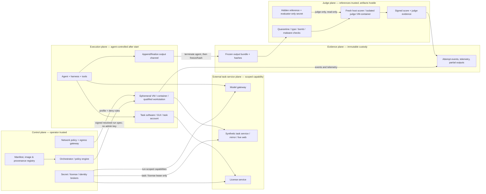

# ALE-style 1,000 runnable instances：Environment & Execution Reference Architecture

**用途：** UniPat 面试作业与 ALE-style 1,000-asset 生产方案  
**研究日期：** 2026-08-09  
**结论性质：** evidence-bounded reference architecture；不是采购报价、排期、人员配置或产能承诺  
**可执行附件：** `environment_manifest.schema.yaml`；逐源证据卡位于 `sources/`

## 执行摘要

### 核心结论

1. **[R] 采用“统一控制面 + 多种执行 substrate + 独立 judge plane”的混合架构。** Linux CLI/构建类任务优先使用受限 container；Windows GUI、驱动敏感、GPU graphics 与 licensed professional software 默认进入完整 VM 或经过资格验证的 remote workstation VM；nested virtualization 仅作为逐宿主验证的兼容路径；existing/static sandbox 默认只用于 debug。固定版 ALE 自身也混合使用 cloud VM、Linux container、QEMU/KVM-in-container 与 static provider；NIST 对 VM/container 的边界分析、Microsoft 的 Windows GUI 限制以及相邻 benchmark 的不同运行基底共同支持这一结论。[S101][S102][S105][S106][S109][S110][S114]
2. **[R] 一次运行的可复现身份不是一个 image ID，而是 `release manifest + resolved launch attestation + task/harness/evaluator bundle`。** Manifest 必须同时记录声明态 `declared` 与启动时观测态 `observed`，并保留结构化 diff；image digest、签名、provenance、SBOM、scan 与 acceptance test 分别回答“哪些字节、谁作出声明、如何构建、包含什么、扫描器发现什么、能否正确启动”，任何单项都不能单独证明安全或可复现。[S203][S206]-[S214]
3. **[R] Golden image 应定义为经过 promotion 的不可变发布物，而不是持续手工修补的“母机”。** 每次字节或语义变更都创建新版本；mutable tag/family 只能作为 promotion channel；每个 benchmark release 与每个 run 绑定 direct digest/provider version。Patch 通过 rebuild → requalify → promote；rollback 重新验证旧版后再移动 channel，不得假设“旧版天然安全”。[S203][S204][S205][S206][S215][S216]
4. **[R] Credentials 必须按 plane 与 principal 拆分。** Cloud provisioner 只留在 control plane；agent model key 尽量留在 host gateway；guest 只获得 run/audience/action-scoped capability；task account、license session、storage capability 与 evaluator secret 是不同主体；manifest 仅保存 opaque binding 和审计引用，绝不保存 secret value。固定版 ALE 的 read-once sidecar 能减少 `_spec.json` 持久化，但最终仍把 key 放进 agent 进程环境；长寿命 GCP service-account JSON 也可进入 guest，因此不能视作目标态。[S303]-[S310]
5. **[R] Network 不能一刀切。** 为每个 instance 选择 `offline`、`allowlist`、`simulated_or_mirrored` 或 `controlled_open`，选择依据是任务 construct 是否真的要求 live/current web。所有联网 profile 都必须阻断 control/judge/reference/metadata/相邻 run，限制 credentials 的 scope，并隔离下载物；search contamination 与 prompt injection 无法靠 allowlist 完全消除，只能通过可见性、约束后果与事后证据降低风险。[S007][S305][S314]-[S317]
6. **[R] Hidden reference 默认永不进入 execution plane。** 简单、被动、确定性的检查可在 host-side scorer 完成；复杂或会执行/解析不可信产物的 evaluator 在 fresh isolated judge VM/container 中完成；中心化保护收益高于服务/驻留风险时才用 versioned remote evaluation service。Same-guest post-run staging 只作为必须依赖本机 licensed software 或不可导出状态的低保证例外。[S006][S007][S301][S302][S313][S322]
7. **[F/I] 固定版 ALE 的 post-run staging 是有价值的时序控制，但不是独立 trust boundary。** Local backend 在 agent 结束后由 host copy reference；baked-in backend 则把加密 reference 留在执行 guest，解密口令通过 guest 命令使用。残留进程、被篡改 interpreter/runtime 或已复制的 ciphertext 仍需考虑；reference staging 被跳过/损坏应触发 run-validity/evaluator incident，不应自动记 agent 0。[S002][S302]
8. **[R] Retry policy 是测量协议的一部分。** 只有被独立 telemetry 证明、且发生在任何 agent-visible/irreversible effect 之前的 operator infrastructure fault，或能证明原操作未生效/真正幂等的微操作，才允许 transparent recovery。Agent 已行动后重新开始是新 trial；不得 best-of-N、只重试低分、覆盖 first attempt 或把所有 timeout/app crash 归为 infrastructure。[S113][S301][S303][S318][S320][S321]
9. **[P] 本报告不预填任何生产阈值。** Start-state integrity、software launch、input integrity、judge repeatability、artifact completeness、cleanup、revocation、incident recovery、cross-provider equivalence 等门槛，必须由代表风险格的 pilot 数据、客户的 measurement error budget、法律/安全要求与实际应用后果共同确定。

### 对关键结论的三类来源交叉验证

| 关键结论 | Benchmark / executable code | 政府 / 标准 | 独立方法研究 / 平台约束 | 研究判定 |
|---|---|---|---|---|
| Hybrid substrate，而非一种万能 sandbox | ALE fixed providers [S101]-[S104]；SWE-bench/Terminal-Bench container lane [S109][S110] | NIST VM/container guidance [S105][S106] | Windows GUI、nested、RDP/GPU 约束 [S114]-[S120] | **[I] 支持**；适用单位是异质 portfolio，不是“每项都用 VM” |
| Manifest 必须覆盖完整 configured system | ALE paper/code lifecycle [S001][S002][S201][S202] | NIST baseline/SSDF [S203][S205] | OCI/SLSA/SPDX/Reproducible Builds [S206]-[S211] | **[I] 支持**；必须拆 declared/observed |
| Separate judge 优于 same-guest staging | ALE lifecycle 与 baked-in code [S002][S302] | NIST AITE/CAISI sequestering 与 cheating [S006][S007] | OWASP hostile artifact guidance；SWE-bench harness [S313][S322] | **[I] 支持**；同时防 reference leakage 与 judge tampering |
| Runtime least privilege；secret 不进入 image/context/log | ALE sidecar 与静态 key 路径 [S303] | NIST 800-190/207、RFC 9700 [S304]-[S306] | OWASP secrets/logging；cloud workload identity [S307]-[S310] | **[I] 支持**；agent 必须使用的能力只能约束，不能对 agent 隐形 |
| Network profile 应服从 task construct | ALE contamination intent [S301] | NIST CAISI、AI 100-2、Zero Trust [S007][S314][S305] | AgentDojo、indirect injection、WebArena [S315]-[S317] | **[I] 支持**；live web 例外必须显式 |
| Retry 会改变 estimand | ALE/Inspect retry behavior [S113][S301][S318] | RFC 9110 幂等语义 [S320] | *AI Agents That Matter* [S321] | **[I] 支持**；恢复 attempt 与原 attempt 必须并存 |
| Image identity 与 runtime equivalence 不同 | ALE start/evaluate [S201][S202] | NIST CM/SSDF [S203][S205] | OCI/SLSA/Reproducible Builds、GPU/Windows 约束 [S206][S207][S211][S217]-[S220] | **[I] 支持**；至少分三类 reproducibility claim |

## 1. 范围、证据冻结与判定语言

### 1.1 ALE 证据冻结

| Surface | 冻结版本 | 本报告用途 | 不可外推的内容 |
|---|---|---|---|
| Paper | `arXiv:2606.05405v2` | 任务/环境/agent/evaluator 设计，作者的 failure/contamination 主张 | 不把作者设计主张当作实现安全证明 |
| GitHub | `1e615e456de7cef57706680613cb80ee13c7fc76` | 执行 lifecycle、provider、image、secret、retry、reference staging 的可执行证据 | 不把后续 main 或本地修改混入冻结事实 |
| Hugging Face | `a8c1fd174a1f6cfa76526572a2e3ebece1276be2` | 公开 metadata/file boundary | 不把 metadata card 当 runnable environment 或完整 private corpus [S005] |

**单位边界：** 本报告设计的是 **1,000 个 runnable instances** 的生产基础设施；`benchmark`、`domain`、`workflow`、`task card`、`runnable instance`、`submission`、`release` 与 `run/attempt` 均是不同单位。1,000 是目标 instance 数，不提供任何 substrate 数量、镜像族数量、并发、人员或周期的数学依据。

### 1.2 五类判定标签

- **[F] 来源直接支持的事实：** 论文报告内容、固定代码行为、规范定义或产品明确限制。
- **[C] 作者/机构主张：** 例如论文作者关于“deterministic start”的设计主张，未自动转化为独立验证事实。
- **[I] 研究者推断：** 基于多个证据面做出的架构或风险判断。
- **[R] 本项目建议：** 可直接进入 implementation plan，但仍需 change control。
- **[P] 客户/pilot 才能确定：** 阈值、次数、容差、法律许可、任务 profile、provider qualification 与 estimator。

## 2. Reference architecture 与 trust boundaries

### 2.1 设计原则

1. **[R] Plane separation：** Control plane 负责 resolution、provisioning、policy 与 ledger；execution plane 在 agent 启动后按不可信处理；evidence plane 只接收 append/finalize artifacts；judge plane 才能访问 hidden reference/evaluator secret；external service plane 只提供 task-scoped/lease-scoped 能力。
2. **[R] 三重隔离：** Placement boundary（reference 不在 execution）、temporal boundary（agent/process/credential 终止并冻结 output 后才评分）、principal boundary（provision/task/license/agent/judge 为不同身份）。仅有“晚一点 copy”不等于三者齐备。
3. **[R] Artifact first：** 先冻结、hash、签名 output bundle 与 attempt ledger，再启动 judge。Judge 只读 reference/evaluator，读取不可信 artifact；不得反向修改执行产物。
4. **[R] Evidence over labels：** `container`、`VM`、`remote desktop` 是产品/包装标签；manifest 还必须记录实际 kernel owner、privilege、host mount、device passthrough、management-plane 权限与 reset semantics。[S101][S106][S115]
5. **[R] Every run is resolved：** Release manifest 是声明，run attestation 是实际落地；任何 required-field drift 都要么命中预先批准的 equivalence class，要么判为 environment incident，不得在低分后事后豁免。

### 2.2 Trust-boundary diagram

**禁止路径：** execution → reference store；execution → judge/admin API；execution → cloud metadata/control plane；judge → execution writable state；execution → adjacent run。**例外：** 当 licensed/on-VM verifier 必须读取不可导出状态时，先 fence agent principal、终止其进程与网络、创建只读 clone/snapshot，再由独立 judge identity 在 clean verifier namespace 中访问；若仍是同一 guest，manifest 必须标记 `exception_same_guest` 与 lower-assurance reason。

### 2.3 End-to-end run protocol

| 阶段 | 控制动作 | 必须产生的证据 | 失败默认归属 |
|---|---|---|---|
| 0 Build | IaC/recipe 构建；生成 digest、provenance、SBOM、scan；签名 candidate | build attestation、SBOM/scan refs、immutable image ID | build/supply-chain incident |
| 1 Resolve | 解析 task/environment/agent/harness/evaluator/network/credential policy | signed resolved manifest；所有直接版本 | control-plane incident |
| 2 Provision | 创建 fresh instance/overlay；注入最小 capability；禁止 reference | provider IDs；credential binding IDs；start timestamp | pre-measurement infra |
| 3 Preflight | 核验 declared vs observed；software/license/GPU/display/input/network probes | structured diff；test suite version；admission decision | mismatch 则 `not admitted` |
| 4 Execute | 启动 agent；记录事件、trajectory、资源、network decisions 与 partial output | append-only attempt ledger；raw+redacted artifact refs | 通过双轴 taxonomy 判定 |
| 5 Freeze | 停止/fence agent；撤销 agent capability；finalize output；hash/sign | frozen bundle hash；quiescence/revocation event | artifact/revocation incident |
| 6 Judge | Quarantine artifact；fresh judge 读取 reference/evaluator；签名结果 | judge image/evaluator/ref hashes；score；logs；replay ID | evaluator incident；只 regrade |
| 7 Teardown | task logout、license return、credential revoke、VM/overlay 删除/净化、orphan reconciliation | cleanup/revocation/sanitization attestation | cleanup/security incident |

## 3. Environment manifest schema

完整可执行逻辑 schema 见 `environment_manifest.schema.yaml`。它不是 secret store，也不是 task card；它描述一个 immutable environment release 与一次 resolved run。

### 3.1 Manifest 的三种视图

| 视图 | 可见内容 | 明确禁止 |
|---|---|---|
| `public/agent_view` | 任务允许知道的 OS/software/interface/input/output/network affordance | hidden reference identity/hash、evaluator internals、secret locator、policy canary |
| `operator/control_manifest` | 所有非 secret 配置、opaque binding、provider/image/policy/reference custody metadata | secret/license/token value；可离线枚举的小空间 secret hash |
| `run_attestation` | 实际 resolved image/host/OS/driver/display/software/license readiness/network、diff、attempt/artifact/judge/cleanup hashes | 可复用 credential；未脱敏 security log 内容 |

### 3.2 Required field groups

| 组 | 必须记录的核心内容 | 为什么 image ID 不够 |
|---|---|---|
| Identity | manifest/instance/workflow/environment family/release、owner、supersedes、ALE evidence freeze | workflow/task/run 单位不能混用 |
| Image & supply chain | provider immutable ID、content digest、parents、recipe/IaC、builder、provenance、SBOM、signature、scan DB/version、waiver | digest 只证明字节；不证明来源、组成或可运行性 [S206]-[S214] |
| OS & substrate | OS edition/build/kernel/patch/arch、hypervisor/runtime、effective boundary、privilege、host mounts、nested layers、secure boot/IOMMU/vTPM | host/kernel/privilege/device 改变安全与行为边界 [S105][S106][S115][S217] |
| Compute/GPU | vCPU/CPU class、memory/storage、GPU model/profile/count、host+guest driver、runtime/firmware、compute/render/encode claims | `gpu: true` 无法区分 CUDA、app rendering 与 remote frame encoding [S117]-[S120] |

| 组 | 必须记录的核心内容 | 为什么 image ID 不够 |
|---|---|---|
| Display/locale | resolution、DPI/scale、color depth/profile、desktop/session、RDP/DCV/VNC versions、codec/chroma、monitors、dynamic resolution、fonts、keyboard、locale、timezone/clock | GUI layout 与 screenshot/coordinate 可由 client/session 改变 [S118] |
| Software/plugin/license | exact app/plugin/version/hash、installer/recipe、lockfile、config hash、launch/version probe、update policy、license model/scope/terms evidence | 专业软件的 installer、activation 与 entitlement 常在 image 外 [S104][S122] |
| Filesystem | base snapshot、partition/mount/ACL/user、input/software/output/scratch/reference contract、writable allowlist、attached volume/reset、forbidden residue | user/profile/volume 可跨 reboot/rebuild 残留 [S103][S121] |
| Network | profile/revision、DNS/proxy、destinations/actions、inbound、download quarantine、upload/DLP、contamination controls、traffic-log policy、mirror fixture hash/reset | live service/redirect/CDN/metadata route 会引入漂移与泄漏 |
| Data bindings | visible input hash/size/media/license；judge-only reference/fixture binding；task account/reset | input/reference 的 custodian 与时序影响 run validity |
| Credentials | class、issuer、subject、audience/actions/resource scope、injection、TTL、revocation/audit ref、`value_present:false` | 需要能力描述与撤销证据，不能把 value 变成 metadata [S304]-[S310] |
| Lifecycle | preflight/start/reset/cleanup/retry/failure-adjudication workflow 版本；fresh-start 与 preserve-all-attempts | `reboot`、`restore`、`rebuild`、`delete` 语义不等价 [S121] |
| Agent/harness | agent/model/revision、harness/executor、prompt hash、tools/permissions、memory/subagent policy、budgets、termination | ALE-style 测量对象是 configured agent system，不是裸模型 |
| Evaluator | code/image/deps/score schema、judge substrate、reference binding、model-judge identity/prompt/sampling、parser hardening、fixture results | scorer version与 placement 决定可重复性和泄漏面 |
| Observability | event/trajectory schemas、raw+redacted logs、network/resource telemetry、partial output、WORM store、retention/legal hold | 失败 run 也必须可归因/重放/审计 |

| 组 | 必须记录的核心内容 | 为什么 image ID 不够 |
|---|---|---|
| Acceptance/run attestation | suite/report refs、declared-observed diff、attempt effects、frozen output/judge/score/cleanup hashes、signature | release 声明必须绑定真实启动与终止证据 |

### 3.3 Identity、policy、diagnostic 与 secret-sensitive 字段分工

- **[R] Identity fields：** 任何改变都会产生新 environment/harness/evaluator release，例如 direct image digest、OS build、app/plugin、driver/runtime、display profile、fixture digest、policy revision、harness/evaluator code。
- **[R] Diagnostic fields：** 运行时观测 CPU model、resolved host、boot/launch timing、network decision、resource telemetry；用于判断是否匹配批准的 equivalence class。
- **[R] Policy fields：** retry eligibility、network profile、retention、download/quarantine、waiver、cleanup/revocation、acceptance threshold profile；全部 versioned 且 pre-frozen。
- **[R] Secret-sensitive fields：** 只保存 opaque binding/audit ID。Hidden reference plaintext hash、exact object locator 与 evaluator prompt 也可属于 restricted/evaluator-only metadata；不因“不是 password”就进入 public view。

## 4. Substrate selection：VM、container、nested、existing sandbox、remot…8498 tokens truncated…tart attestations / attempted starts`；同时报告各 required-field mismatch | substrate × OS × image family × reset path | `θ_SSI`、mismatch taxonomy、equivalence classes |
| `SLR` Software launch readiness | `app/plugin/version/license probe pass / eligible preflights` | app/version/license model/cold-warm | `θ_SLR`、launch latency distribution |
| `IIR` Input integrity | `all visible input hashes/ACL/path match / staged attempts` | input type/size/staging backend | `θ_IIR`、corruption/missing handling |
| `GSF` GUI state fidelity | display/session facts match + structural/visual calibration statistic | app/display/session/client/codec | `θ_GSF` 与 per-app tolerance |
| `GPR` GPU path readiness | required compute/render/encode probes pass / GPU preflights | GPU/profile/driver/app/path | `θ_GPR` 与 fallback detection |
| `CPR` Control-plane readiness | required control endpoints healthy and policy-bound before agent | provider/substrate/region | `θ_CPR` 与 failure signatures |
| `ER` Evaluator repeatability | Deterministic: exact rubric+score agreement；continuous/stochastic: within-artifact difference/flip/ICC 等预先指定统计 | evaluator class/version/reference/model judge | `θ_ER,class` 与 drift envelope |
| `RAC` Run-artifact completeness | `terminal attempts with all required integrity-valid artifacts / terminal attempts` | status/stage/substrate | `θ_RAC`、missing-channel distribution |
| `CI` Cleanup integrity | `attempts with expected resource/session/credential/license/storage reconciliation / teardown-eligible attempts` | terminal state + failure stage + provider | `θ_CI`、orphan types |
| `RVK(t)` Revocation success | `capabilities proven unusable by elapsed t / revocation tests` | credential/task/license class | `θ_RVK,class(t)` 与 latency distribution |
| `IRS` Incident recovery success | `drills restored to accepted state and complete evidence / incident drills`；另报 detection/contain/recovery times | incident type/substrate/provider | `θ_IRS`、RTO/RPO-like client targets |
| `CPE` Cross-provider equivalence | `oracle replay pairs within approved output/evaluator/GUI equivalence / eligible pairs` | environment family/provider pair | `θ_CPE`、non-equivalent fields |
| `IAC` Infra-adjudication completeness | `infra exclusions with required independent evidence + review / claimed infra exclusions` | cause/stage/reviewer | `θ_IAC`、undetermined rate/agreement |
| `JIS` Judge isolation security | no forbidden reference/artifact escape, tamper or network path in adversarial tests | judge substrate/parser/artifact class | non-compensable gates + `θ_JIS` where statistical |

**不要合并成一个“reproducibility score”：** SSI/SLR/IIR 代表起点；ER 代表评分器；RAC 是证据完整性；CI/RVK/IRS 是终止与运营；CPE 是可移植性。加权平均会让一个领域的高分掩盖 reference leak、secret exposure 或 evaluator mismatch 这类不可补偿失败。

### 10.2 Pilot measurement plan

1. **Risk-cell coverage，不是领域配额。** 只覆盖实际 scope 中的组合：`substrate × OS × GUI/CLI × GPU path × licensed/unlicensed × network profile × reset path × evaluator class`。每格 `n_cell`、repeat `r_cell`、forced incidents 与 confidence 由客户的风险、可用资产与 pilot variance 决定。
2. **Deterministic oracle first。** 先用 scripted oracle 隔离 environment variance，再在通过资格的环境中运行 agent；否则 agent stochasticity 会污染 environment SLA。
3. **Same-host / cross-host / cross-provider：** 对同 image/manifest 做同宿主重复、跨宿主与必要时跨 provider；明确 block live service/time window，避免把网站变化错归 substrate。
4. **Positive/negative/adversarial fixtures：** 正常、部分、损坏、gaming、malicious artifact、secret canary、residual process、network bypass、orchestrator kill、license outage。
5. **Statistics：** Binary reliability 同时报点估计与预先选定 confidence interval；latency 报 distribution/quantiles 并分 cold/warm、GPU、license；judge 报 exact agreement 或 within-artifact dispersion/flip；adjudication 报 reviewer agreement 与 undetermined share。
6. **Threshold selection：** 从 downstream measurement error budget、task consequence、security/legal non-compensable gates、客户 utility 与 pilot distributions 倒推；在 production 前冻结。不得从 ALE 的公开 pass rate、repeat count 或 task count复制阈值。
7. **Change trigger：** Image/OS/app/plugin/driver/GPU/session/network/mirror/harness/evaluator/license model/provider reset 任何身份变化，按影响范围重新 qualification；不可用“minor update”绕过。

### 10.3 尚待 pilot/客户确定的 SLA 变量

- `θ_SSI, θ_SLR, θ_IIR, θ_GSF, θ_GPR, θ_CPR, θ_ER,class, θ_RAC, θ_CI, θ_RVK,class(t), θ_IRS, θ_CPE, θ_IAC, θ_JIS`。
- `n_cell`、`r_cell`、forced-incident 次数、confidence level/interval method、per-app GUI tolerance、evaluator repeat count。
- 每 provider 可接受的 reset verb 与 evidence contract；cross-provider equivalence classes。
- Retry-eligible signatures、effect boundary、first-attempt vs recovery estimator、manual adjudication owner。
- Incident detect/contain/recover objectives、orphan reconciliation、secret rotate、license/task-session release、storage sanitization evidence。

## 11. 最强反方证据、适用边界与 residual risks

1. **反对“所有任务都用 VM”：** SWE-bench、Terminal-Bench 与 Inspect 说明 Linux CLI/container 是有效适用域；full VM 增加 image/patch/boot/driver 运维面。[S109][S110][S112] **结论：** hybrid routing，不是 VM-only。
2. **反对“container 必然是共享 kernel/弱隔离”：** Hyper-V isolated container 和 QEMU-in-Docker 说明产品名不等于实际边界。[S101][S115] **结论：** 记录 effective boundary。
3. **反对“VM/snapshot 就可复现”：** RDP client 可改变 display；GPU driver/license/migration/reset 有约束；PyTorch 不保证跨平台/release 完全相同；remote rebuild 可能恢复 user volume。[S118]-[S121] **结论：** runtime attestation + replay tests。
4. **反对“完全离线”：** 真正的 research、SaaS、current data 与 online license task 可能需要连接；mirror 测量的是 replica。**结论：** task-level profile + live-web exception，不是全局禁网。
5. **反对“credential 永不让 agent 看见”：** 登录/API/GUI 本身可能是 task affordance。**结论：** synthetic least-privilege capability，隔离 admin/真实数据；不要虚称隐形。
6. **反对“separate judge 总是可用”：** Licensed/on-VM professional app 与不可导出状态可能要求本机 verifier。[S301] **结论：** 优先 clean clone；same-guest 是 fenced、attested、lower-assurance 例外。
7. **反对“remote judge 一定最安全”：** 它集中 reference，但引入 opaque service、availability、data residency、retention、model/API drift 与 regrade 依赖。**结论：** local deterministic scorer 能完成时不要远程化；远程服务需 exact version/evidence contract。
8. **反对“post-run staging 已解决泄漏”：** 它降低 agent 正常路径的可见性，但固定 ALE baked-in ciphertext/guest command、残留进程与 tampered runtime 仍是 attack surface。[S302] **结论：** placement + temporal + principal 三重隔离。
9. **反对“separate judge 已解决 evaluator security”：** Agent 控制提交 bytes；parser、macro、archive、media、serialized object 可攻击 judge。[S313] **结论：** quarantine + no-network disposable parser sandbox。
10. **反对“完全不 retry”：** Pre-measurement transient infra fault 会造成与可用性相关的 missingness；Inspect 支持 recovery，同时警告 retry 导致 distribution shift。[S318] **结论：** 独立证据、clean start、immutable attempt ledger、predeclared estimator。
11. **反对“timeout 都是 agent failure / 都是 infra”：** Provider stall 与 agent strategy 都可能导致 timeout；ALE 的探索性 taxonomy 不能直接决定生产统计处理。[S301] **结论：** cause/owner 与 disposition 双轴。
12. **供应商文档边界：** Microsoft/NVIDIA/AWS/Google/Autodesk/Revenera 只证明某机制、兼容矩阵、许可模型或已知问题；不证明本项目安全、可靠、经济，也不提供发生率。所有 cost、throughput、availability、seat count、acceptance threshold 仍为 **[P]**。

**Scope exclusions / new-pilot triggers：** macOS、physical dongle、audio/MIDI、USB/serial、HSM、special camera/display calibration、kernel module、dedicated physical robot/instrument 未在本研究充分覆盖；进入 scope 时新增 substrate/device/license-specific evidence stream。

## 12. 可直接采用的项目建议

### 12.1 Architecture decision records（建议立即冻结）

1. **ADR-ENV-001：** 采用 control / execution / evidence / judge / external-service 五 plane；reference/evaluator secret 不进入 execution。
2. **ADR-ENV-002：** 采用 hybrid substrate routing；Windows GUI/licensed app 默认 full VM；Linux CLI 默认 container candidate；nested/existing/remote 需资格规则。
3. **ADR-ENV-003：** 每个 instance/run 绑定 immutable manifest、direct image ID/digest、harness/evaluator versions 与 resolved attestation。
4. **ADR-ENV-004：** `latest`/image family 只能是 signed promotion channel，不是 run identity；patch 和 rollback 都要 rebuild/requalify 或 revalidate。
5. **ADR-ENV-005：** Host gateway/workload identity 优先；cloud admin 与 evaluator credentials 禁止进入 guest；task/license/storage 分 principal。
6. **ADR-ENV-006：** Network profile 是 instance construct 字段；controlled-open 是显式 exception；四种 profile 分别 versioned。
7. **ADR-ENV-007：** Host passive scorer / fresh isolated judge 为默认；same-guest 标 lower assurance；artifact 对 judge 一律不可信。
8. **ADR-ENV-008：** Failure taxonomy 使用 cause/owner + measurement disposition 双轴；没有独立证据不得 infra exclusion。
9. **ADR-ENV-009：** 保留所有 attempts 与 partial artifacts；recovery attempt 不覆盖 first attempt；judge failure 只 regrade。
10. **ADR-ENV-010：** Production gates 只引用 pilot threshold profile；任何 public benchmark 数量或成绩不得变成 SLA 默认值。

### 12.2 Production onboarding gate for each runnable instance

一个 instance 只有满足下列条件才从 `development` 进入 `accepted release pool`：

- Task/output/evaluator construct 与 measured system boundary 已明确；
- Substrate routing 有理由且 required host/device/session/license 能被观测；
- Environment manifest、IaC/image/provenance/SBOM/scan/signature 完整；
- Visible inputs 与 hidden reference/evaluator custody 分离并 hash/version；
- Credential/license/task-account/network profile 有 owner、scope、reset/revoke/audit；
- ENV-001 至适用测试已通过客户批准的 `pilot_threshold_profile`；
- Positive/negative/partial/gaming/malicious evaluator fixtures 已运行；
- Failure/retry/retention/cleanup/incident ownership 已签字；
- Refresh trigger 与 rollback predecessor 已登记。

## 13. 尚待确定的客户输入与 pilot 变量

| 类别 | 必须输入/测量 | 为什么公开证据不能决定 |
|---|---|---|
| Measured system | model-only、model+harness、或 hosted agent service；provider/tool/network 是否属于 subject | 同一 429/GUI crash/timeout 的归属会随边界变化 |
| Portfolio | 实际 OS/GUI/CLI/GPU/app/license/network/evaluator 风险格；不是领域配额 | 1,000 instances 不推出 substrate/image family 分配 |
| Licensing/legal | 每产品 automation/VDI/cloud/clone/snapshot/concurrency/evaluator/redistribution 权利 | Vendor/product/contract-specific，供应商示例不可泛化 |
| Network | live/current necessity、endpoint/action、mirror freshness、privacy/DLP/logging、contamination response | Task construct 与数据分类决定 |
| Secrets/accounts | IdP/broker capabilities、token scope/TTL/revoke、synthetic account reset、break-glass | 客户 IAM 与服务支持决定 |
| Judge | artifact classes、parser risk、on-VM dependency、remote service residency/retention/regrade、LLM judge drift | Evaluator 设计与客户风险决定 |
| Retry/estimator | effect boundary、eligible signatures、first-attempt/fixed-repeat/retrying-system estimator、adjudicator | Retry 改变 estimand，需在数据前冻结 |
| SLA/statistics | 所有 `θ_*`、`n_cell/r_cell`、confidence、visual/evaluator tolerance、incident/revocation/cleanup objectives | 应来自 pilot variance 与 measurement error budget |
| Retention/sanitization | Raw/redacted/security log、snapshot、reference、judge package、legal hold 与 cloud sanitization evidence | 法律、安全、数据分类与 provider 可见性决定 |
| Operations | Provider qualification、change cadence、emergency revocation、rollback comparability policy | 不能从 benchmark task count 推导 |

## 14. 来源表

完整逐源记录（访问日、版本、短引文、支持/反方、边界与质量评分）在 `sources/`；`sources.csv` 是索引。下表列出支撑最终架构的主要来源。

| ID | Source / version | 类型 | 本报告用途 | 关键边界 |
|---|---|---|---|---|
| S001 | *Agents' Last Exam*, arXiv:2606.05405v2 | Canonical paper | Environment/task/agent/evaluator contract | 作者主张不等于实现安全证明 |
| S002-S004 | ALE GitHub `1e615…` lifecycle/providers/secrets/retry/cleanup | Fixed official code | 可执行事实与实现 gap | 只代表固定 commit |
| S005 | ALE HF `a8c1…` | Fixed metadata | Dataset surface boundary | Metadata 不等于 runnable instance |
| S006 | NIST AITE | Government method | Sequestered testbed/test data | 不规定具体 infra，也不防 hostile artifact |
| S007 | NIST CAISI evaluation cheating | Government method/risk | Contamination 与 grader gaming | 不提供 ALE 发生率 |
| S008 | NIST SP 800-88r2 | Government guidance | Sanitization evidence | 不等于 credential revoke/license return |
| S101-S104 | ALE fixed QEMU/provider/static/license docs | Official code/docs | Hybrid substrate、existing sandbox、licensed software | ALE-specific implementation |
| S105 | NIST SP 800-125 | Government guidance | Full virtualization boundary | 较旧；产品细节需 refresh |
| S106 | NIST SP 800-190 | Government guidance | Shared-kernel/container security | 不覆盖所有 microVM/isolated container |
| S107-S113 | OSWorld, SWE-bench, Terminal-Bench, Harbor, Inspect | Papers/official frameworks | Adjacent execution/log/retry patterns | 相邻 evidence，不是 ALE replication |
| S114-S118 | Microsoft Windows container/Hyper-V/nested/AVD/RDP docs | OS/hypervisor docs | Windows GUI、nested、GPU/session constraints | Platform/vendor-specific |
| S119-S120 | NVIDIA vGPU notes; PyTorch reproducibility | Vendor/framework docs | GPU driver/license/nondeterminism | 不提供项目故障率 |
| S121-S122 | AWS WorkSpaces reset; Autodesk virtualization | Provider/vendor docs | Reset semantics 与 license rights variability | 不能泛化全部 providers/products |
| S203-S205 | NIST CM-2, SP 800-190, SSDF | Government standards/guidance | Baseline、image lifecycle、release integrity | 需映射到实际 builder/provider |
| S206 | OCI Image Spec v1.1.1 | Open standard | Digest/content identity | 仅 container artifact；不含 runtime host |
| S207-S208 | SLSA v1.2; in-toto | Open supply-chain standards | Provenance/attestation | 信任继承 builder/control plane |
| S209-S212 | SPDX 3.0.1, CycloneDX 1.7, Reproducible Builds, NTIA SBOM | Standards/method | Composition 与 reproducibility definitions | SBOM 不是 vulnerability/safety proof |
| S213-S216 | CISA/NSA signing; NIST scanner limits; Docker pinning; GCP image family | Gov/vendor docs | Sign/scan/pin/channel/rollback | Mechanism线索，不等于项目 outcome |
| S217-S222 | Windows compatibility/license, NVIDIA driver, OSWorld release, Packer, NIST IaC | Platform/standard/docs | Host/external boundary、golden image、IaC | Vendor claim 需独立 acceptance |
| S301-S303 | ALE paper + fixed reference/secret/retry code | Canonical paper/code | Judge、credential、failure counterevidence | 不能从 attack surface 推断已发生事件 |
| S304-S306 | NIST 800-190/207; RFC 9700 | Gov/IETF | Runtime secret、zero trust、token audience/action | General control，不替代 task design |
| S307-S310 | OWASP secret/logging; Google/AWS workload identity | Security/vendor docs | Gateway, TTL, revoke, audit, log hygiene | Cloud product behavior需现场验证 |
| S311-S312 | FlexNet; NVIDIA vGPU licensing | License vendor docs | 多种 license lifecycle | 仅行业机制线索，不支撑 seat 数 |
| S313-S317 | OWASP file upload, NIST AI 100-2, AgentDojo, indirect injection, WebArena | Security/method/paper | Hostile artifact、prompt injection、mirrors | 不能证明完全防御或项目发生率 |
| S318-S322 | Inspect errors/logs, RFC 9110, *AI Agents That Matter*, SWE-bench harness | Framework/standard/method/code | Retry estimand、idempotency、failure evidence | 要映射到本项目 measured system |

## 15. Refresh targets

| Target | 为什么会变 | Refresh trigger |
|---|---|---|
| ALE paper/repo/HF | Provider、reference staging、retry、redaction、taxonomy、dataset files 会变 | Architecture sign-off、每个 pilot/release；保留 frozen ledger，不覆盖本报告事实 |
| NIST AITE/CAISI/AI 100-2、800-190/207/88、SSDF | Agent security、sequestering、sanitization、supply-chain guidance 更新 | 新 revision/edition 或 security review |
| OCI/SLSA/SPDX/CycloneDX/SBOM guidance | Spec/version/attestation schema 更新 | Builder/registry upgrade 或 spec revision |
| Microsoft Windows/Hyper-V/RDP/AVD | OS build、GUI/container/nested/GPU/session support 改变 | Host/guest/remote client/server upgrade |
| NVIDIA GPU/vGPU/CUDA drivers/license | Compatibility、known issues、license enforcement、SKU retirement 改变 | Driver/GPU/profile/host migration |
| 每个 professional software vendor/EULA | Automation、cloud/VDI、clone/snapshot、named/floating、machine identity 改变 | Image build、renewal、app/version/substrate change |
| Cloud/remote providers | Image、reset/rebuild/restore、profile storage、IAM、GPU SKU、artifact/control API 改变 | Provider qualification/release |
| Search/sites/mirrors/task services | Endpoint、auth、content、UI、results、policy 漂移 | 每个 network-policy release；mirror snapshot 留档 |
| Judge/evaluator/model APIs | Model aliases、prompt/deps、retention、availability、scoring drift | 每个 evaluation release/依赖变更；重新做 ENV-017 |
| Scanner/malware/parser rules | 新漏洞、格式与 DB 每日变化 | Rescan feed；critical finding 触发 rebuild/requalify |
| Pilot threshold profile | 环境/portfolio/风险/measurement error budget 变化 | 每 pilot wave、material drift 或 incident postmortem |

## 结论

这套 1,000-instance 环境方案的核心不是预先决定“用多少 VM 或多少人”，而是把每个 runnable instance 变成一个可审计的系统契约：**不可变 release + 实际启动 attestation + 最小权限执行 + 冻结证据 + 独立 judge + 可追溯清理**。公开证据足以支持这些控制方向，也足以指出 ALE 固定实现中 same-guest reference、guest credentials 与 retry 的适用边界；但它不足以决定任何生产阈值、比例、并发、周期或成本。那些值应由风险分层 pilot 测量后，在 production 数据产生前冻结。
