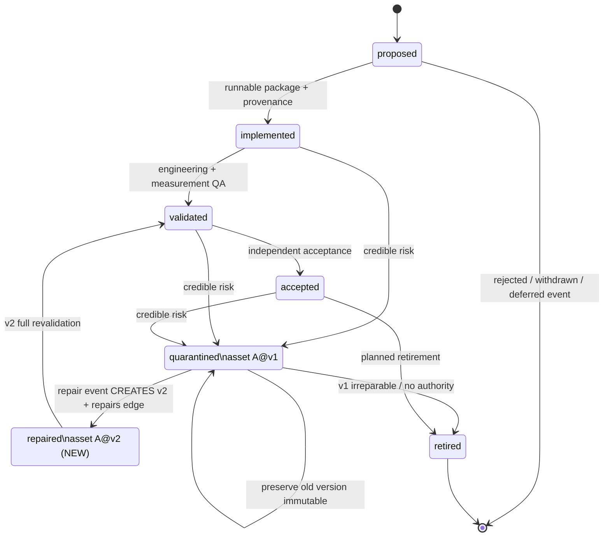
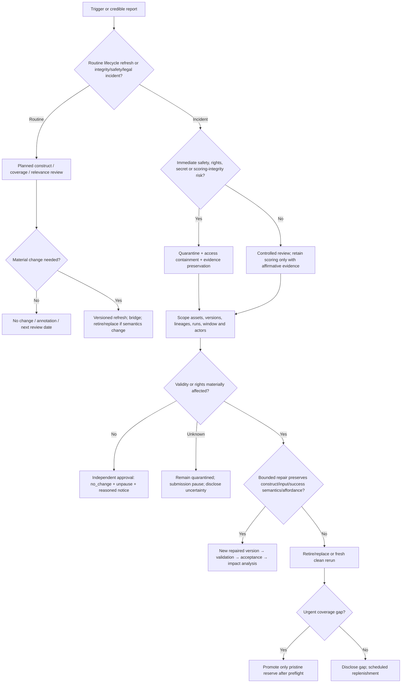

# ALE-style living benchmark：Release Architecture、污染控制与生命周期治理

**用途：** UniPat 面试作业与 1,000-asset 生产方案  
**证据截止：** 2026-08-09  
**ALE 冻结基线：** `arXiv:2606.05405v2`；GitHub `1e615e456de7cef57706680613cb80ee13c7fc76`；Hugging Face `a8c1fd174a1f6cfa76526572a2e3ebece1276be2`  
**重要限制：** 本报告不从 ALE 或任何公开 benchmark 的 release counts 推导人员、工时、成本、周期、throughput、acceptance yield、通过率、阈值、领域配额或 public/private/rotation 比例。

## 0. 阅读规则与证据边界

全篇使用以下标签，避免把证据、主张和项目决策混在一起：

- **[E] 来源事实：** 来源直接支持且本研究可定位的事实。
- **[C] 来源主张：** 论文作者、机构或供应商的解释/宣称；不等同于本研究独立验证。
- **[I] 研究者推断：** 多源证据支持的项目语境推断，但不是来源原句或已验证的项目事实。
- **[P] 项目建议：** 可直接进入 ALE-style 1,000-asset 方案的治理规则。
- **[V] 客户/pilot 变量：** 必须由客户输入、合同、风险偏好或 pilot 测量确定。

“Asset”在本报告中默认指**已定义身份的 concrete runnable instance**。Workflow family、workflow、concrete instance、submission、release 和 run 是不同单位；只有客户另行定义，1,000-asset 目标才可包含其他单位。

## 1. 核心结论

1. **[P] 把治理对象拆成五个正交轴，再提供六个业务视图。** 原子记录分别是 asset lifecycle、pool purpose、access class、release membership、version/lineage；development/demo、restricted validation、private final、rotation reserve、training、retired archive 是业务用途/派生视图，不能塞进一个 `status` 字段。
2. **[P] 同一 workflow family 可以跨池，但必须重新实例化 attack surface。** 只允许共享稳定的能力构念/工作流契约；concrete inputs、reference、hidden tests/secret seeds、environment state、外部 IDs、ACL 和 canary/copy IDs 不得直接复用。
3. **[P] Public subset 的主功能必须先由 intended decision 冻结。** 若 adoption/integration 是主约束，它承担示例、开发、harness integration、复现；若监管/科学透明是主约束，它可主要承担公开审计或 representativeness check。无论哪种，representativeness 都必须验证，且 tuned public score 不是 unseen final evidence。
4. **[P] “保持 private”不是污染控制方案。** Pretraining exposure、post-training optimization、public solution、near-duplicate、search-time contamination、reference/evaluator leakage、internal leakage、repeated-query hill climbing 是八条不同路径；需要身份、访问、服务端执行、反馈信息预算、日志、传感器、审计与 incident response 的组合。
5. **[P] Gating 和 evaluation-as-a-service 缩小直接暴露面，却增加 operator trust、集中式服务、日志和内部权限的新攻击面。** Canary/watermark 只能作为检测/归因传感器；未触发不能证明没有污染。
6. **[P] 原子 lifecycle 只描述内容成熟度与资格。** `proposed → implemented → validated → accepted`；可信风险进入 `quarantined`；`repaired` 表示新 version 等待重新验证；不可修复进入 `retired`。`active-public`、`active-private`、`rotation` 和 `replaced` 是由多轴组合计算的派生视图，不是 lifecycle 原子状态。
7. **[P] Quarantine 是保全证据的暂停状态，不是有罪判定；repair 也不是直接复活。** 对旧 version、旧分数和旧访问状态采用 append-only 记录，严禁静默覆写。
8. **[P] Refresh 恢复 freshness，却不自动保留可比性。** 跨版本只允许三种结果：native release score、带假设和不确定性的 bridge-linked estimate、或 `not comparable`。
9. **[P] Leaderboard 分成 historical snapshot、current live、bridge analysis。** `submission_pause` 是事故动作，不再与 frozen snapshot 混名；历史 regrade 只增加 `corrected_score_view`，alternate metric 与 bridge estimate 另列；不覆盖 original。泄漏不能靠 regrade 恢复 unseen validity。
10. **[V] Public/private/rotation 的数量与比例没有公开的通用答案。** 需要由决策损失、覆盖要求、运行方差、反馈强度、暴露半衰期、资产生成能力、维护/替换负担、权利/安全约束和 reserve burn rate 的 pilot 值共同决定。

## 2. Claim-level 三类来源 ledger

**审计规则：** 同一 canonical project 的 paper/code/data 只算一个 source family；三个栏目分别支持 recommendation 的不同组成部分，不能说任一来源“证明了整个项目 policy”。Exact ontology/state 名称始终是 [P]，不是来源事实。完整摘要见 [claim ledger](working/claim_ledger.md)；可机械连接的权威表是 [claim-source join](claim_source_join.csv)，其每行含 `source_family_id` 外键、source category、institution family、evidence role、evidence card、locator type、exact locator、supported subclause 和 boundary。`validate_claim_join.py` 检查 orphan/mismatch、三类来源、机构独立性、来源类型与定位格式、反证与边界。

| Claim | Role | Benchmark / operational family | Government / standard family | Independent method / audit family | 结论强度与边界 |
|---|---|---|---|---|---|
| CL01 五轴 registry，derived active views | P | ALE official family 显示 paper/code/data/run 是不同对象 | NIST AI 800-2 精确版本/log；W3C PROV entity/derivation | UTBoost 显示 grader/version 变化改变 score/rank | 三类支持“必须分离和追溯”；五轴 enum 是本项目 ontology |
| CL02 Public 主功能需按 intended decision 冻结；tuned public 非 unseen | P | ALE/MMLU-CF/公开 benchmark 显示 public development 与 closed test 模式 | NIST TREC/pooling 研究支持 sampling/representativeness 需验证 | Reusable Holdout/Ladder 支持 adaptive feedback 风险 | 三类支持边界；哪个功能“第一”是 V，不是通用事实 |
| CL03 Family 可跨池，score-bearing concrete/secret surface 不复用 | P | ALE official family 支持 hidden reference 与 distinct instances | NIST 800-171/WIPO 支持 least privilege/need-to-know/copy tracking | Yang et al. 支持 paraphrase/translation 绕过去重 | 各源只支持 input/reference/access 子命题；跨模态 gate 需 pilot |
| CL04 Private/EaaS 必须叠加 feedback、logging、audit | P | Codabench/Kaggle 展示 gated/phased service practice | NIST 800-171 + W3C 支持权限、audit、provenance | Reusable Holdout + Shaky Ladder 支持 adaptive attack | 可支持 defense-in-depth；不提供 quota/delay |
| CL05 Marker/detector 只是 sensor，不是 clean certificate | P | BIG-bench official canary 是 exclusion-notice 实践 | WIPO 支持 copy tracking/attribution，不支持 clean claim | Watermark methods + Duan MIA failure evidence | 三类共同限定用途；具体 power/FPR/FNR 为 V |
| CL06 Quarantine 保全证据；repair 新版本再验证 | P | ALE/SWE benchmark repair/retirement 是 operational cases | NIST AI RMF/SP 800-61r3 支持 contain/recover/improve | W3C provenance + UTBoost grader audit | Incident流程可迁移；score treatment 为项目政策 |
| CL07 泄漏不能靠 regrade 恢复 unseen validity | P | ALE hidden-reference design/retirement cases表明 secrecy 是解释前提 | NIST incident guidance支持限定 scope/containment | Controlled contamination、near-duplicate 与 grader audits支持条件效应 | 这是三类证据的保守综合；受影响 lineage/window 要 incident-specific |
| CL08 Refresh 不自动保留跨版可比性 | P | Dynabench/LiveBench/SWE-rebench rolling practices；Dynabench提示不同比分 | NCES/Testing Standards/PISA 要求 linking/invariance/error | UTBoost 显示 regrade rank 变化；dynamic theory给出 stall反证 | 支持 conditional bridge；不能宣称严格 equating |
| CL09 Historical/current/bridge 三视图，original 不覆写 | P | SWE-bench-Live frozen/live 为 operational precedent | NIST AI 800-2 + W3C 支持版本、日志、派生 | NCES/testing + UTBoost 支持新 view/警告 | 视图命名与 priority 是 policy；coverage 不全不重排 |
| CL10 Pool allocation 由客户约束与 pilot measurement 决定 | P/V | ALE counts 是特定 snapshot/单位，不能当比例 | NIST AI 800-3 支持 sampling/randomness/uncertainty建模 | Adaptive evaluation与dynamic benchmark显示反馈/refresh trade-offs | 三类支持“不能直接外推”；具体变量/比例仍未知 |

主要证据卡见 [sources/](sources/)；canonical family 去重、外链、版本、mutable/refresh owner 见 [source manifest](source_manifest.csv)。

## 3. 多池 release architecture

### 3.0 五个原子轴与派生视图

**[P] Registry 不使用复合 `release_state`。** 至少拆成：

| Axis | 原子字段 | 说明 |
|---|---|---|
| Asset lifecycle | `proposed / implemented / validated / accepted / quarantined / repaired / retired` | 只描述内容成熟度、资格暂停和退役；不编码池或 release |
| Pool purpose | `development_demo / restricted_validation / private_final / rotation_reserve / training` | 描述允许用途；retired archive 由 lifecycle + archive disposition 表示 |
| Access class | `public / identity_gated / private_service / audit_only` | 与 pool 分离；同一 purpose 可因客户/权利使用不同 access class |
| Release membership | `(release_id, asset_version_id, role, effective_from, effective_to)` | 多对多、append-only；一个 version 可同时留在 R1 historical manifest 并作为 R2 anchor |
| Version / lineage | immutable `asset_version_id` + `repairs / supersedes / replaces / derived_from` edge | Edge 同时指向 asset 与 version；不把 `replaced` 存成可覆盖状态 |

另设 **actor/model-lineage-relative exposure relation**：`(asset_version_id, exposed_surface, actor_org, model_lineage, first_known_time, evidence_strength)`；以及独立的 `global_eligibility_decision`。因此一个 item 对 lineage A 可是 exposed、对 lineage B 仍可能未见；项目仍可基于传播/公平风险做 pool-global retirement，这属于 [P] policy decision，不是 exposure fact。

用户要求的四个名称按下式计算：

- `active-public := accepted + active release membership(public_dev) + development_demo purpose + public access`；
- `active-private := accepted + active release membership(native_unseen_core) + private_final purpose + private_service access + applicable lineage eligibility`；
- `rotation := accepted + rotation_reserve purpose + no score-bearing participant/provider exposure`；
- `replaced := retired old asset + accepted successor + replaces edge`。

这保证同一 `asset_version_id` 可以同时出现在 R1 historical snapshot 与 R2 bridge manifest，而不会覆盖 lifecycle、pool、access、exposure 或 lineage。

### 3.1 五个 active purpose + 一个 retired archive view

**标签说明：** 下表的 pool 划分、允许行为和解释边界均为 **[P] 项目建议**；它不是 ALE 作者规定，也不是公开 count 的推导。

| Pool / view | 主要功能 | 允许使用 | 禁止解释/行为 | 默认访问与反馈 | 退出条件 |
|---|---|---|---|---|---|
| **Development / demo** | 示例、authoring guidance、local debug、harness integration、schema/evaluator contract tests、复现与公开审计 | 公开练习、prompt/harness/tool 开发、教学 reference | 不得称为 unseen final；不得把 tuned public score 当最终泛化证据 | Public；详细 diagnostics；公开版本和已知问题 | 暴露不导致退出；过时/缺陷则 repair 或 retire |
| **Restricted validation** | pre-final eligibility、regression、system selection、受限客户 rehearsal | 限定次数/身份的自适应验证 | 不得当作未接触 final；不得无限次调试 | Identity-gated EaaS；聚合/粗粒度或延迟反馈；完整日志 | 反馈预算耗尽、污染、漂移或到期后 rotate/demote/retire |
| **Private final holdout** | 最终比较、客户验收、对未用于系统选择的 concrete instances 做泛化检验 | 预先冻结系统后的最终运行；受控 appeal | 不作为调试器；不返回可用于逐题爬坡的 oracle | 隔离 EaaS/可信节点；最小即时信息；窗口结束后聚合披露 | 曝光、重复反馈、缺陷、漂移、权利/安全事件或计划轮换 |
| **Rotation reserve** | 替代污染、过时、缺陷、许可失效、危险或失去辨别力的 active assets | Static QA、严格预注册的 sealed local QA、未来 promotion | 不做 participant/provider-visible routine scoring、training 或 validation；每次接触必须 disposition | 最严格 IAM/KMS；无参评者反馈；reserve-contact ledger | 仍 pristine 才可 promotion；外部接触则 burn/demote；或 quarantine/retire |
| **Training assets** | SFT/RL/agent policy、tool use、author training、evaluator/harness development、regression fixture | 可公开或按许可训练 | 对参与过优化的 actor/model lineage 永久不能恢复 unseen interpretation；是否全局退役另行决策 | 按训练/许可政策；关系型 exposure ledger | 继续 training/public；缺陷/权利事件可 retire |
| **Retired archive** | `retired` lifecycle + `archive_disposition` 派生视图；历史复现、审计、appeal、漂移、lineage | 冻结查看；按权利提供受控审计 | 不参与 current allocation denominator/scoring；不等于“可重新上线” | Public-retired 可公开；private-retired 可继续 sealed | 终态；有 accepted successor + replaces edge 时派生 `replaced` |

### 3.2 Public、restricted、private 的功能边界

- **[E]** ALE 冻结 paper/code surface 包含开放框架、公开任务与 agent 不可见 reference 的设计证据。**[C]** 作者提出 private/rotation 可降低暴露风险；该主张不证明任何比例对本项目合适，也不证明已执行 rotation。[R01](sources/R01_ale_arxiv_v2.md) [R02](sources/R02_ale_github_pinned.md)
- **[P]** Public 的主职责由 decision table 决定：adoption/integration 优先时用于构建、接入、复现；regulatory/scientific transparency 优先时用于公开审计/representativeness study。其 representativeness 仍必须用 blueprint sampling、缺失 strata、pooling-bias counter-audit、public/private directional check 与不确定性验证。[R25](sources/R25_nist_pooling_bias.md)
- **[P]** Restricted validation 承认自己是 adaptive surface；每次 query/反馈消耗 exposure budget。它不应伪装成 final。
- **[P]** Private final 回答“这个冻结系统在未用于其训练/选择/逐题反馈的 concrete instances 上表现如何”。对某个 actor/model-lineage 已产生实质自适应反馈后，原始结果仍保留，但 interpretation 必须变为 exposed/adaptive。
- **[P]** Private 不等于不可审计。应公开 construct、方法、版本、aggregate coverage、QA/uncertainty、已知限制，并让受控独立 auditor 查看 raw inputs/references/graders/logs。

### 3.3 Workflow family 是否可以跨池

**答案：可以，但只在 family/construct 层复用；不得直接复用 scored concrete surface。**

跨池 gate：

1. **[P]** Family 定义的是稳定能力/专业 workflow，不包含 family-wide invariant answer 或固定 grader shortcut。
2. **[P]** 新建 concrete inputs 与独立 reference outcome；跨公开/训练/隐藏池做 text、code/AST、file hash、formula/dependency graph、image/geometry、semantic 与 workflow/evaluator graph 的多层近重复检查。
3. **[P]** 可共享 evaluator interface；hidden tests、secret seeds、weights/tolerances、exploit fixtures、error behavior 必须独立实例化或严格 access-separated。
4. **[P]** 重建/重新播种 environment；移除 cache、history、temp files、credentials、future artifacts 和可搜索 sibling metadata。
5. **[P]** 外部 ID 使用不编码 pool、sequence、customer、source path 或 sibling count 的 scoped pseudonym；只有受限 registry 保留 family lineage。
6. **[P]** Training/dev 用户和管线不得通过共享 group、bucket、CI、dashboard、backup、support 或 observability 获得 private/reserve 访问。
7. **[P]** 用 common-agent pilot 证明新实例产生新的判别信息，而非 cosmetic variation 或答案迁移。

直接复用的风险：concrete input 允许答案/文件指纹迁移；reference 直接暴露目标状态；公开 grader/parser/error/weights 可形成 grader gaming；共享 ID 支持跨池 join、enumeration、cache/log lookup；共享 ACL 使“逻辑分池”变成标签而非隔离。

允许共享的边界进一步收紧为：**construct schema、non-secret evaluator engine/interface 和受限 internal family lineage 可以共享；score-bearing concrete input/reference、secret fixtures/config/weights/error oracle、external ID namespace 与 ACL 不共享。**

### 3.3.1 Linking anchor 与 reserve contact

**[P] `linking_anchor` 是独立 release role，不属于 private-final unseen numerator。** 每个 release 机械区分三张互斥计分面：

- `unseen_core_score`：只含对适用 actor/model lineage 未暴露的 private-final native items；
- `linking_diagnostics`：anchor/bridge paired runs，只支持跨版分析；
- `exposed_validation_or_public_score`：公开、training、restricted validation 或已反馈 items。

公开/重复使用的 anchor 不得混入 `unseen_core_score`。若业务需要 composite view，必须并列披露各面分数、权重和暴露状态，不能称“全体 unseen”。Common-agent bridge 默认使用预先指定的 bridge/anchor role，不从 emergency reserve 无痕抽样。

**[P] Reserve contact classes：**

| Class | 接触方式 | 默认 disposition |
|---|---|---|
| `RC0` | Static lint、schema、license、hash、reference-only QA；无 agent/model runtime | 不 burn；仍记录 operator/access event |
| `RC1` | Sealed local QA agent/reference run；无外部 provider、参评者、task-level feedback | 有限 exposure；只有预注册 cleanliness 条件满足才可继续 reserve |
| `RC2` | 外部 model/API/provider 可见 prompt/input，或非隔离 common-agent run | 默认 burn；移为 exposed-reserve/bridge candidate，不再 pristine |
| `RC3` | Participant/team 可见或获得 item/score/error feedback | Demote 到 restricted validation 或 public/exposed；不得 promotion 为 unseen core |

每次 reserve contact 必须记录 actor/model lineage、provider retention/training terms、task surface、feedback、日志位置和 `remain / burn / demote / quarantine` 决策。

### 3.4 建议的 release bundle

**[P] 每次 release 的 immutable manifest 至少包含：**

```yaml
suite_release_id: ...
evidence_cutoff: ...
pool_snapshot_id: ...
workflow_family_schema_version: ...
asset_versions: []
input_bundle_hashes: []
reference_bundle_version: ...
evaluator_bundle_version: ...
environment_bundle_version: ...
harness_protocol_version: ...
metric_definition_version: ...
access_feedback_policy_version: ...
leaderboard_policy_version: ...
license_rights_snapshot: ...
known_incidents_and_exclusions: []
signatures_attestations: []
```

## 4. Access matrix

`R`=read；`W`=write/change；`X`=单次 runtime ephemeral use；`A`=approve；`—`=无权限。此表是最小职责分离模板，不预设实际团队人数。

**标签说明：** 整张矩阵是 **[P] 项目建议**；NIST/WIPO/W3C/MLCommons 只支持最小权限、审计、provenance 和独立检查等原则，不直接规定这些角色或权限单元格。

| Trust domain / role | Private input / environment | Submitted artifact | Reference | Evaluator production secret | Real ID map | Keys / markers | Logs | Approval |
|---|---:|---:|---:|---:|---:|---:|---:|---:|
| Registered submitter | —；只经 API/runtime | own artifact W | — | interface only | own pseudonym | — | own receipt/allowed feedback | — |
| **Agent execution worker** | X | content-addressed handoff W | **—** | **—** | pseudonym only | — | append-only run events | — |
| **Scoring worker** | **—**；不得读 agent workspace/credentials | X immutable handoff | X | X | — | non-scoring trap X only | append-only score event | — |
| Append-only log writer | — | hashes only | — | — | pseudonym/event ID | — | append only；default no read | — |
| Source curator | R/W input source | — | — | — | — | — | asset history R | — |
| Reference adjudicator | selected/masked R | test artifacts R | R/W candidate | — | — | — | adjudication log W | reference approval under review |
| Evaluator maintainer | synthetic/masked fixtures | test artifacts R | selected test reference | R/W non-production code；no prod key | — | — | evaluator-test logs R | code review only |
| Identity registrar | — | — | — | — | R/W | copy-recipient mapping only | identity events | mapping approval |
| Release steward | metadata only | hashes only | version metadata | build/version metadata | — | — | R | publication A；不得自批作者资产 |
| Security / independent audit | controlled R | controlled R | controlled R | controlled R under dual control | controlled R only if needed | controlled R under dual control | R + integrity verify | recommendation / appeal |
| Key/marker custodian | marker placement interface only | — | marker placement only | key injection interface only | recipient mapping scoped R | R/W | marker events only | key rotation A under dual control |

**[P] 强制 trust boundary：** Agent execution worker 永远不 mount/decrypt reference 或 evaluator secret；scoring worker 永远不获得 agent workspace、tool credentials、network session 或修改 handoff artifact 的权限。攻陷任一 domain 均不能独立跨越这条边界。

**[P] 权限实现不能只用 R/W/X。** Secret capability 需分别声明 `list / read / export / decrypt / mount / append / network_egress / approve`；`W` 不隐含 delete/overwrite。Break-glass 约束覆盖人、service account、CI runner、host、backup、observability 与 support tooling，并产生 stable event、expiry、双人/独立 review。实际角色合并与供应商权限为 [V]。

## 5. Contamination taxonomy

**标签说明：** 下表“定义与边界”默认是把公开方法映射到 ALE-style 场景的 **[I] 研究者推断**；“主要检测/首要缓解”是 **[P] 项目建议**；“不能推断”是证据边界。各类来源直接支持的内容与机构主张在来源卡中分别标为 [E]/[C]。

| ID | 类型 | 定义与边界 | 主要检测 | 首要缓解 | 不能推断 |
|---|---|---|---|---|---|
| T1 | **Pretraining exposure** | 基础模型参数形成阶段出现 prompt/input/reference/solution/grader 线索或近重复；通用领域知识不自动算污染 | 训练 cutoff/manifest attestation；公开语料/code/cache 搜索；membership probes；canary；fresh paired runs | private/reserve 不发布；提交绑定 base model/cutoff；重大疑点以经 preflight promotion 的 fresh private-final clean rerun | detector 未命中 ≠ 无暴露；黑盒供应商常不可完全审计 |
| T2 | **Post-training optimization** | SFT/RL/distillation、prompt/harness/tool/memory/routing 对 benchmark item 或反馈进行针对优化 | post-training lineage；benchmark-specific strings/branches/cache；public→validation→fresh active-private gap | dev/training 可合法优化但单独标记；final/reserve 禁止针对性更新；身份绑定完整 agent config | 性能提升序列本身不能证明动机或数据来源 |
| T3 | **Public solution** | gold/reference、human solution、walkthrough、repair patch、rubric/grader probe 出现在 web/code/video/log | web/code/transcript 定期搜索；reference/artifact structural fingerprints；时间线关联；copy marker | 公共池使用专门可公开 reference；private/reserve reference 和 scorer 细节隔离；retire 后才评估披露 | 删除网页不能删除模型参数、镜像、缓存和截图 |
| T4 | **Near-duplicate** | paraphrase/translation/格式或数值变换/模板换皮/近似文件、reference 或 evaluator graph | exact hash → normalized fingerprints → semantic retrieval → graph compare → expert adjudication | family 跨池重建 concrete surface；pilot 校准 detector | 单一字符串去重不充分；阈值过严会误删合法同领域任务 |
| T5 | **Search-time contamination** | agent 运行时经 web、code search、history、enterprise KB、cache、vector store、shared memory 找到题目/答案/ grader 线索 | 完整 network/DNS/proxy/query/snippet/tool/URL/content hashes；controlled-network 对照 | 若开放 web 属构念，隐藏 searchable IDs 并审计轨迹；否则 allowlist/mirror/offline | ALE-style 发生率/效应证据不足，必须 pilot；禁网也可能破坏真实构念 |
| T6 | **Reference/evaluator leakage** | reference、hidden tests、judge prompt、tolerance/weight/hash、gold patch、seed、grader API behavior 泄漏 | secret/repo history audit；non-scoring trap；异常边界行为；scorer query/error sequence；独立 exploit review | EaaS；reference/key 分仓；ephemeral mount；最小 error/feedback；rotate secret surface | 大量黑盒 query 仍可能反推；grader bug 可伪装成攻击 |
| T7 | **Internal leakage** | 员工、专家、供应商、平台管理员、自动化系统故意/意外/被入侵泄露 | identity-bound access/download/egress logs；per-recipient copy marker；DLP；privilege recertification | need-to-know、JIT、自动过期、职责分离、双人导出、offboarding revoke | 内部生产必然需要部分访问；过度监控有隐私/劳动成本 |
| T8 | **Repeated-query hill climbing** | 看不到 raw holdout，仍根据 score/pass/error/rank/latency 反复优化 | account+org+model-lineage linkage；提交序列/score gradient；跨账号同步；fresh final/新晋 promoted item 复核 | 同时限制 query、feedback granularity/delay、final selection、reset 与 eligibility；给 dev surface 足够 diagnostics | 正常产品迭代也会提高分数；模式是调查线索，不是作弊证明 |

**[P] contamination registry 不使用单一布尔值。** 至少记录 `vector`、`exposed_surface`、`first_known_time`、`source`、`affected_assets`、`affected_model_lineage`、`detection_method`、`evidence_strength`、`score_impact_status`、`containment`、`regrade_or_bridge`。

## 6. Contamination detection / mitigation mapping

符号：`P` 主要预防；`D` 主要检测/取证；`M` 降低影响或泄漏信息量；`—` 无直接作用。

**标签说明：** 这张作用映射是 **[I] 研究者综合判断**，后续 control baseline 是 **[P] 项目建议**；它不表示来源机构对本项目的认证。

| Vector | Gated access | EaaS | Query limits | Submission logging | Canary/watermark | Delayed/coarse feedback | Audit trail |
|---|---|---|---|---|---|---|---|
| T1 Pretraining | P/M 防未来扩散 | P/M 不外发秘密 | — | D 版本/时间线 | D 有条件检测 | — | D 训练声明与 provenance |
| T2 Post-training | P/M 限制取材 | P/M 隐藏 scorer | M | D lineage/迭代 | D 部分暴露 | M | D 优化历史 |
| T3 Public solution | P 仅对未公开池 | P 保留 reference | M 限制反馈复原 | D 异常引用 | D 泄漏/归因 | M 只延缓 | D 首次公开/复制链 |
| T4 Near-duplicate | M | M | —/M | D detector/adjudication | D 仅有标记者 | — | D family/input/ref/grader lineage |
| T5 Search-time | M 隐藏 IDs | P/M 若也控网络 | M 需纳入检索预算 | D trajectory/network | D 若命中 marker | —/M | D URL/query/content chain |
| T6 Reference/grader | P | P 但集中风险 | M 黑盒反推 | D query/error | D copy/trap | M | D secret/access/run/score |
| T7 Internal | P JIT/least privilege | M 减少副本 | — | D access/egress | D per-recipient | —/M | D tamper-evident chain |
| T8 Hill climbing | —/M 身份辅助 | —/M 服务也产生反馈 | M 核心之一 | D 序列核心证据 | —/D 特殊 trap | M 核心之一 | D org/model linkage |

### 6.1 控制的效用与反证

| 控制 | 直接价值 | 必须实现的证据 | 反方证据 / 适用边界 | [V] 客户或 pilot 决定 |
|---|---|---|---|---|
| **Gated access** | 降低 anonymous scraping，支持身份、用途、撤权和 need-to-know | actor/org、purpose、ACL、条款、expiry、download/export、revocation logs | 无法消除 provider 既有训练、授权 insider、sybil/collusion；会降低开放复现 | eligibility、审批、期限、研究者/auditor/appeal 权利 |
| **Evaluation-as-a-service** | raw input/reference/grader 不离开受控节点；环境标准化；集中日志 | image/commit/digest、secret mount、network policy、run manifest、reproduction/appeal、独立 audit | operator/service 成为集中信任与可用性单点；error/artifact/log 可泄漏；私有服务仍可 hill-climb | 模型交付方式、IP/data residency、隔离、network realism、证据返还 |
| **Query limits** | 限制自适应交互和 scorer 反推 | account+org+model-lineage+release counters、reset/exception log | 少量高信息反馈仍危险；多账号绕过；过紧限制妨碍 reliability/debug | 各 identity scope 的 quota、误操作恢复、例外与跨版本累计 |
| **Submission logging** | attribution、pattern detection、incident reconstruction、regrade evidence | immutable submission ID、config hashes、pool/version、trace/artifact/score/feedback hashes | 日志不能自己防止事故；privileged actor 可篡改；日志本身是敏感 attack surface | retention、privacy notice、redaction、legal hold、review cadence |
| **Exclusion notice / crawler canary** | 向愿意合作的 crawler/trainer 发出过滤信号；BIG-bench 是实践先例 | 固定文本、placement/version、预期 crawler 行为 | 不是统计检测器；可忽略/删除；未出现不证明未训练 | notice 文本、传播渠道、合作方义务 |
| **Per-recipient forensic mark** | 复制/分发归因 | recipient mapping、copy-level ledger、chain of custody、合法性 | 可被重写/截图；命中只是调查线索，可能 false flag | marking modality、recipient notice、证据与 appeal 标准 |
| **Statistical training watermark** | 在预注册 null/alternative 下检测部分训练暴露 | key custody、power/FPR/FNR、utility、blind calibration、adjudication | MIA/检测研究显示部分设置接近随机或被 distribution shift 误导；命中/未命中都不是 verdict [R22] | sample size、operating point、validity region、retest rule |
| **Non-scoring honeytoken / grader trap** | 侦测 scorer probing、secret lookup 或异常 path | 不影响正常分数、secret design、trigger null、review protocol | 命中可由 bug/环境/偶然触发；不得自动定罪或下榜 | placement、false-positive handling、incident scope |
| **Delayed/coarse feedback** | 降低每次反馈的信息量和即时调参速度 | feedback schedule、aggregation/precision/error taxonomy、released payload hash | 延迟只改变速度；过粗会妨碍 grader defect 发现、appeal 和小团队参与 | delay、granularity、security error、release-window、appeal turnaround |
| **Audit trail** | 可追溯 asset→access→run→artifact→grader→score→feedback→leaderboard | immutable manifest、provenance graph、raw trace/hash、actor/owner、integrity proof | Provenance 模型不保证记录真实；审计可能抽样不足或有利益冲突 | auditor independence、范围、公开摘要、retention、解封权限 |

### 6.2 多维 feedback-risk ledger，不伪造统一“信息量”

**[I]** Repeated-query 风险不仅由 submission count 决定，但目前没有可把 score、error、rank timing、artifact 和 search leakage 直接相加的共同单位。因此 pilot 前不使用无量纲 `L_release` 标量。

**[P]** 每个 actor/org/model-lineage/release 维护风险向量：`{query_count, task_level_feedback, score_precision, error_specificity, delay, selectable_final_submissions, cross_account_linkage, artifact_export, search_exposure}`；policy 在每个维度设约束/监控，不提前加权求和。

**[V]** 只有 pilot 定义各维单位、normalization、interaction、uncertainty 和 decision loss 后，才可讨论 scalar information budget。Pilot 比较详细/聚合、即时/延迟、账号/组织绑定、fixed/fresh holdout、开放/隐藏 grader error，并纳入 Shaky Ladder 类后续攻击的 red-team regression。[R23](sources/R23_shaky_ladder_attack.md)

## 7. Lifecycle state machine



### 7.1 状态定义与 gates

**标签说明：** 全部状态定义、进入/退出 gate 和 leaderboard 后果为 **[P] 项目建议**；W3C/NIST 提供 provenance、monitor/change/incident 原则，不直接规定这 7 个原子状态。

| State | 进入条件 | 允许行为与离开 gate | Leaderboard 含义 |
|---|---|---|---|
| `proposed` | Construct、family、来源/权利初审、预期 I/O 和 evaluator idea；stable draft ID | 评审、拒绝、实现 | 不算 accepted runnable asset；不得 official score |
| `implemented` | package 可安装/启动/提交/评分；manifest/hash/license snapshot | reference run、negative/metamorphic、exploit、rebuild、安全检查 | engineering QA only |
| `validated` | 可运行、reference 可复现、evaluator/construct/权限/安全/许可证据通过 | 独立 acceptance；证据过期退回或 quarantine | calibration only |
| `accepted` | 独立于作者的 acceptance authority 批准 scope/version/limitations | 可建立 pool assignment、access class 与 release membership；这些不改变 lifecycle | 只有进入特定 release role 后才有计分含义 |
| `quarantined` | credible contamination、grader、environment、license、safety 或治理问题 | 保全证据、停止受影响访问/计分、scope、repair/retire | current board freeze/annotation；历史不删除 |
| `repaired` | **仅属于 repair event 新建的 version**；`repairs` edge 指向旧 version；旧 version 保持 `quarantined` 或随后独立 `retired`；repair record 完整 | 新 version 重新走 `validated → accepted`；不能直返 active | old/new asset-version、grader 与 score 分开 |
| `retired` | current scoring 资格终止；reason/effective time/affected release 披露 | immutable archive；可建立 successor link | frozen history 保留并标注 |

**派生视图定义：** `active-public`、`active-private`、`rotation` 和 `replaced` 依第 3.0 节规则计算；查询结果必须同时返回组成它的 lifecycle、pool、access、release role、exposure eligibility 与 lineage，禁止只返回复合词。

**[P] 状态不变量：**

- 同一 `asset_version` 只有一个 lifecycle status，但可拥有多个 append-only release-membership records；historical membership 不因 current removal 被覆盖。
- Pool/access/release/exposure 变化各自产生 event；input/reference/evaluator/environment 改变产生新的 immutable version。
- `repaired` 是**新 version**必须重验证的暂态，不是旧 version 从 `quarantined` 原地变更的目标；`retired` 是资格终止；`repairs`、`supersedes` 和 `replaces` 都是跨 version 的 lineage edge。
- Repair transaction 必须原子地：(a) 保持 old `asset_version` 状态不变；(b) 创建 new `asset_version_id`；(c) 写入含两端 asset 和 version 身份的 `repairs` edge。默认 `repairs/supersedes` 为同一 `asset_id` 的新 version，`replaces` 为不同 `asset_id`；例外必须记录 authority 和 reason。
- 旧 version 永不物理覆盖。若法律/安全要求删除 payload，仍保留允许的 tombstone、hash、时间、授权和原因；保留边界为 [V]。
- `proposed` 的 rejected/withdrawn/deferred 不物理删除；记录 `proposal_disposition, reason, authority, effective_at`，以支持 selection/yield pilot。

## 8. Refresh、repair、quarantine 与 retirement decision tree



### 8.1 九类 refresh trigger

**标签说明：** 来源卡中的 benchmark refresh 事实或作者动机分别标 [E]/[C]；下表把它们映射成“可观察信号”属于 **[I] 研究者推断**，“首要动作”是 **[P] 项目建议**，“待确定”全部为 **[V] 客户/pilot 变量**。

| Trigger | 可观察信号 [I] | 首要动作 [P] | 待确定 [V] |
|---|---|---|---|
| **Saturation** | score distribution 接近 ceiling、challenge headroom 消失 | 分 task/domain/system 分析；从 reserve 生成 challenge replacement；保留健康 anchors | 系统集合、观察窗口、ceiling/materiality、cadence |
| **Discrimination loss** | 能力不同系统得分趋同；rank 对抽样/重跑不稳定；item 与 construct 关系减弱 | repeated-run variance、item information、bootstrap/rank stability；先排除噪声和 grader defect | precision/uncertainty、共同系统、分 domain policy |
| **Contamination** | solution/train disclosure、near-dup、canary/log、verbatim/search/insider/provider signal | 锁定 exposure、保存 trace、界定 window；相应 asset/family/grader quarantine | evidence grade、scope、通知、freeze 层级 |
| **Environment drift** | dependency/app/API/OS/license server 改变；reference run 失败 | 重建并对照；区分 infra invalid 与 capability failure；repair 或 replace | support matrix、health cadence、允许差异、fallback |
| **License change** | 分发、运行、模型调用、保留或商用权利改变/撤回 | 暂停访问/新 run；权利 owner 决定 restricted use、repair 或 retire | 法域、notice、deletion/legal hold、archive/regrade 权利 |
| **Evaluator defect** | false accept/reject、parser error、reward exploit、judge drift、reference contradiction | quarantine grader/items；保存 outputs；old/new 双评分 impact analysis | materiality、sample review、regrade eligibility、appeal |
| **Task obsolescence** | 工具/规范/workflow 不再存在，或不再测目标工作 | construct owner 复核 relevance；语义改变则 retire/replace | 权威更新源、review cadence、customer acceptance |
| **Customer change** | target capability、risk、用户、合规或产品用途改变 | 重新 MAP construct/coverage；旧版冻结，新版重走 acceptance | intended-use change authority、major-release rule |
| **Safety incident** | 危险操作、真实 secret/PII、恶意 artifact、越权 tool | immediate containment、撤权、隔离、evidence preservation、通知 | severity、通报/披露、retention、recovery authority |

### 8.2 Repair 还是 replacement

**[P] Repair = same `asset_id` + new immutable `asset_version_id`。** 仅当 construct、concrete input meaning、required output 与 success semantics 不变：非语义 typo/manifest/path；恢复原 contract 所承诺的依赖/环境；修正 parser/scorer implementation；或原 success definition 清楚但 reference implementation 错误。全部仍需 revalidation。

**[P] Replacement = new `asset_id` + `replaces` edge。** 更换 concrete input/required deliverable；reference truth 本身有歧义或 success semantics 改变；改变 target capability、允许工具、资源语义或主要交互；污染已破坏 unseen interpretation；license/safety/obsolescence 使原任务不再合法、可运行或相关。

**[P] Alternate metric view 不是 repair。** 同一 item evidence 用不同 aggregation/reporting 产生 `alternate_metric_score`；它不得命名为 corrected，也不得自动获得 original metric 的 official priority。是否可比较由预注册 intended use、definition 与 bridge evidence 判断。

“增加更多 tests”可能是 implementation fix，也可能改变 success semantics。Construct owner 和 evaluator reviewer 必须联合判断并发布 old/new delta；不能仅因为代码 diff 小就称为 patch。

## 9. Contamination / grader-leak incident response

### 9.1 预案与七步流程

1. **Prepare [P]：** 预先定义 incident commander、measurement owner、security/legal/safety、freeze authority、evidence store、contact tree、kill switch、replacement inventory、notification 与 broken-task 模板。
2. **Detect / triage [P]：** 创建 stable incident ID；记录来源、时间、资产/版本、可信度、直接事实、机构判断和未知；先保全，不先清理 trace。
3. **Contain [P]：** 按最小充分 scope 暂停 query、grader、asset、workflow family 或 release；撤销 credential；快照 ACL、logs、manifest、artifact、service image、key metadata。
4. **Scope / analyze [P]：** 界定受影响 input/reference/grader/ID/用户/model lineage/submission/leaderboard/时间窗；区分“暴露已确认”与“分数因暴露提高已证明”。
5. **Eradicate / repair [P]：** 修复 root cause、轮换 secret、创建新的 evaluator/asset/environment version；旧 version 与证据保持 immutable。
6. **Recover [P]：** revalidation、acceptance、clean/bridge/common-agent runs；按证据 reopen、retire 或 replace；更新 controls。
7. **Disclose / improve [P]：** 发布 issue class、affected versions/window、score treatment、repair/replacement、uncertainty、appeal；postmortem 进入 control/authoring/review checklist。

这是把 NIST SP 800-61r3 的 prepare/detect/respond/recover/improve 结构迁移到 benchmark；score/leaderboard 后果是本项目建议，不是 NIST 原文要求。[L11](sources/L11_nist_sp800_61_incident_response.md)

### 9.2 Grader/reference leak 的特别规则

- **[P]** Confirmed grader/reference secret leak 默认 quarantine 共享该 attack surface 的 evaluator bundle 与 sibling family，直到 scope review 证明可缩小；只换 task ID 不构成修复。
- **[P]** 若仅发现 contamination signal，先标 `suspected`/`signal_supported`；signal 可能是 false positive 或 denial-of-evaluation，未经 scope/independent review 不能自动判 guilt、删除 entry 或扩大 quarantine。
- **[P]** `regrade` 只回答旧 artifact 在新 scorer 下的分数；它不能让已暴露 input/reference/grader secret 重新成为 unseen evidence。
- **[P]** Incident 期间保留 `historical_snapshot`；对 current live 使用 `submission_pause / entry_withdrawn / claim_scope_invalid` 等明确动作；禁止静默删题后重排。

### 9.2.1 Incident → score treatment matrix

| Incident class | Historical regrade | Unseen claim | Official treatment |
|---|---|---|---|
| Bounded grader implementation bug | 条件满足时允许 `corrected_score_view` | 仅在披露假设和 coverage 后可保留 | Original + corrected；coverage 不足只做 delta，不重排全榜 |
| Grader secret / exploit leak | 可作 `alternate_forensic_score` | Regrade 默认不能恢复 | `submission_pause` / affected `claim_scope_invalid`；新 secret + clean rerun |
| Reference / solution leak | 不能恢复 validity | 对受影响 actor/model lineage/window 失效 | Rotate/replace + fresh clean rerun；旧结果仅 historical/exposed view |
| Input / public / search contamination | Regrade 无关 | 依 exposure evidence 界定 | Quarantine、scope、fresh unseen instances；允许 false-positive no_change path |
| Environment / protocol drift | 通常不足 | 需同环境或 bridge 假设 | Common-agent rerun、bridge 或 `not comparable` |

### 9.3 Broken-task disclosure 最小字段

```yaml
incident_id: ...
status: investigating|bounded|repaired|retired|closed
owner: ...
detected_at: ...
contained_at: ...
decision_at: ...
effective_at: ...
published_at: ...
last_updated: ...
supersedes_notice: null
affected_asset_versions: []
affected_release_ids: []
affected_actor_orgs: []
affected_model_lineages: []
affected_result_window: {from: ..., to: ...}
issue_class: contamination|grader_defect|environment|license|safety|obsolete|other
directly_confirmed_facts: []
maintainer_interpretation: []
unknowns: []
containment: []
evidence_grade: suspected|signal_supported|independently_reproduced|confirmed_scope|not_assessable
root_cause: {status: unknown|hypothesis|confirmed, evidence: []}
score_treatment: submission_pause|annotation|corrected_score_view|alternate_score_view|entry_withdrawn|claim_scope_invalid|no_change
repair_or_replacement: ...
evidence_and_method: []
independent_reviewer: ...
appeal_or_contact: ...
```

**[P]** Defect count 必须同时披露 denominator、selection mechanism 和外推边界；对 failure-conditioned audit 的缺陷比例不能外推到全体。安全/隐私/商业秘密可采用 delayed/redacted disclosure，但至少披露受影响版本、score treatment、有效时间和剩余不确定性；具体延迟为 [V]

## 10. Versioning 与 leaderboard policy

### 10.1 Version vector

**[P] 每条 official result 绑定：**

```text
suite_release_id
+ asset_manifest_hash
+ pool_snapshot_id
+ input/reference bundle versions
+ environment bundle version
+ evaluator bundle version
+ harness/protocol version
+ metric definition version
+ access/feedback policy version
+ leaderboard policy version
+ agent/model/config identity
+ budget/retry/repeat policy
+ run timestamp
```

Composite `release_id` 可供展示，但不可隐藏向量。Metadata-only 修改仍需新 manifest 与 regression 证据；evaluator、aggregation、missing/broken handling、partial-credit/pass semantics 改变必须递增 evaluator/metric version；environment/app/API 改变必须递增 environment version，若改变 affordance/construct 则新 asset/release。

| Change class | 条件 [P] | Leaderboard 默认后果 |
|---|---|---|
| Metadata-only | 不改变 agent-visible 信息、执行、reference、grader、aggregation；regression 证明 | 原 native score 可保留；发布 patch note |
| Compatible repair | 修复已定义 contract implementation；old/new 可双评分 | append `corrected_score_view`；original priority 与升级条件在事故前预注册 |
| Content rotation | 增删/替换 concrete instances；blueprint 基本不变 | 新 release；native score 不直接并表；运行 bridge |
| Protocol/environment change | Harness/tools/budget/runtime 可能改变行为 | 新 release/protocol；common-agent rerun |
| Alternate reporting metric | 同一 per-item evidence，不改变 task success；另一个预注册 aggregation/view | `alternate_metric_score` 独立展示；不取代 original official |
| Construct/metric break | Target capability、success definition、或 intended use 实质改变 | 新 scale/major release；默认 not comparable |

### 10.2 Historical regrade

**[P] 允许 append-only regrade 需同时满足：**

1. 原 submission artifact、必要 trace/log、原 score/version identity 完整；
2. 新 grader 能对同一 artifact 评分，不需要 agent 获取新信息或采取未发生行为；
3. 修复的是既有 evaluator contract 的 implementation defect；独立新 metric view 不叫 correction；
4. 受影响 assets、submissions、window 可界定；
5. old/new grader、reference、environment 差异已版本化并独立审查；
6. 新 score 明确回答“旧 artifact 在新 scorer 下如何”，而不是伪造“原 run 当时本应怎样”。

若 artifacts 缺失、new tests 要求新行为、environment/tool/reference/instruction 已变、success definition 已变、proprietary agent 无法复现、影响面/selection bias 不可界定，则保留 original，标 `not_regradable`，用 common-agent bridge reruns 研究版本差异。

展示分为 `original_score@R@G1`、`corrected_score@R@G2`、`alternate_metric_score@M2` 与 `bridge_estimate@B`；四者不互换。披露 affected tasks、delta、coverage/missingness 和 uncertainty。若 regrade coverage 不完整，只发布 covered-subset delta analysis，不发布新的全榜 rank；绝不把未能 regrade 的 submissions 当 0 或静默丢弃。

### 10.3 Anchor、bridge runs 与 common-agent reruns

**[P] Anchor gate：** Anchor 使用独立 `linking_anchor` release role，排除在 native unseen-core numerator 之外。其 concrete input、reference truth、evaluator semantics、environment affordance、instructions 和 administration position 可跨 release 保持；覆盖目标 construct；grader 已通过 exploit/false-accept/false-reject validation；exposure/query 可审计；不进入 training；检查跨系统行为和 differential drift。公开 anchor 只支持 linking diagnostics，不承担 unseen 证据。

**[P] Bridge protocol：**

1. 冻结 old/new releases、共同 protocol 与 infrastructure window；
2. 选择可复现 common agent configs，覆盖稳定 baseline 与目标系统区间；具体数量/重复为 [V]；
3. 同 configs 成对运行 old/new，保存 raw outputs、traces、invalid reasons、repeat variation；
4. 分解 anchor-only、retained-task、new/retired composition、environment/grader effects；
5. 只有 anchor invariance、coverage、fit 与 uncertainty 达到客户预先冻结的 acceptance rule 才发布 linked estimate；否则 `not comparable`；
6. 用后续新 submissions 检查 bridge 外推；失效即撤回解释，但保留研究记录。

**[I]** 对异质、交互、环境依赖的 agent benchmark，应默认称 `bridge/linking`，而非 `equating`。教育测量方法提供设计原则，不能直接证明 ALE-style scores 已可严格等值。

### 10.4 三种 leaderboard 视图

| View | 内容 | 不允许 |
|---|---|---|
| **Historical snapshot** | 关闭 release 的 immutable manifest、native metric、当时结果；可追加 annotation、withdrawal、corrected view | 改写历史列；把 aging/exposed 分数称当前 unseen 能力 |
| **Current live** | 当前 release/current protocol 的新运行；展示 agent/config、time、version vector、query policy、budget/retry/repeat、logs status | 旧 release entry 自动 carry forward；混合 grader/metric versions |
| **Bridge analysis** | common-agent paired runs、linked estimates、uncertainty、applicable range、non-comparable regions | 把 estimate 冒充 official native score；为只有单边 native result 的系统生成伪跨版排名 |

**Leaderboard action vocabulary [P]：** `historical_snapshot` 是历史对象；`submission_pause` 是停止新 entry 的事故动作；`entry_withdrawn` 保留记录但取消指定榜单资格；`claim_scope_invalid` 撤销某一解释而非删除分数；`alternate_score_view` 不取代 official。Credible grader/reference/rights/safety issue 触发最小 scope pause 与 evidence preservation；恢复要求 root cause/false-positive finding、版本/验证、score treatment、notice lineage 和 appeal 完成。

## 11. Public/private/rotation allocation：变量、公式与 pilot

设 `p ∈ {dev, validation, final, reserve, training}`，stratum/workflow family 为 `s`，`n[p,s]` 为**accepted concrete runnable instances**。Archive 是历史状态，不与 active inventory 重复计数。

### 11.1 Hard constraints [P]

- 每个 active concrete `instance_id` 只有一个主要用途池；多重暴露写 exposure ledger，不靠复制 ID。
- Training 与 final/reserve 的 concrete hashes、reference、grader secrets 及 adjudicated semantic-near-duplicate clusters 不重叠；只允许通过 gate 的 family-level 复用。
- 客户要求的 construct/domain/software/environment/risk coverage 明确成约束。
- Final 的决策 precision/discrimination 在 pilot 估计的 item information、run variance、grader uncertainty 下满足客户可接受 decision error。
- Reserve 满足选定 planning horizon 下由 pilot 观测的 retirement/incident/drift demand；不以公开 benchmark 比例替代。
- Anchor/bridge coverage、权利、访问、数据驻留与安全约束显式进入模型。

### 11.2 Feasible set、Pareto 与 sensitivity；不使用无量纲单目标

**[P]** Pilot 前只构造 feasible set：满足 coverage、decision-uncertainty、rights、安全、access、reserve-cleanliness 和 bridge constraints 的 `n[p,s]` 组合。对每个可行方案并列报告多维向量 `{maintenance burden, access-ops burden, exposure risk, decision error, coverage gap, refresh resilience}`，做 Pareto 与 sensitivity；不把不同单位直接相加。

**[V]** 只有客户定义单位、normalization、weights、uncertainty 与 decision loss 后，才可生成 scalar objective；所有输入仍来自 pilot，而非公开 benchmark counts。

### 11.3 决定比例的变量 [V]

- 最终 score 将授权什么决策，以及 false ranking/false confidence 的损失；
- Construct、domain、software、environment、安全/合规 strata 的 coverage；
- 用户/组织/model lineage 数、submission cadence、run variance、反馈粒度和所需 turnaround；
- Transparency、reproducibility、appeal、procurement、independent-audit obligations；
- 模型/post-training 更新 cadence、task exposure half-life、公开 solution 传播速度；
- Family 内 semantic/template/evaluator transfer risk；
- Pilot 的 evaluator defect/exploit、environment/license attrition 和 reserve burn-rate 分布；
- 每 family 生成独立有效 instances 的能力、维护/rebuild/replacement burden；
- Legal、confidentiality、privacy、export、safety、client isolation；
- Anchor/bridge 的信息与稳定性需求；public/training 是否是独立产品。

### 11.4 Pilot measurement plan

| Pilot stream | 测什么 | 输出变量，不提前填值 |
|---|---|---|
| Authoring / acceptance | 每 stratum 从 proposed→implemented→validated→accepted 的 transition、rework 与 rejection reason | `yield[s]`、authoring/engineering/review effort distributions |
| Run reliability | 重复运行、provider outage、environment/tool failures、infra invalid 与 score variance | `run_variance[s]`、`p_infra_invalid[s]`、rerun evidence |
| Evaluator validity | known-good/bad、alternate-correct、metamorphic、exploit fixtures、human disagreement | false accept/reject evidence、disagreement、materiality classes |
| Contamination detectors | exact/semantic/file/graph/canary/membership 的 blind labeled set | precision/recall/FPR/FNR/coverage 与 not-assessable regions |
| Hill climbing | query×granularity×delay×identity regimes 的 red-team | information leakage proxy、iteration gain、legitimate developer friction |
| Pool/release comparability | common-agent public/validation/native-final/linking-anchor paired runs；不把 emergency reserve 当 bridge | directional gaps、composition effects、rank stability、coverage |
| Refresh / reserve | observed defect, drift, license, contamination, safety, obsolescence incidents | attrition/burn-rate distribution 与 planning scenarios |
| Operations / rights | IAM approval/revoke、EaaS queue、audit/appeal、data retention、vendor/legal review | access-ops burden、rights constraints、evidence retention feasibility |

Pilot 后做情景分析，而不是单点配额：例如 transparency-priority、integrity-priority、customer-isolation-priority 三种 objective weights，输出 feasible ranges、binding constraints、sensitivity 和哪些变量改变会切换 policy。

## 12. 三种 release-policy options（不预设比例）

### Option A — Open-core + sealed final

- **架构：** 公开 dev/demo corpus 与 harness/evaluator contract；注册用户使用 restricted validation；sealed private final；unqueried reserve。
- **适用：** 生态 adoption、复现、外部方法审计和人才/供应商接入重要。
- **优势：** 开发体验与公开 audit 最强；private final 仍保留最终决策面。
- **残余风险：** public family optimization 可迁移；validation 仍会 adaptive；需 family gate、反馈预算、reserve 与 bridge。
- **客户必须选：** 哪些 construct/strata 必须公开审计；何时 private→public；public solution policy；independent auditor 权限。

### Option B — Managed evaluation service

- **架构：** 仅 integration kit/schema simulator 公开；restricted/final 由服务端执行；身份、query/feedback budget、日志、attested manifest、独立审计与 appeal。
- **适用：** final-decision integrity、reference/evaluator secrecy、统一环境或 rights 控制占主导。
- **优势：** 原始 secret 副本最少；run environment 与 evidence 集中。
- **残余风险：** Operator/service 单点、black-box bias、内部权限、日志泄漏、availability、IP/data residency；私有服务仍可能 hill-climb。
- **客户必须选：** 可接受的 operator trust、模型交付方式、数据驻留、network realism、evidence return、service outage treatment。

### Option C — Federated customer-private releases

- **架构：** 公共方法/harness；每客户独立 private instances/environments/ACL；另设受控 anchor/bridge surface；不把 raw customer data 合并成 universal pool。
- **适用：** Confidential、regulated 或高度客户特定的专业 workflows。
- **优势：** 客户隔离、rights 和现实流程贴合度强；降低跨客户泄漏。
- **残余风险：** 版本/运维复杂，通用排行榜意义弱，anchor 也可能暴露/漂移；结果必须 customer/release scoped。
- **客户必须选：** 是否需要 global ranking；跨客户 family/anchor 允许范围；谁托管评测；客户离场后的 archive/regrade/retention。

## 13. 可直接采用的项目建议

### 13.1 Minimum viable governance

1. **[P]** 建立 immutable/event-sourced registry，分开存 lifecycle、pool purpose、access class、release membership、version/lineage、actor-relative exposure、rights 和 incident；禁止复合 `release_state`。
2. **[P]** 从 authoring 开始给 workflow family、concrete instance、input/reference/evaluator/environment 各自 stable internal ID 与 hash；外部 ID 使用 scoped pseudonym。
3. **[P]** `active-public/private`、`rotation`、`replaced` 只作为可审计 derived views；accepted inventory 不自动等于 current release/private holdout。
4. **[P]** Public 主功能由 intended decision 决定；restricted-validation 明确为 adaptive；private-final 不作为调试器；rotation 使用 contact class 与 burn/disposition rule。
5. **[P]** Family 跨池实施强制 checklist：new input/reference、multimodal near-dup、new/segregated evaluator secret、clean environment、non-joinable IDs、purpose ACL、pilot discrimination。
6. **[P]** 用 gated EaaS + **agent/scoring 两个 trust domains** + controlled network + identity/model-lineage feedback controls + tamper-evident logs + 分型传感器 + independent audit/appeal。
7. **[P]** 在上线前预建 quarantine、broken-task disclosure、submission_pause/unpause、repair/replacement、score-treatment matrix 和 false-positive/no_change path。
8. **[P]** 保存 raw artifact/trace/log 与 old graders，用于 bounded regrade；无法保留时预先声明 `not_regradable`。
9. **[P]** 每个 release 先做 common-agent paired bridge；native score 始终 primary，linked estimate 始终 secondary；证据不够就 `not comparable`。
10. **[P]** 同时维护 historical snapshot、current live、bridge analysis；corrected/alternate/bridge 视图分离；coverage 不完整不重排全榜。
11. **[P]** 定期 review saturation、discrimination、contamination、environment、license、grader、obsolescence、client change、safety；所有 operational thresholds 由客户/pilot 冻结。
12. **[P]** 私有集提供受控独立 audit 与不泄漏 oracle 的 defect appeal；secrecy 不能成为拒绝 validity audit 的理由。

### 13.2 最小数据对象

```yaml
workflow_family_id: wf_...
asset_id: inst_...
asset_version_id: inst_...@v...
asset_lifecycle_status: proposed|implemented|validated|accepted|quarantined|repaired|retired
pool_assignment:
  purpose: development_demo|restricted_validation|private_final|rotation_reserve|training
  effective_from: ...
  effective_to: null
access_class: public|identity_gated|private_service|audit_only
release_memberships:
  - {release_id: ..., role: native_unseen_core|linking_anchor|public_dev|validation, effective_from: ..., effective_to: ...}
manifest_hash: sha256:...
input_bundle_hash: sha256:...
reference_version: ...
evaluator_version: ...
environment_version: ...
license_snapshot: ...
exposure_relations:
  - {surface: ..., actor_org: ..., model_lineage: ..., first_known_time: ..., evidence_strength: ...}
global_eligibility_decision: ...
validation_evidence: []
incident_ids: []
lineage_edges:
  - type: repairs|supersedes|replaces|derived_from
    from_asset_id: ...
    from_asset_version_id: ...
    to_asset_id: ...
    to_asset_version_id: ...
    exception_authority: null
    exception_reason: null
archive_disposition: null
proposal_disposition: null
change_record:
  actor: ...
  timestamp: ...
  reason: ...
  approved_by: ...
```

### 13.3 Candidate implementation deliverables for a client-defined window

本报告不承诺 90-day 或任何日历窗口。只有客户明确给出时间约束、依赖、审批/采购 lead time，并用 pilot 测得 effort、acceptance/rework 和 throughput 后，才能产出 full/partial/infeasible scope scenarios 与 stop/rescope conditions。

- **Governance package：** pool policy、state machine、RACI/authority、version vector、change/incident/disclosure templates。
- **Registry prototype：** assets、families、exposure、access、runs、scores、incidents 的 append-only schema；manifest/hash/signature workflow。
- **Control pilot：** EaaS、network modes、feedback regimes、logging/canary、appeal/audit 的最小 end-to-end run。
- **Measurement pilot：** 分层 authoring/acceptance、grader validation、run variance、near-dup/detector、bridge/rank-stability、reserve attrition variables。
- **Release decision：** 用 measured variables比较三种 policy；明确 binding constraints、remaining uncertainty、stop/rescope conditions。

### 13.4 Policy-spec release-gate tests

修订版包含五个**规范逻辑**桌面测试：reference leak 不能靠 regrade 恢复 unseen；agent/scoring worker trust domains 分离；public anchor/private unseen/reserve 可无歧义并存；false-positive contamination 可 no_change/unpause；repair 创建新 version 且旧 version 身份与状态不被覆写。测试记录见 [release-gate tests](qa/release_gate_tests.md)。这不等于生产 IAM/EaaS/registry/leaderboard 已实现或通过 penetration test；实现验证仍为 [V]。

## 14. 必须由客户确认的问题

### 14.1 Decision 与 unit

1. 最终 score 将授权什么：研发方向、供应商选择、客户 acceptance、采购、安全 assurance，还是对外 leaderboard？可接受 false ranking/false confidence 风险是什么？
2. “1,000 assets”究竟是 workflow families、workflows、accepted concrete runnable instances，还是合同定义的 mixture？是否排除 proposed、rejected、quarantined、retired、重复 run 和 submission？
3. 目标 claim 是首次处理未知 workflow、同 family 新实例泛化、允许开放互联网的真实执行，还是在公开任务上的工程优化？

### 14.2 Pool 与 access

4. Public subset 的主功能优先级：example、developer practice、harness integration、debug、external audit、representativeness check？哪些不能同时满足？
5. Private final 的主功能：frontier discrimination、customer acceptance、unseen generalization、安全/合规 assurance，还是 procurement decision？
6. 哪些角色/客户/供应商需要 dev、validation、final、reserve、archive access？哪些角色必须分权？
7. 模型以 API、container、weights、remote agent 哪种方式进入 EaaS？IP、data residency、export、subprocessor、network 和 credentials 限制是什么？
8. Private/raw evidence 对 independent auditor、researcher 和 appeal 可开放到什么层级？NDA、redaction、retention 和解封条件是什么？

### 14.3 Feedback、污染与 incident

9. Query budget 绑定个人、组织、model lineage、harness、customer program 还是组合？需要何种合法 debug、reliability repeat、exception 和 appeal？
10. Public/restricted/final 分别可返回 task-level score、pass/fail、error、trace、rank、aggregate score 到什么粒度和延迟？
11. Open web、allowlist、controlled mirror、offline 哪种模式符合 target construct？允许 enterprise KB、shared memory、human escalation 吗？
12. Threat actors 包括哪些：模型供应商、外部参评者、内部员工、专家、数据/工程 vendor、平台管理员？风险容忍和通知对象是谁？
13. Canary/watermark 的 modality、可接受 utility 影响、key custody、per-recipient marking 合法性、trigger confidence 和 false-positive workflow 是什么？
14. Incident 的 freeze authority、严重度、通知时限、证据保留、legal/safety redaction、appeal authority 和公开 disclosure 边界是什么？

### 14.4 Lifecycle、metrics 与 comparability

15. 谁拥有 proposed→accepted、activation、quarantine、repair、retire、replace、unfreeze 的 decision rights？作者能否批准自己的 asset？
16. 哪些 evaluator/environment 变化仍算 compatible repair，哪些必须 new ID/major release？
17. Historical regrade 需要保留哪些 artifacts/logs；最低 coverage；missing submissions 如何处理；original/corrected 谁是 current official？
18. Metric 的 reporting unit、workflow/domain weighting、partial credit、full pass、invalid/timeout/infra/broken handling、repeat aggregation、tie/uncertainty policy 是什么？
19. Anchor 的 coverage、保密期、reuse、退出条件；common agents、repeats、bridge model、linked-estimate acceptance 与有效期是什么？
20. 哪些情况允许正式结论为 `not comparable`，而不是业务强制生成趋势线？

### 14.5 Rights、change 与 reserve

21. 哪些 assets 可公开、训练、第三方 audit、客户特定评测？客户/第三方数据能否进入 archive、regrade 或未来 research？
22. 目标 workflow、法律/许可、app/API/OS、模型供应商和客户需求的 change owner/authoritative source 是什么？
23. Reserve 要覆盖怎样的 planning horizon 和 risk scenarios？Emergency promotion 与普通 promotion 的 gate 有何不同？
24. 客户离场、合同终止、license 撤回、data deletion 或 safety incident 时，payload、tombstone、logs、leaderboard、regrade evidence 如何处理？

## 15. 反方证据、失败案例与回应

### 15.1 “完全开放更容易审计，私有集制造黑箱”

**[E]** Public benchmark surfaces enable direct third-party inspection and reproduction in their released scope. **[I]** 因此完全保密会增加 bias/representativeness、grader defect、appeal 对 operator 的依赖；强 gating 也增加参与门槛。**[P] 回应：** 采用 tiered transparency：公开 construct、taxonomy、method、aggregate stats、version history、synthetic/examples；受控 independent audit raw surface；提供不泄漏 oracle 的 appeal；退役后按风险延迟披露。

### 15.2 “Private/EaaS 已经解决污染”

**[E]** Reusable-holdout/Ladder 类方法在其假设下证明 repeated feedback 可产生 adaptive overfitting。**[I]** 因而 ALE-style private EaaS 不能仅凭“raw task 未公开”宣称免疫；服务还引入 admin、worker、error、artifact export 与 logs 风险。**[P] 回应：** 使用多维 feedback-risk ledger、身份/model-lineage linkage、delay/granularity、双 trust domains、fresh final 与 independent audit。

### 15.3 “Fresh/rotating 就是 contamination-free”

**[C]** 部分 benchmark creators 把 fresh/rolling collection 描述为降低 contamination 的方法。**[I]** 这不等于 clean：新任务仍可能 near-duplicate、公开可搜、内部泄漏、grader 弱或环境漂移；理论工作还显示 sequential dynamic benchmark 可能停滞或在 label noise 下损害 representativeness。[R24](sources/R24_dynamic_benchmark_theory_limits.md) **[P] 回应：** 每次 release 仍做 exposure、near-dup、distribution、grader/environment QA 与 limitations。

### 15.4 “Canary 未触发证明 clean”

**[I] 不成立。** Marker 可被删除、转写、翻译、稀释，或没有足够 statistical power；false negative 不代表无暴露。**[P] 回应：** Canary 只作为 pre-registered sensor，和 provenance、搜索、membership/behavioral evidence、clean rerun 组合。

### 15.5 “Refresh 后只需把新旧分数放一起”

**[E]** Dynabench 文档承认不同 release 分数可能不可比；测试标准要求实质变化时提供新 scale/警告；独立 regrade audits 观察到 rank 变化。**[I]** 因而 ALE-style native scores 在 content、environment、grader/metric 变化后不能默认共用标尺。**[P] 回应：** Historical native series + conditional bridge；没有 invariance/coverage/uncertainty 就 `not comparable`。

### 15.6 “用新 grader 覆写历史更干净”

**[E]** Independent audits 观察到新 parser/tests 可改变历史 score/rank。**[I]** Regrade 回答旧 artifact 在新 scorer 下的结果，不一定重建当时运行，更不能恢复泄漏后的 unseen status。**[P] 回应：** Append-only corrected/alternate view；不能 regrade 时 common-agent rerun；披露 coverage/missingness/rank delta。

### 15.7 “日志越多越安全”

**[E]** NIST 要求组织选择必要事件并保护 audit information。**[I]** Raw logs 可能包含 private prompt、reference、客户数据和可利用 error，因此“越多越安全”不能成立。**[P] 回应：** Data minimization、分层保留、受限索引、完整性保护、review owner 和 legal hold。

### 15.8 “Detector 没命中就没有训练污染”

**[E]** Duan et al. 在其多个 LLM/domain 设置中观察到多种 membership-inference attack 接近随机，并显示 distribution shift 可制造 apparent success。[R22](sources/R22_mia_failure_modes.md) **[I]** 因此 Min-K/MIA 命中或未命中都不能单独决定 contamination。**[P]** 预注册 access assumptions、calibration、FPR/FNR、not-assessable region，并与 corpus search、canary、behavior、clean rerun 组合。

### 15.9 “有动态采集或 judgment pool 就能保持代表性”

**[E]** Dynamic-benchmark theory 展示 sequential process 的 stall/noise failure；NIST/TREC 研究展示 pooling 在大集合中可出现系统性 bias。[R24](sources/R24_dynamic_benchmark_theory_limits.md) [R25](sources/R25_nist_pooling_bias.md) **[I]** 这些不是 ALE effect size，但足以反驳自动保证。**[P]** 代表性必须通过 sampling blueprint、missing strata、new-system counter-audit、measurement uncertainty 和 external review验证。

### 15.10 False flag / denial-of-evaluation

**[I] Threat hypothesis：** 竞争者或无关第三方可能公开 task、伪造 marker signal、构造 trap false positive，以迫使结果下架。**[P]** Signal 只触发 evidence-grade review 与最小 scope containment；必须保留 false-positive/no_change、independent appeal 和 notice lineage，不把 signal 当 guilt。

## 16. 适用边界

- **[I]** 大量 contamination 实验来自 text QA、translation、code benchmark；其效应大小不能直接量化迁移到 ALE-style GUI/CLI、长程、多文件、多模态 artifact workflows。
- **[I]** NIST/W3C/WIPO/供应链标准支持 confidentiality、accountability、provenance 与 incident handling，不自动证明 task representativeness、construct validity、grader correctness 或跨版本 equivalence。
- **[I]** Education psychometrics 的 anchor/linking 提供原则；agent tasks 异质、交互、部分计分、环境依赖且运行随机，因此默认只作 conditional bridge。
- **[I]** Gating、EaaS、delayed feedback、logging 和 watermark 都有 privacy、cost、participation、reproducibility 和 appeal trade-offs；不存在通用最优组合。
- **[I]** ALE 作者提出的 private/rotation 方向与冻结 code/data surface 是研究基线，不是本项目比例、零污染或生产 throughput 的证据。
- **[P]** 所有缺乏三类独立来源直接支持的 ALE-specific 发生率、效果、阈值、quota、yield、周期和比例，统一标 `evidence insufficient / pilot required`。

## 17. 来源表

**标签说明：** “来源与版本/类型”是 **[E] 本轮核验的来源元数据**；“本报告用途/主要边界”是 **[I] 研究者对证据适用范围的判断**。供应商/平台材料仅作为 operational practice clue。

| ID | 来源与版本 | 类型 | 本报告用途 | 主要边界 |
|---|---|---|---|---|
| R01 | [ALE arXiv v2](sources/R01_ale_arxiv_v2.md) | 冻结论文 | public/private、hidden reference、rotation 的作者设计 | 不是项目比例或实际治理成效证明 |
| R02 | [ALE GitHub pinned](sources/R02_ale_github_pinned.md) | 官方代码/commit | framework、run/evaluator surface、版本冻结 | 只代表该 commit |
| R03 | [ALE HF pinned](sources/R03_ale_hf_pinned.md) | 官方 dataset revision | 冻结公开数据面与字段 | 不代表完整私有 taxonomy/库存 |
| R04 | [ALE grader hardening PR](sources/R04_ale_grader_repair_pr64.md) | 官方 code change | evaluator defect/attack surface 的操作证据 | 不能外推 defect rate |
| R05 | [NIST AI RMF](sources/R05_nist_ai_rmf_core.md) | 政府框架 | monitor、change、incident、decommission | 非 benchmark-specific implementation |
| R06 | [NIST CAISI cheating](sources/R06_nist_caisi_evaluation_cheating.md) | 政府案例/方法 | search/grader/environment cheating 与 trace review | 案例不提供本项目发生率 |
| R07 | [NIST SP 800-61r3](sources/R07_nist_sp800_61r3.md) | 政府标准/指南 | incident prepare/respond/recover/improve | Score policy 为本项目扩展 |
| R08 | [W3C PROV-DM](sources/R08_w3c_prov_dm.md) | 标准 | entity/activity/agent、revision/replacement lineage | 不验证记录真实性 |
| R09 | [LiveBench v2](sources/R09_livebench_v2.md) | Peer-reviewed benchmark | recurring/public refresh 实例 | Creator evaluation；公开题会暴露 |
| R10 | [SWE-rebench](sources/R10_swe_rebench.md) | Peer-reviewed benchmark | fresh collection 与 train/eval 分层线索 | 自动化 QA 有 trade-off |
| R11 | [Dynabench](sources/R11_dynabench.md) | Peer-reviewed method | dynamic rounds、human/model loop | Release comparability 受限 |
| R12 | [The Ladder](sources/R12_ladder_leaderboard.md) | Peer-reviewed method | adaptive leaderboard/feedback risk | 具体参数不可直接迁移 |
| R13 | [MS MARCO leaks](sources/R13_ms_marco_leaderboard_leaks.md) | Independent empirical study | hidden test/repeated submission 泄漏与 overfit | 领域与 ALE 不同 |
| R14 | [MLCommons governed evaluation](sources/R14_mlcommons_governed_evaluation.md) | 官方 rules/practice | manifest、audit、benchmark detection restrictions | 行业实践，不独立证明 validity |
| R15 | [GAIA private answers](sources/R15_gaia_private_answer_pattern.md) | Benchmark practice | hidden-answer pattern 与局限 | 隐藏答案不是完整保密 |
| R16 | [HAL verified runs](sources/R16_hal_verified_runs.md) | Benchmark platform practice | run evidence/verified execution 线索 | 平台主张需独立 audit |
| R17 | [Reusable Holdout](sources/R17_reusable_holdout.md) | Peer-reviewed theory | adaptive reuse 风险与受控反馈 | 假设/机制不能直接给 quota |
| R18 | [NIST AI 800-2 draft](sources/R18_nist_ai_800_2_draft.md) | 政府 draft guidance | objective、protocol、log、QA、version、qualified claims | Initial public draft，需 refresh |
| R19 | [NIST AI 800-3](sources/R19_nist_ai_800_3_measurement.md) | 政府测量方法 | sampling/randomness/uncertainty 与 comparisons | 非 ALE-specific |
| R20 | [NIST AITE](sources/R20_nist_aite_sequestered.md) | 政府 operational program | Sequestered blind EaaS 实例 | Early phase，不是成熟效果证明 |
| R21 | [NIST TREC](sources/R21_nist_trec_governance.md) | 政府长期 benchmark | annual tracks、blind runs、archive、test-collection reuse | IR 任务与 agent workflow 不同 |
| R22 | [MIA failure modes](sources/R22_mia_failure_modes.md) | Independent empirical study | Detector near-random/distribution-shift 反证 | 不证明所有 detectors 失败 |
| R23 | [Shaky Ladder](sources/R23_shaky_ladder_attack.md) | Peer-reviewed method/counterexample | Adaptive leaderboard attack 与持续 red-team | 不提供项目 quota |
| R24 | [Dynamic benchmark theory](sources/R24_dynamic_benchmark_theory_limits.md) | Peer-reviewed theory | Stall/noise/representativeness 反证 | 形式模型，不是 ALE measurement |
| R25 | [NIST pooling bias](sources/R25_nist_pooling_bias.md) | Government-hosted empirical method | Judgment-pool representativeness 反证 | IR evidence，不能外推 effect size |
| C02 | [Rephrased samples](sources/C02_yang_rephrased_samples_near_duplicate.md) | Peer-reviewed/preprint empirical | paraphrase/translation near-duplicate 风险 | 文本为主 |
| C03 | [Search-time contamination](sources/C03_wang_search_time_contamination.md) | 2026 preprint | evaluation-time retrieval threat | 单篇新研究；ALE-specific evidence insufficient |
| C04 | [Min-K membership detection](sources/C04_shi_min_k_pretraining_detection.md) | Peer-reviewed/preprint method | black-box exposure signal | 概率 detector，不是 verdict |
| C05 | [Reusable holdout](sources/C05_dwork_reusable_holdout.md) | Peer-reviewed theory | private repeated-query 风险 | 无项目阈值 |
| C06 | [Ladder](sources/C06_blum_hardt_ladder_leaderboard.md) | Peer-reviewed theory | Feedback precision/adaptive leaderboard | 小样本与攻击存在反证 |
| C07 | [BIG-bench canary](sources/C07_bigbench_canary_official_code.md) | 官方 benchmark code | Canary exclusion/diagnostic practice | 可删除；非强制 crawler control |
| C08 | [Watermark contamination](sources/C08_sander_watermark_contamination.md) | Research method | Statistical exposure attribution | Power/utility/false signals 需 pilot |
| C09 | [Publish without answers](sources/C09_ishida_publish_without_answers.md) | Research/counterevidence | Private submissions 仍可 overfit | 任务类型不同 |
| C10 | [Codabench docs](sources/C10_codabench_official_participant_docs.md) | 官方平台文档 | Gating、phases、submission history | 技术能力不等于安全配置 |
| C11 | [Kaggle rules](sources/C11_kaggle_public_private_submission_rules.md) | 行业实践 | Public/private leaderboard、submission limits | 只能作为实践线索 |
| C12 | [NIST SP 800-171r3](sources/C12_nist_sp800_171r3_access_and_audit.md) | 政府标准 | Least privilege、protected audit | 不是 measurement-validity 标准 |
| C13 | [W3C PROV](sources/C13_w3c_prov_dm_audit_provenance.md) | 标准 | Provenance graph | 不提供 tamper resistance |
| C14 | [WIPO trade-secret guidance](sources/C14_wipo_trade_secret_need_to_know.md) | 政府间机构实践 | Need-to-know、copy tracking、access records | 法律适用需客户法务确认 |
| C15 | [MLCommons audit rules](sources/C15_mlcommons_inference_rules_audit.md) | 官方规则 | Independent audit、run restrictions | 不能单独证明 benchmark validity |
| C16 | [MMLU-CF](sources/C16_mmlu_cf_public_validation_private_test.md) | Research benchmark | Public validation + closed test 模式 | 与 ALE task form 不同 |
| C17 | [Open contamination report](sources/C17_li_open_contamination_report_counterevidence.md) | Independent study | 污染 effect 非统一的反证 | 不证明 ALE effect |
| C18 | [SWE-rebench fresh trade-off](sources/C18_swe_rebench_fresh_tasks_and_tradeoffs.md) | Peer-reviewed benchmark | Freshness 与自动 QA trade-off | Creator claims 需 audit |
| C19 | [Controlled contamination impact](sources/C19_icml_controlled_contamination_impact.md) | Peer-reviewed empirical | 暴露内容/阶段影响 effect | 非 agent artifact workflow |
| L04 | [Dynabench releases](sources/L04_dynabench_rounds_and_noncomparability.md) | Peer-reviewed method | Release-specific noncomparability | 不能给 bridge 参数 |
| L05 | [NIST AI 800-2 records](sources/L05_nist_ai_800_2_evaluation_records.md) | 政府 draft | Precise versions、logs、QA、bugs | Draft |
| L06 | [NCES linking standard](sources/L06_nces_linking_and_reporting_standard.md) | 政府统计标准 | Linking design、error、invariance | 教育测量迁移边界 |
| L07 | [Testing Standards](sources/L07_testing_standards_anchor_items.md) | 专业标准 | Anchor/common items、substantial change | 非 agent-specific |
| L08 | [PISA bridge design](sources/L08_oecd_pisa_bridge_design.md) | 政府间技术方法 | Cross-cycle/mode bridge | 不能直接 equate agent scores |
| L09 | [NIST AI RMF monitor](sources/L09_nist_ai_rmf_monitor_change_decommission.md) | 政府治理 | Monitor/change/decommission | Operationalization 为项目建议 |
| L10 | [W3C PROV-O](sources/L10_w3c_prov_lineage.md) | 标准 | Immutable version/derivation model | 不证明 content correctness |
| L11 | [NIST incident response](sources/L11_nist_sp800_61_incident_response.md) | 政府指南 | Incident process | Leaderboard policy 非原文 |
| L12 | [SWE-Bench+ audit](sources/L12_swe_bench_plus_independent_audit.md) | Independent audit | Solution/grader quality failure | 不外推全体缺陷率 |
| L13 | [UTBoost regrade](sources/L13_utboost_regrade_rank_changes.md) | Peer-reviewed audit | Regrade 改变 score/rank | 不能证明新 grader 是同一尺度 |
| L14 | [SWE-bench-Live](sources/L14_swe_bench_live_frozen_and_live_splits.md) | 官方 operational docs | Frozen/live split 实例 | 实践线索，不单独支撑政策 |
| L15 | [TRUCE](sources/L15_truce_private_benchmark_audit_tradeoff.md) | Private-eval research | Privacy/auditability trade-off | 仍需真实第三方 audit |
| L16 | [OpenAI retirement post](sources/L16_openai_swe_bench_retirement_disclosure.md) | Vendor/creator case | Retirement/disclosure 示例 | 供应商材料不能单独支撑通用结论 |

## 18. Refresh targets

| Target | 为什么 mutable | 何时触发 refresh | 核验动作 | Owner |
|---|---|---|---|---|
| ALE paper/code/HF frozen surfaces | 后续 commit、revision、task/grader/license/runtime 可变化 | 新 release、grader fix、task removal、rotation、leaderboard archive | 保留 frozen ledger；paper/code/HF 分别 diff，不回写旧事实 | Benchmark research owner |
| NIST AI 800-2 | Initial public draft | Final publication 或 major draft | 对 objective/log/version/cheating/reporting 逐节 diff | Standards owner |
| NIST AITE | Early/evolving program | Operational rules、audit、blind-data/execution changes | 更新 sequestered EaaS、evidence/appeal 边界 | Evaluation-ops owner |
| MLPerf Endpoints / inference rules | v0.x、rolling roadmap、GitHub rules mutable | Tag/release/rules/audit/change log | Pin tag/commit；更新 manifest、audit、continuous-review evidence | Benchmark research owner |
| Codabench / Kaggle practice | Latest docs 与 competition-specific rules | Platform/rule/API/feedback policy change | 保存 dated snapshot；不把平台能力当项目配置 | Evaluation-ops owner |
| HAL / live leaderboard surfaces | Dynamic content、verified-run criteria 可变 | Verification/schema/leaderboard change | 保存 manifest/screenshot/hash 与访问日 | Benchmark research owner |
| BIG-bench canary repo | Repository/root 引用可能变化 | Commit/tag/canary text change | Pin commit；只用于 exclusion-notice 证据 | Contamination-control owner |
| WIPO live guide / NIST live pages | Web content/法律实践更新 | Updated page、law/guidance revision | Archive page/hash；交 legal/security review | Legal/security owner |
| LiveBench / SWE-rebench / SWE-bench-Live | Cohort、split、scoring、frozen/live policy 可变 | 新 cohort/release/retirement/correction | 记录 release comparability、manifest 与 corrected views | Benchmark research owner |
| ALE independent audit | 当前缺乏多源 ALE-specific audits | 新 near-dup/provider/grader/environment/representativeness study | 验证 creator claims；不外推单一 audit | Independent-review owner |
| Contamination detectors | Methods/counterevidence 快速变化 | Detector validation/failure study | 记录 assumptions、calibration、FPR/FNR、validity region | Contamination-control owner |
| Search-time contamination | 新兴；ALE-specific 证据不足 | 多个独立研究、真实 traces、index changes | 更新 threat model；controlled-network pilot | Contamination-control owner |
| Marker families | Notice/forensic/watermark/trap 的绕过与合法性变化 | New modality/method、known bypass、law change | 分型测 power、survivability、false signal、key custody | Security + legal owner |
| Anchor/bridge for agents | 公开方法仍少；common agents 会消失/漂移 | Linking/rank-stability research 或 pilot | 验证 invariance、coverage、availability、uncertainty；允许 not comparable | Measurement owner |
| Environment/app/API/license | 外部依赖与权利持续漂移 | Health fail、vendor/API/license/contract notice | Freeze versions；reference/common-agent rerun；rights review | Environment + legal owner |
| Incident/repair precedents | 新 leak/regrade/retirement 影响 policy | Postmortem、appeal、raw-artifact regrade | 更新 score-treatment/disclosure/coverage/missingness | Governance owner |

## 19. 最终判断

**[P]** 对 UniPat/ALE-style 1,000-asset 生产，最稳健的起点不是先填 public/private 百分比，而是先冻结：决策与 unit、lifecycle/pool/access/release membership/version-lineage 五轴、family 跨池 gate、anchor/reserve contact、八类污染 registry、双 trust-domain EaaS、incident score-treatment matrix、三视图 leaderboard，以及 pilot 测量字段。随后再用真实 acceptance、run、grader、contamination、refresh、rights 和 access-operations 数据求可行 allocation。

**[P]** 不提供无条件默认 option。仅当客户已经确认 ecosystem adoption/open audit 是主约束、rights 允许公开、family-transfer risk 经 pilot 可接受时，才优先比较 Option A；当 final-integrity/operator-controlled execution 支配时比较 Option B；当客户隔离/regulated data 支配时比较 Option C。若这些约束未确认，三者并行做 feasible/Pareto analysis。

**[V]** 在 customer decision loss、asset unit、feedback needs、rights、安全与 pilot 数据未确认前，任何人员、工时、成本、周期、throughput、acceptance yield、通过率、阈值、领域配额和 pool 比例都应保持为空变量。
